# ARCHITECTURE.md — Spot Order-Book Matching Engine

> Mesin *matching* order-book **spot** yang deterministik, *event-sourced*, dan
> *zero-alloc* di jalur panas, ditulis dalam Go murni (zero-dependency).
> Dokumen ini menjelaskan **bagaimana** engine bekerja: aliran data, ring
> buffer (siapa produsen, siapa consumer), cara kerja sequencer, balance
> authority, matching, WAL, snapshot/recovery, dan strategi multi-core —
> dipetakan eksplisit ke pola **LMAX Disruptor**.
>
> Dokumen ini menggambarkan **implementasi nyata** di `internal/`. Untuk
> spesifikasi rancangan & rasionalisasi keputusan, lihat
> [`docs/designs/spot-orderbook-engine-design.md`](docs/designs/spot-orderbook-engine-design.md)
> dan pemetaan konsep LMAX di
> [`docs/designs/lmax-reference.md`](docs/designs/lmax-reference.md).

---

## Daftar Isi

1. [Filosofi: Mengapa LMAX](#1-filosofi-mengapa-lmax)
2. [Peta Komponen Tingkat Tinggi](#2-peta-komponen-tingkat-tinggi)
3. [Pemetaan LMAX → Engine ini](#3-pemetaan-lmax--engine-ini)
4. [Kontrak Determinisme](#4-kontrak-determinisme)
5. [SPSC Ring Buffer: Produsen & Consumer](#5-spsc-ring-buffer-produsen--consumer)
6. [Sequencer: Otoritas Urutan Tunggal](#6-sequencer-otoritas-urutan-tunggal)
7. [Balance Authority: Single-Writer Ledger](#7-balance-authority-single-writer-ledger)
8. [Order Book & Matching Engine](#8-order-book--matching-engine)
9. [Write-Ahead Log (Journaller)](#9-write-ahead-log-journaller)
10. [Replikasi & Hot Standby](#10-replikasi--hot-standby)
11. [Snapshot & Recovery](#11-snapshot--recovery)
12. [Siklus Hidup Sebuah Order (End-to-End)](#12-siklus-hidup-sebuah-order-end-to-end)
13. [Strategi Multi-Core: Serial vs Paralel](#13-strategi-multi-core-serial-vs-paralel)
14. [Performa & Zero-Alloc](#14-performa--zero-alloc)
15. [Peta Paket](#15-peta-paket)

---

## 1. Filosofi: Mengapa LMAX

LMAX (London Multi-Asset Exchange) membuktikan ~2011 bahwa satu thread bisa
memproses **~6 juta order/detik** dengan latency mikrodetik — **tanpa lock,
tanpa database di hot path, semuanya in-memory**. Pelajaran intinya:

> **Concurrency adalah musuh throughput.** Dorong kerja konkuren ("kotor") ke
> *tepi*; jadikan logika bisnis **single-threaded, in-memory, dan
> deterministik**.

Engine ini mewarisi empat prinsip itu secara langsung:

| Prinsip LMAX | Implementasi di sini |
|---|---|
| **Single Writer Principle** | Sequencer satu-satunya pemberi `Seq`; ledger satu-satunya otoritas dana; tiap book hanya dimiliki satu shard. |
| **Mechanical sympathy** | SPSC ring *cache-line padded* (hindari false sharing), tipe POD bebas-pointer, arena pra-alokasi, GC dimatikan saat sesi. |
| **Event sourcing** | WAL = sumber kebenaran. State = fungsi deterministik dari log command terurut → replay membangun ulang state byte-identik. |
| **Ring buffer, bukan queue** | Handoff antar-tahap memakai SPSC ring lock-free, bukan channel Go. |

**Perbedaan penting dari LMAX klasik:** LMAX menjalankan SELURUH logika bisnis di
satu thread. Engine ini punya **dua topologi** matching **dan** dua mode
journaling yang ortogonal:

- **Topologi matching:**
  - **Serial (default)** — sequencer + ledger + matching berjalan **inline di
    satu goroutine**. Paling setia pada model BLP LMAX, paling sederhana dibuktikan.
  - **Paralel** — market di-*shard* ke goroutine **worker di core berbeda**,
    jalur kontrol (sequencer + ledger) tetap satu penulis. *Refinement* untuk
    isolasi & paralelisme per-market.
- **Mode journaling (§9.4):**
  - **Sync** — Append + fsync inline di goroutine sequencer.
  - **Async** — fsync pindah ke goroutine **Journaller** terpisah (core sendiri)
    sehingga matcher tak pernah beku menunggu disk → jalur **1 juta TPS durable**.

Korektnesnya identik di semua kombinasi; bedanya throughput, latency tail, dan
jumlah core. Defaultnya: serial matching, dan **async journaling** untuk benchmark
(`.env.example` merekomendasikan `OB_JOURNAL_MODE=async`).

---

## 2. Peta Komponen Tingkat Tinggi

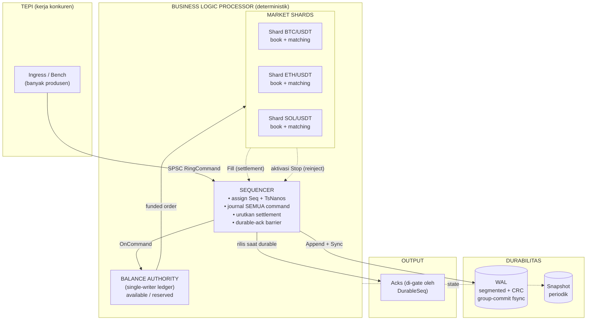

**Lima peran:**

1. **Ingress / Bench** — sumber `Command`. Banyak produsen, tiap produsen punya
   SPSC sendiri (lihat §5 dan §6).
2. **Sequencer (+ WAL)** — penulis tunggal urutan global. Memberi `Seq`
   monotonik + `TsNanos`, men-*journal* **setiap** command (eksternal **dan**
   aktivasi stop), lalu meneruskan ke ledger. Juga mengurutkan `Fill` sebelum
   settlement, dan menahan ack sampai durable.
3. **Balance Authority** — satu ledger `available/reserved` bersama untuk semua
   market. *Single writer* → konsisten lintas market tanpa lock.
4. **Market Shard** — order book + matching + tabel stop, per market. Tidak
   menyentuh dana; hanya menghasilkan `Fill` dan aktivasi stop.
5. **Output** — `Ack` dirilis hanya untuk command yang `Seq`-nya **sudah durable
   di WAL** (lihat *durable-ack barrier*, §6).

---

## 3. Pemetaan LMAX → Engine ini

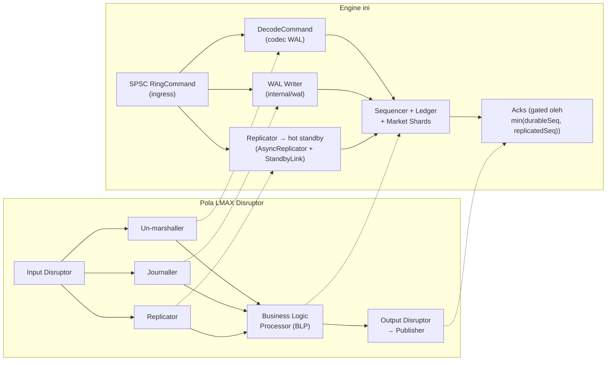

| Konsep LMAX | Padanan di engine | Lokasi |
|---|---|---|
| **Business Logic Processor** | sequencer + balance + market shard | `internal/sequencer`, `internal/balance`, `internal/market` |
| **Input disruptor** | SPSC ring ingress + reinject | `internal/spsc` |
| **Journaller** | seam `Journaller` (sync inline / **async goroutine konsumer**) di atas WAL segmented+CRC+group-commit | `internal/sequencer/journaller.go`, `async_journaller.go`, `internal/wal` |
| **Replicator** | konsumer kedua atas stream ber-`Seq` (mirror `AsyncJournaller`) yang stream ke **hot standby** lewat seam `StandbyLink`; promosi manual ber-*epoch fence*, mode `off`/`sync`/`async` | `internal/sequencer/replicator.go`, `async_replicator.go`, `internal/market/standby.go` |
| **Un-marshaller** | `types.DecodeCommand` (codec WAL) | `internal/types/codec.go` |
| **Sequence barrier (persist sebelum lepas output)** | *durable-ack barrier* — ack hanya rilis di bawah `DurableSeq` | `internal/sequencer/sequencer.go` |
| **Single Writer Principle** | ledger single-writer + book single-owner | `internal/balance`, `internal/orderbook` |
| **Mechanical sympathy** | SPSC cache-line padded, zero-alloc, pin core | `internal/spsc`, `internal/platform` |
| **Batching effect** | drain batch fill + group-commit WAL | `internal/sequencer`, `internal/wal` |

> **Catatan jujur:** dalam mode **async**, *Journaller* kini benar-benar jadi
> consumer paralel atas stream command — pola input-disruptor LMAX yang
> sesungguhnya (matcher & Journaller jalan bersamaan, barrier sebelum lepas
> output). *Replicator* kini ada juga: konsumer kedua yang stream ke **hot
> standby** dan menerbitkan `replicatedSeq`; di mode `sync` ack di-gate
> `min(durableSeq, replicatedSeq)` (lihat §10). Yang **belum** ada di v1: transport
> jaringan di balik seam `StandbyLink` (v1 in-process), pemilihan leader otomatis
> (promosi masih manual ber-*epoch fence*), dan rejoin in-engine primary lama
> (sementara: runbook operator wipe-and-resync). *Output disruptor* di v1 berupa
> buffer ack yang dirilis bertahap sesuai watermark, bukan ring publisher penuh.

---

## 4. Kontrak Determinisme

Seluruh sistem adalah **state machine deterministik** di atas satu log event
terurut. Inilah yang membuat replay & (kelak) replikasi menghasilkan state
**byte-identik**. Enam aturan yang dijaga kode:

1. **Satu sumber urutan.** Hanya sequencer yang memberi `Seq`
   (`sequenceAndRoute`, `sequencer.go:274`). Tidak ada komponen lain mengarang
   urutan.
2. **Timestamp di-capture sekali.** `c.TsNanos = s.clock()` dibaca **hanya** di
   sequencer, tepat satu kali per command (`sequencer.go:277`). Replay memakai
   nilai tersimpan — tidak pernah membaca jam lagi.
3. **Tiap komponen = fungsi murni** dari aliran input terurutnya. Tanpa
   randomness, tanpa I/O, tanpa wall-clock di dalam logika.
4. **Antar-komponen lewat SPSC FIFO** → urutan terjaga di tiap link.
5. **Fill diurutkan deterministik** oleh kunci `(AggressorSeq, MatchIndex)` —
   properti *data*, bukan waktu kedatangan (`drainFills`,
   `sequencer.go:235`). Walau matching berjalan di goroutine terpisah (mode
   paralel), settlement-nya selalu dalam urutan kunci yang sama.
6. **Stop activation di-journal juga.** Aktivasi stop di-*reinject* sebagai
   command ber-`Seq` baru dan ditulis ke WAL. Saat replay, aktivasi
   di-*suppress* (sudah ada di log) agar tidak ter-trigger dua kali
   (`SuppressStops`).

> **Konsekuensi bisnis yang benar:** kamu tak bisa menjual aset yang fill-nya
> belum disetel pada posisi `Seq` lebih awal. Ini deterministik (tergantung
> urutan `Seq`, bukan timing) — dan memang perilaku spot yang benar.

---

## 5. SPSC Ring Buffer: Produsen & Consumer

Engine **tidak memakai channel Go** di jalur panas. Handoff antar-tahap memakai
**SPSC ring** (Single-Producer Single-Consumer) lock-free bergaya *rigtorp* —
padanan langsung ring buffer Disruptor.

### 5.1 Struktur (mechanical sympathy)

`internal/spsc/ring.go`:

```go
type Ring[T any] struct {
    _    [64]byte
    head atomic.Uint64 // dibaca consumer, maju saat Pop
    _    [56]byte       // padding → head & tail beda cache line
    tail atomic.Uint64  // dibaca producer, maju saat Push
    _    [56]byte
    buf  []T
    mask uint64
}
```

**Kenapa padding?** `head` ditulis consumer, `tail` ditulis producer. Tanpa
padding keduanya bisa jatuh di *cache line* yang sama → **false sharing**:
tulisan satu pihak meng-invalidasi cache pihak lain. Padding 64-byte memastikan
keduanya di line berbeda → tiap pihak menulis ke line-nya sendiri tanpa
mengganggu.

### 5.2 Push (hanya producer) & Pop (hanya consumer)

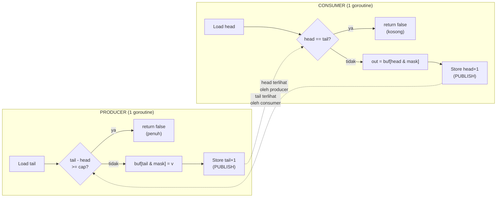

- **Kapasitas wajib power-of-two** → indeks `seq & mask` tanpa modulo.
- **Producer tak pernah menulis `head`; consumer tak pernah menulis `tail`** —
  inilah kunci lock-free SPSC. Tiap pihak hanya membaca counter pihak lain
  sebagai *hint* penuh/kosong.
- Atomik Go bersifat *sequentially consistent* → tidak perlu barrier eksplisit.
- Entry **dipakai ulang** (`buf` pra-alokasi) → nol garbage di steady state.

### 5.3 Ring konkret & siapa produsen/consumer

`internal/spsc/concrete.go` mendefinisikan alias tipe-konkret untuk link
terpanas (menghindari overhead generic di call site):

```go
type (
    RingCommand = Ring[types.Command]
    RingFunded  = Ring[types.FundedOrder]
    RingFill    = Ring[types.Fill]
    RingAck     = Ring[types.Ack]
)
```

| Ring | **Produsen** | **Consumer** | Isi |
|---|---|---|---|
| `ingress` (`RingCommand`) | klien eksternal / bench | Sequencer | order, cancel, amend, deposit, withdraw |
| `reinject` (`RingCommand`) | Market shard (lewat `Sink` aktivasi stop) | Sequencer | aktivasi stop → command baru (prioritas) |
| `reqs[w]` (`Ring[wreq]`) | jalur kontrol (`remoteShard`) | Worker | request matching (Submit/Cancel/Amend/LastPrice) |
| `resps[w]` (`Ring[wresp]`) | Worker | jalur kontrol (`remoteShard`) | hasil matching (fills, ok, aktivasi) |
| `fills[m]` (`RingFill`) | Market shard | Sequencer | fill untuk settlement urut `(AggressorSeq, MatchIndex)` |

> `reqs`/`resps` hanya dipakai di **topologi paralel** (§12). Di topologi serial,
> matching dipanggil inline tanpa ring perantara.

---

## 6. Sequencer: Otoritas Urutan Tunggal

`internal/sequencer/sequencer.go`. Inti dari BLP: satu goroutine, penulis
tunggal urutan global. Loop-nya (`Step()`) menjalankan fase **deterministik**
berikut setiap iterasi:

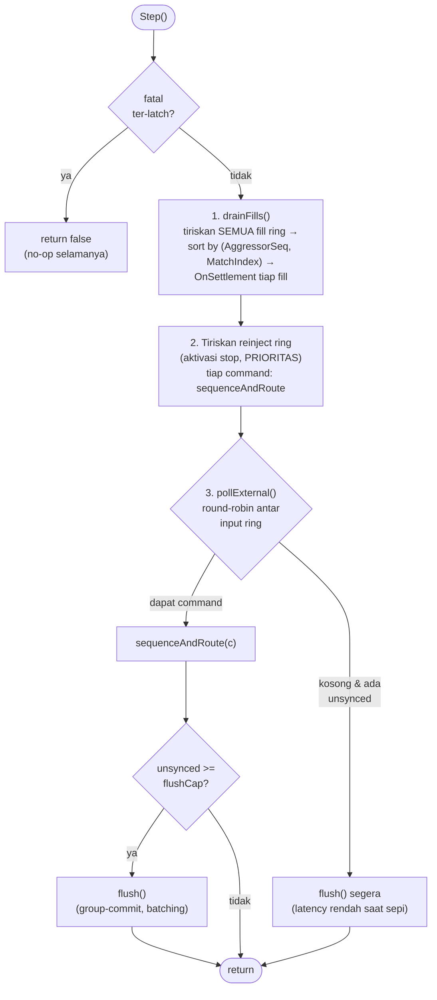

### 6.1 Assign Seq + timestamp + journal (atomik secara logis)

`sequenceAndRoute` (`sequencer.go:274`) adalah jantungnya:

```go
func (s *Sequencer) sequenceAndRoute(c *types.Command) error {
    s.seq++
    c.Seq = s.seq
    c.TsNanos = s.clock()              // satu-satunya pembacaan jam
    if err := s.journaller.Append(*c); err != nil {
        return err                     // GAGAL journal → JANGAN route, latch fatal
    }
    s.router.OnCommand(*c)             // baru teruskan ke ledger + matching
    return nil
}
```

`journaller.Append` adalah seam §9.4: di mode **sync** ia encode+tulis WAL
inline; di mode **async** ia push command ke ring Journaller (puluhan ns) lalu
matching lanjut tanpa menunggu disk.

**Urutan ini krusial:** journal **dulu**, route **kemudian**. Jika `Append`
gagal, command tidak pernah diterapkan dan tidak ada ack — WAL tetap sumber
kebenaran.

### 6.2 MPSC fan-in: round-robin, bukan queue ber-CAS

Banyak produsen → satu sequencer. Engine **tidak** memakai satu queue MPSC
ber-CAS (titik kontensi). Polanya: **tiap produsen punya SPSC sendiri, sequencer
poll bergiliran**:

```go
func (s *Sequencer) pollExternal() (types.Command, bool) {
    n := len(s.inputs)
    for i := 0; i < n; i++ {
        idx := (s.rr + i) % n
        var c types.Command
        if s.inputs[idx].Pop(&c) {
            s.rr = (idx + 1) % n   // cursor maju hanya saat sukses
            return c, true
        }
    }
    return types.Command{}, false
}
```

Tiap link tetap SPSC (tercepat); sequencer yang melakukan penggabungan + assign
`Seq`. Cursor `rr` menjamin keadilan antar-produsen.

### 6.3 Prioritas reinject

Aktivasi stop di-*reinject* lebih dulu daripada command eksternal dalam satu
`Step()` (fase 2 sebelum fase 3). Ini memberi interleaving deterministik:
trigger yang lahir dari fill harus diproses sebelum command eksternal
berikutnya.

### 6.4 Pengurutan fill untuk settlement

`drainFills` (`sequencer.go:235`) menarik fill dari **semua** market ring,
menggabungnya, lalu **mengurutkan**:

```go
sort.Slice(batch, func(i, j int) bool {
    if batch[i].AggressorSeq != batch[j].AggressorSeq {
        return batch[i].AggressorSeq < batch[j].AggressorSeq
    }
    return batch[i].MatchIndex < batch[j].MatchIndex
})
for _, fl := range batch {
    s.router.OnSettlement(fl)
}
```

Karena urutan settlement ditentukan **data** (`AggressorSeq`, `MatchIndex`),
bukan timing kedatangan, hasilnya identik antar-run dan saat replay.

### 6.5 Durable-ack barrier (sequence barrier ala LMAX)

Padanan langsung *"persist sebelum lepas output"* LMAX. Bersifat **output-side
saja** — tidak pernah di-journal, tidak memengaruhi `Seq`/timestamp/urutan fill,
jadi replay tetap byte-identik berapa pun cadence-nya.

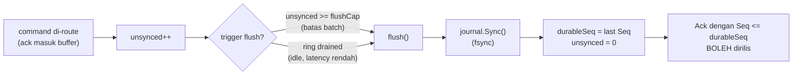

- `flushCap` (default **64**) = langit-langit *group-commit*. Makin besar →
  throughput durable naik, latency durable-ack naik. Inilah **batching effect**
  LMAX: di bawah beban, banyak command meng-amortisasi satu `fsync`.
- `DurableSeq()` jadi gerbang rilis ack. Ack di atas watermark = *speculative*,
  ditahan.
- **Fail-stop:** kegagalan `Append`/`Sync` di-*latch* ke `s.fatal`; sesudahnya
  `Step()` jadi no-op dan tak ada ack dirilis. WAL rusak = engine berhenti maju,
  bukan melanjutkan diam-diam.

> Diagram di atas adalah jalur **sync** (fsync inline di goroutine sequencer). Di
> mode **async** (§9.4) langkah `journal.Sync()` + advance `durableSeq` pindah ke
> goroutine Journaller terpisah — sequencer cukup push ke ring dan matcher tak
> pernah beku menunggu fsync. Barrier-nya tetap sama (ack di-gate `DurableSeq`);
> hanya *siapa* yang mengeksekusi fsync yang berbeda.

---

## 7. Balance Authority: Single-Writer Ledger

`internal/balance`. Satu ledger `available/reserved` bersama untuk **semua**
market. Karena single-writer, konsisten lintas market tanpa lock — USDT yang
sama tak bisa dipakai dua kali di BTC/USDT dan ETH/USDT.

### 7.1 Satu aliran event bertag

Reservasi & settlement mengalir lewat **satu** stream bertag → interleaving
tetap & deterministik (`internal/balance/event.go`):

```go
const (
    EvReserve  EventKind = iota // kunci dana untuk order baru
    EvSettle                    // terapkan satu fill (pembeli bayar, penjual terima)
    EvRelease                   // lepas sisa reservasi saat selesai/cancel
    EvDeposit                   // kredit available
    EvWithdraw                  // debit available
)
```

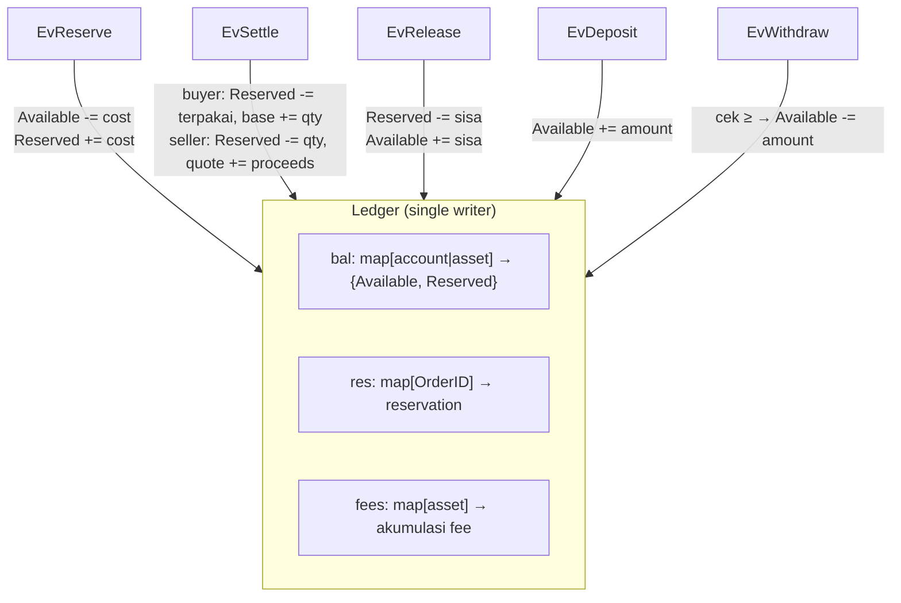

### 7.2 Aturan pembulatan uang (satu bug = uang hilang)

Semua aritmetika `price × qty` di `int64` ter-skala via `MulDiv` dengan
*intermediate* 128-bit (`internal/types/money.go`) sehingga produk tak pernah
overflow sebelum dibagi. Arah pembulatan **disengaja**:

| Operasi | Arah | Alasan |
|---|---|---|
| **Reservasi** (`EvReserve`) | **round UP** | reservasi pembeli **tak pernah under-cover** fill yang akan datang |
| **Settlement** (`EvSettle`) | **round DOWN** | menguntungkan engine; tak ada uang tercipta |

```go
// Reserve: Notional(..., roundUp=true), Fee(..., roundUp=true)
// Settle:  Notional(..., roundUp=false), Fee(..., roundUp=false)
```

---

## 8. Order Book & Matching Engine

### 8.1 Order book: arena + intrusive FIFO (cache-friendly, zero-GC-scan)

`internal/orderbook/book.go`. Order disimpan di **arena** `[]orderNode` dan
dirujuk lewat indeks `uint32` (**bukan pointer**) → ramah cache, nol scanning
GC. Tiap price level adalah **doubly-linked list intrusive** untuk FIFO.

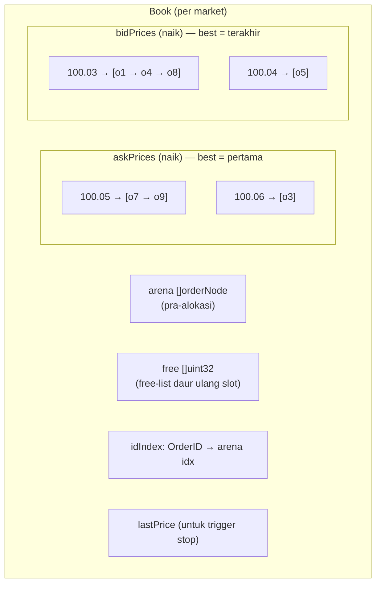

`orderNode` adalah POD bebas-pointer; iceberg dipecah `display` (tampak) +
`hidden` (cadangan) + `peak` (ukuran chunk replenish). FIFO dijaga via
`next/prev` indeks arena; `NilIdx = 0xFFFFFFFF` menandai ujung.

### 8.2 Inti matching: price-time priority

`internal/matching/match.go`. Entry point `Submit`:

```go
func (e *Engine) Submit(o types.FundedOrder) Result {
    if o.OrdType == types.Stop || o.OrdType == types.StopLimit {
        e.addStop(o)                 // simpan off-book, Pending
        return Result{Pending: true}
    }
    res := e.matchActive(o)          // sapu level lawan, FIFO dalam level
    e.triggerStops()                 // cek trigger setelah lastPrice berubah
    return res
}
```

Order agresor menyapu level lawan dari harga terbaik, FIFO dalam level, sampai
habis atau harga tak lagi cocok. **Fill selalu pada harga maker (resting)**.

### 8.3 Delapan "order type" = 4 OrderType × TIF × Flags

Enum `OrderType` hanya empat (`Limit`, `Market`, `Stop`, `StopLimit`), tapi
kombinasi dengan `TIF` (GTC/IOC/FOK) dan `Flags` (PostOnly/Iceberg) menghasilkan
delapan perilaku yang disebut di spec:

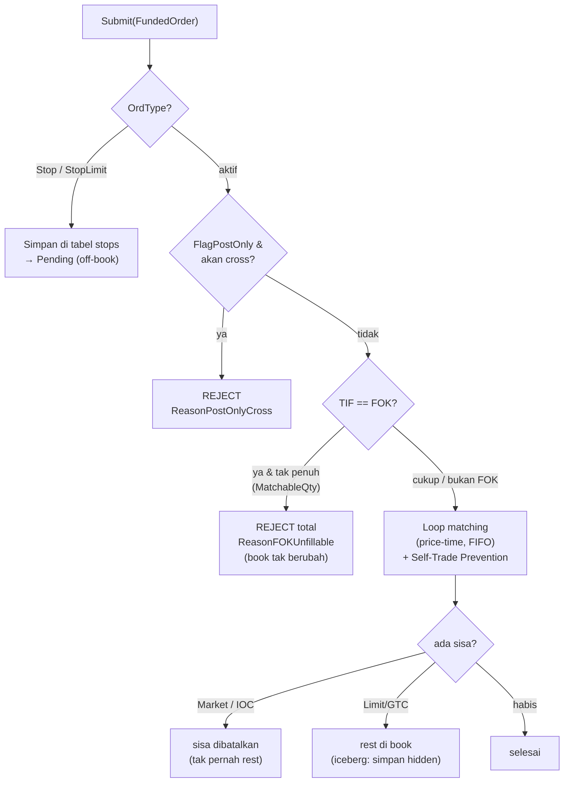

| Perilaku | Mekanisme |
|---|---|
| **Limit (GTC)** | match sebisanya; sisa **rest** di `price`. |
| **Market** | sapu tanpa batas harga; sisa **dibatalkan**. Market-buy dibatasi `MaxQuote` (budget). |
| **IOC** | match segera; sisa **cancel** (tak rest). |
| **FOK** | pra-cek `MatchableQty` — bila tak bisa penuh → **reject total, tanpa mutasi**. |
| **Post-Only** | bila akan cross → **reject**; bila tidak → rest penuh (jamin maker). |
| **Iceberg** | hanya `display` tampak; saat habis & `hidden>0` → replenish dari hidden lalu **re-queue di tail** (kehilangan prioritas waktu — standar). |
| **Stop** | off-book; trigger saat `lastPrice` lewat `StopPrice` → jadi **Market**. |
| **Stop-Limit** | off-book; trigger → jadi **Limit** pada `Price`. |

Plus **Self-Trade Prevention (STP):** bila order lawan berikutnya milik akun yang
sama, sisa agresor dibatalkan (`STP: true`).

### 8.4 Trigger stop: re-injeksi sebagai command baru (anti-rekursi)

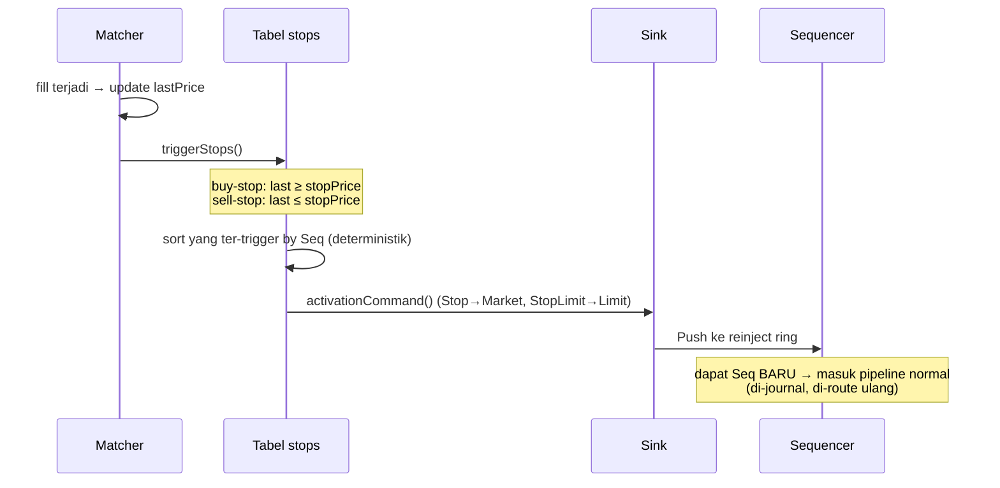

Aktivasi **tidak** diproses inline (hindari rekursi tak terbatas). Ia jadi
command baru ber-`Seq`, di-journal, dan diproses di `Step()` berikutnya dengan
prioritas reinject — sehingga deterministik dan tahan-replay.

---

## 9. Write-Ahead Log (Journaller)

`internal/wal`. Journal append-only, ter-*segment*, ber-CRC, dengan replay
tahan-*torn-tail* dan tahan-*gap*.

> v1 memakai I/O `os.File` ber-buffer + group-commit berbasis `Sync`. Jalur cepat
> `mmap` dari rancangan ditangguhkan ke fase performa; framing, segment, dan
> semantik replay (bagian yang menentukan korektnes) independen dari pilihan itu.

### 9.1 Format record (header 28 byte + payload)

```
 [0:8]   Seq        uint64
 [8:16]  TsNanos    int64
 [16:18] Type       uint16
 [18:20] Flags      uint16
 [20:24] PayloadLen uint32
 [24:28] CRC32      uint32  (atas payload)
 [28:]   Payload    (Command ter-encode)
```

### 9.2 Group-commit: satu `write` + satu `fsync` per batch

```go
func (w *Writer) Append(r Record) error {
    // frame ke encBuf, buffer di memori (BELUM durable)
    w.pending = append(w.pending, enc...)
    return nil
}
func (w *Writer) Sync() error {   // titik group-commit
    w.flushPending()              // satu write(2) untuk seluruh batch
    return w.cur.Sync()           // satu fsync
}
```

Mem-batch **syscall write** (bukan hanya fsync) inilah yang membuat group-commit
meng-amortisasi kedua syscall — biaya dominan jalur durable. Aman di bawah
durable-ack barrier: tak ada yang durable (dan tak ada ack dirilis) sampai
watermark maju saat `Sync`, jadi record pending yang belum di-Sync tak pernah
teramati.

Segment file ukuran tetap (default **1 GiB**, `%06d.wal`); roll-over mem-flush
batch lebih dulu agar satu record tak pernah melintasi dua segment.

### 9.3 Replay yang aman

`Replay(dir, afterSeq, fn)` membaca record `Seq > afterSeq` berurutan:

- **Kontiguitas wajib:** record pertama harus `afterSeq+1`, lalu naik satu-satu.
  Ada lubang → `ErrSeqGap` → **HALT** (jangan menebak).
- **Torn tail:** record tak lengkap / CRC buruk **di ujung segment terakhir** =
  belum durable → berhenti bersih (bukan error).
- **CRC buruk sebelum ujung** = `ErrCorrupt`.

### 9.4 Journaller: sync (inline) vs async (off-thread)

Antara sequencer dan WAL ada satu *seam*: **`Journaller`**
(`internal/sequencer/journaller.go`). Sequencer tak menulis WAL langsung — ia
menyerahkan command ber-`Seq` ke Journaller. Ada **dua implementasi**, dipilih
`Config.AsyncJournal` (env `OB_JOURNAL_MODE`, default di `.env.example` = `async`):

| | **SyncJournaller** | **AsyncJournaller** |
|---|---|---|
| Append + fsync jalan di | inline, goroutine sequencer | goroutine **terpisah** (core sendiri) |
| Saat fsync | **matcher beku** menunggu disk | matcher **jalan terus** |
| Durable ceiling (mesin dev) | ~960k cmd/s | **~1.3M cmd/s** (lewat 1M) |
| Match-latency p99 @500k | ~77ms (kecekik fsync) | **~10ms** (decoupled) |
| Kompleksitas | rendah, 1 goroutine | + ring + atomic + barrier, 1 core ekstra |
| Cocok untuk | tes, replay, beban modest | kejar 1M / beban tinggi |

> **Korektnes identik** — WAL byte-identik, state sama (dibuktikan determinism +
> differential + fuzz). Ini murni trade-off operasional, bukan benar-salah.

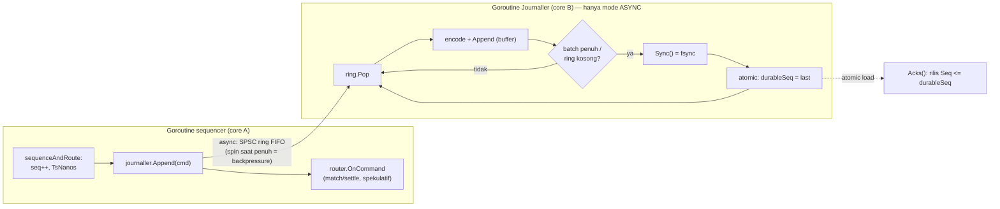

Di mode **async**, `Append` hanya push ke ring (puluhan ns) lalu lanjut matching;
goroutine Journaller di core B menanggung encode + write + fsync. FIFO ring →
**urutan byte WAL identik** apa pun timing (determinisme aman). `durableSeq`
dikabarkan balik lewat satu **atomic**. `Append` *backpressure* (spin) saat ring
penuh — record **tak pernah** di-drop (WAL = sumber kebenaran). Kegagalan
Append/Sync di-*latch* jadi fatal lintas-goroutine yang dilihat sequencer
(`Fatal()`), dan **`DrainJournal`** jadi barrier yang dipakai snapshot/drain
untuk menunggu consumer mengejar sebelum membaca state durable.

Di mode **sync** (default historis), Journaller = `SyncJournaller`: `Append` dan
`Sync` jalan inline di goroutine sequencer — persis perilaku §6.5 di bawah. Tak
ada goroutine/core tambahan.

---

## 10. Replikasi & Hot Standby

*Replicator* LMAX = **konsumer kedua** atas stream command ber-`Seq`, kembaran
struktural dari Journaller (§9.4). Di engine ini ia stream tiap command ke sebuah
**hot standby** sehingga sebuah node sekunder bisa mengambil alih saat primary
mati — **zero confirmed-order loss** di mode sync. Dipilih lewat
`OB_REPLICATION_MODE` = `off` (default) / `sync` / `async`.

> **Status v1:** data-plane in-process **sudah ada & teruji** (differential,
> property, fuzz, chaos). Yang ditunda: transport jaringan di balik seam
> `StandbyLink`, pemilihan leader otomatis (promosi masih **manual**), dan rejoin
> in-engine primary lama (sementara: runbook operator *wipe-and-resync*).

### 10.1 Komponen

| Bagian | Peran | Lokasi |
|---|---|---|
| `Replicator` (seam) | mirror `Journaller`: `Replicate/Flush/Drain/ReplicatedSeq/Fatal/Close`; `NopReplicator` = mode `off` (`ReplicatedSeq=+inf`) | `internal/sequencer/replicator.go` |
| `AsyncReplicator` | konsumer off-thread; `Replicate` **non-blocking** (ring penuh → standby mundur ke catch-up dari WAL, **bukan** stall sequencer) | `internal/sequencer/async_replicator.go` |
| `StandbyLink` (seam) | transport: `Send/AckedSeq/Fetch/Fatal/Close`; impl in-process menggerakkan `Standby` | `internal/sequencer/replicator.go`, `internal/market/standby.go` |
| `Standby` | shadow `Engine` mode *suppress-stops* (postur replay) yang apply stream via `ApplyJournaled` dengan **guard dup-Seq** (`ApplyJournaled` tidak idempoten) | `internal/market/standby.go` |

### 10.2 Sync vs Async — bedanya **hanya di gerbang ack**

Streaming-nya **selalu** off-thread (`AsyncReplicator`) di kedua mode; yang
membedakan hanyalah apakah ack menunggu standby:

| Mode | Gerbang ack (`ReleaseSeq`) | Arti |
|---|---|---|
| **`sync`** | `min(durableSeq, replicatedSeq)` | command *confirmed* hanya setelah **durable DAN ter-replikasi** — zero loss saat failover, tapi standby ada di jalur kritis |
| **`async`** | `durableSeq` saja | replikasi **di luar** jalur kritis (lag terbatas); ack lepas begitu durable, standby boleh tertinggal |
| **`off`** | `durableSeq` saja | tanpa standby (`replicatedSeq=+inf` → `min` runtuh ke `durableSeq`) |

Karena `Replicate` non-blocking, throughput primary praktis tak berubah di kedua
mode (standby yang mengejar, bukan sequencer yang menunggu). Gerbang ada di
`releaseGate` (`internal/market/engine.go`), dipakai identik oleh topologi serial
& paralel.

### 10.3 Promosi ber-epoch-fence (anti split-brain)

Setiap command di-*stamp* `Epoch` (term kepemimpinan) oleh sequencer.
`Standby.Promote()`: naikkan epoch → prime `Seq`/`Epoch` engine → `EnableStops` →
jadi primary live. Sebuah record dengan **epoch lebih lama** (primary zombie yang
hidup lagi) **di-fence**: tidak ada Seq dikonsumsi, tidak ada mutasi state — di
jalur apply maupun jalur replay (`recover.go` → `ErrStaleEpoch`). Epoch ikut
tersimpan di header snapshot, jadi fencing bertahan lintas restart dingin.

### 10.4 Degrade-to-solo & re-arm

`CmdDegradeToSolo`/`CmdRearm` adalah **record kontrol** ber-`Seq` (no-op ke
book/ledger) yang membalik gerbang sync → `durableSeq` saja saat standby tumbang
(operator-armed), lalu kembali. Karena ter-journal, mode di-rekonstruksi
deterministik saat replay dan disimpan di snapshot (`secReplication`); ia **tidak**
masuk `StateFingerprint`, jadi primary yang degraded tetap *fingerprint-equal*
dengan standby-nya.

### 10.5 Backpressure & catch-up

Ring replikator penuh **tidak** menghentikan sequencer (beda dari Journaller yang
spin): command di-drop dari ring (masih durable di WAL) dan consumer mengejar via
`StandbyLink.Fetch` (dibatasi `fetchCap` per panggilan, ber-batch). Standby yang
restart/tertinggal re-sync dari snapshot + WAL tail dan konvergen ke
*fingerprint-equality* — diuji oleh `INV-REP-01/02`, `RunDifferentialReplicated`,
dan chaos suite (primary-crash → promosi mempertahankan tiap confirmed order).

### 10.6 Lifecycle: Drain ≠ DrainStandby ≠ Close

- **`Drain`** — kuras command + durabilitas WAL primary (tidak menunggu standby).
- **`DrainStandby`** — catch-up standby secara *graceful* (dipakai snapshot quiesce
  & assertion konvergensi).
- **`Close`** — stop **abrupt** (membuang lag standby, seperti crash) — supaya
  beban open-loop maksimum tidak menggantung shutdown.

---

## 11. Snapshot & Recovery

### 10.1 Snapshot: lima section dalam satu container WAL

`internal/market/snapshot.go`. Snapshot men-*drain* engine ke batas command,
men-`Sync` journal, lalu menyerialisasi state ke lima section:

| Section | Isi |
|---|---|
| `secHeader` | versi format, scale, layout market→asset |
| `secLedger` | balance, fee terakumulasi, reservasi |
| `secOpenMap` | order pending (`Core.open`) |
| `secBooks` | order book tiap market |
| `secStops` | tabel stop tiap market |

`Snapshotter` (`snapshotter.go`) memicu snapshot berdasarkan **hitungan command**
(`everyN`) atau **interval waktu** (`interval`), menyimpan file `%020d.snap`
(zero-padded `Seq` → urutan leksikal = numerik), dan men-GC sisakan `retainK`
terbaru.

### 10.2 Recovery: snapshot + replay tail

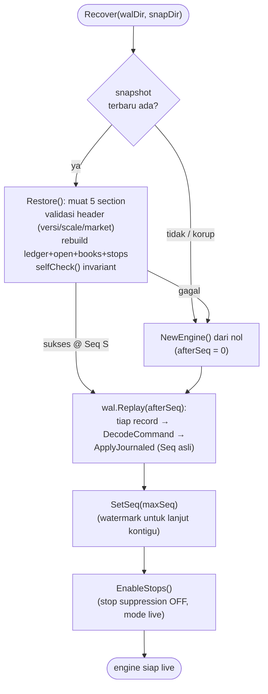

Kunci: selama replay, `SuppressStops = true` agar aktivasi stop (yang **sudah**
ada di log) tidak ter-trigger ganda. Setelah replay selesai, `EnableStops()`
mengembalikan re-injeksi untuk mode live. Snapshot yang korup tidak fatal —
engine *fail-over* ke replay WAL penuh dari `Seq 0` (dicatat di log).

---

## 12. Siklus Hidup Sebuah Order (End-to-End)

Menyatukan semuanya — sebuah limit-buy yang sebagian langsung match:

```mermaid
sequenceDiagram
    autonumber
    participant CL as Klien
    participant ING as ingress ring (SPSC)
    participant SEQ as Sequencer
    participant WAL as WAL
    participant LED as Ledger
    participant SH as Market Shard
    participant ACK as Ack buffer

    CL->>ING: Push(Command{NewOrder, Buy, ...})
    SEQ->>ING: pollExternal() (round-robin)
    SEQ->>SEQ: seq++; TsNanos = clock()
    SEQ->>WAL: Append(record)  (buffered)
    SEQ->>LED: OnCommand → Reserve (round UP)
    alt dana cukup
        LED->>SH: Submit(FundedOrder)
        SH->>SH: matchActive() price-time FIFO
        SH-->>SEQ: Fills + Filled
        SEQ->>LED: Settle tiap fill (round DOWN)<br/>urut (AggressorSeq, MatchIndex)
        LED->>LED: Release sisa untuk order selesai
        SEQ->>ACK: ack(Accepted) masuk buffer
    else dana kurang
        LED->>ACK: ack(Rejected, InsufficientFunds)
    end
    SEQ->>WAL: Sync() saat flushCap/idle (group-commit)
    Note over SEQ,ACK: durableSeq maju → Ack ≤ durableSeq dirilis ke klien
```

---

## 13. Strategi Multi-Core: Serial vs Paralel

Inilah inti "menggunakan core yang berbeda-beda". Engine punya **dua topologi**
yang berbagi sequencer + ledger yang sama.

### 12.1 Topologi Serial (v1, default) — BLP klasik

Sequencer, ledger, dan matching berjalan **inline di satu goroutine**. Caller
(test harness atau `cmd/engine`) menggerakkan loop via `Step()`/`Drain()`. Tidak
ada ring perantara ke shard — `Core.OnCommand` memanggil `Shard.Submit`
langsung.

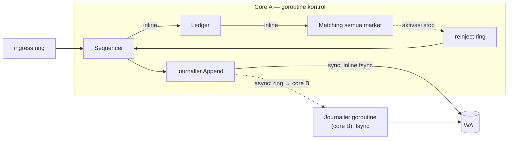

Paling sederhana & deterministik. Catatan: **mode journaling ortogonal** ke
topologi — bahkan di serial, mode **async** menambah **satu goroutine Journaller
di core terpisah** (core B) sehingga fsync tak membekukan matcher. Satu shard Go
sanggup >1 juta match/detik; async journaling menjaga **durable** throughput juga
di atas 1 juta.

### 12.2 Topologi Paralel — shard market antar-core

`internal/market/parallel.go`. Market dikelompokkan; **tiap grup berjalan di satu
goroutine worker yang di-pin ke core berbeda** (`platform.PinCurrentThread`).
Jalur kontrol (sequencer + ledger) tetap satu penulis dan **memblokir** menunggu
hasil worker lewat sepasang ring request/response.

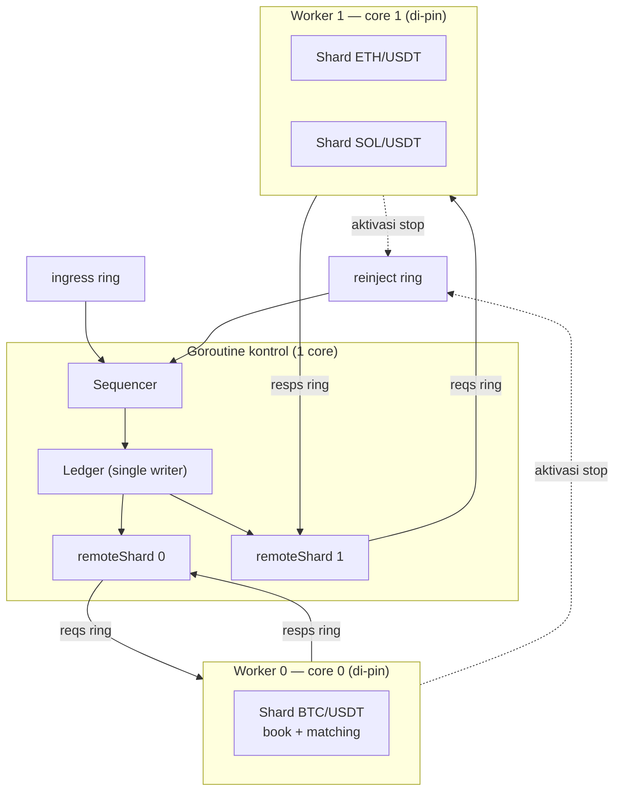

**Cara worker bekerja** (`worker.run`):

```go
for !w.stop.Load() {
    var req wreq
    if !w.reqs.Pop(&req) { runtime.Gosched(); continue } // busy-poll + yield
    sh := w.shards[req.market]
    var resp wresp
    switch req.kind {
    case reqSubmit:
        r := sh.Submit(req.funded)
        // SALIN slice fills/filled — buffer shard dipakai ulang antar-request
        resp.result = r
        resp.acts   = w.coll.drain()  // aktivasi stop dikumpulkan
    case reqCancel:    resp.ok = sh.Cancel(req.id)
    case reqAmend:     resp.ok = sh.AmendDown(req.id, req.qty)
    case reqLastPrice: resp.price, resp.ok = sh.LastPrice()
    }
    for !w.resps.Push(resp) {}        // spin sampai response masuk
}
```

`remoteShard.call` mendorong request lalu **spin** menunggu response, dan
mendorong aktivasi stop ke `reinject`. Karena ledger tetap single-writer dan
hanya satu shard yang menyentuh sebuah book, **tidak ada lock** — pemisahan ke
core hanya untuk paralelisme matching per-market.

> **Pemetaan grup → worker:** `groups [][]MarketID`. Bila `nil`, tiap market
> dapat worker sendiri. Jumlah worker = jumlah grup.

### 12.3 Pinning core & GC

`internal/platform`:

- **GC off saat sesi:** `GCOff()` = `debug.SetGCPercent(-1)`; `GCOn(prev)`
  memulihkan. Menghapus jitter pause GC pada jalur zero-alloc.
- **Pin thread:** `PinCurrentThread(cpu)` → `runtime.LockOSThread()` di Linux
  (binding afinitas `SchedSetaffinity` menyusul saat `golang.org/x/sys`
  di-vendor); **no-op di Darwin** (macOS tak mengekspos API afinitas — mesin dev
  hanya menjalankan tes korektnes di sini).

- **Journaller pinning (mode async):** goroutine Journaller juga busy-spin di
  core sendiri (`Config.JournalCore`, default tak-pin/`-1` di Darwin).

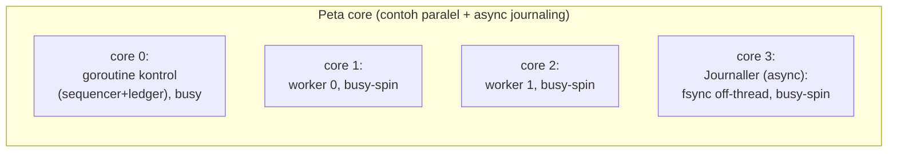

Di mode **sync**, core Journaller tak terpakai (fsync inline di core kontrol).
Di mode **async**, Journaller menempati core sendiri — itulah pertukarannya:
+1 core untuk durable throughput >1M & tail latency matcher µs.

---

## 14. Performa & Zero-Alloc

Target & hasil terukur (mesin dev: Apple M2, Darwin — pinning no-op):

| Metrik | Target | Terukur |
|---|---|---|
| Matching ceiling (no-op journal) | — | ~1.4M cmd/detik |
| **Durable throughput** | **≥ 1 juta cmd/detik** | **sync ~960k · async ~1.3M** ✅ |
| Alokasi di hot path | **0 B/op** | 0 allocs/op (gated CI) |

**Dua SLO terpisah** (diukur `cmd/loadtest`, open-loop coordinated-omission-correct):

| @ 500k TPS | sync | async |
|---|---|---|
| *internal match latency* p99 (intended→matched) | ~77ms (kecekik fsync) | **~10ms** |
| *durable-ack latency* p99 (intended→WAL durable) | ~87ms | **~16ms** |

Inilah inti nilai async: matcher **decoupled** dari fsync. p50 match async = 705ns
vs sync 305µs di 500k TPS. (Sync tetap lebih sederhana & cukup di beban modest.)

Teknik yang menjaganya:

- **Tipe POD bebas-pointer** (`Command`, `Fill`, `orderNode`) → ditulis langsung
  ke ring & WAL, tanpa marshalling, tanpa scanning GC.
- **Arena pra-alokasi + free-list** untuk order; semua `make`/`reserve` di
  *startup*, hot path nol-alokasi.
- **SPSC ring** lock-free, cache-line padded, entry dipakai ulang.
- **Buffer dipakai ulang** di Journaller (`payloadBuf` encode) dan matcher
  (`fills`, `filled`); `Append` async (push ke ring) tetap 0 alloc.
- **GC off + pin core + busy-spin** saat sesi ukur.

CI menggerbang zero-alloc lewat `*_bench_test.go` pada `internal/spsc`,
`internal/matching`, `internal/balance` (lihat `make bench`). Lihat
[`docs/designs/invariant-fuzz-testing-guide.md`](docs/designs/invariant-fuzz-testing-guide.md)
untuk kontrak korektnes (`INV-*`) yang diuji via property / differential / fuzz.

---

## 15. Peta Paket

```
cmd/engine          # wiring in-process: recovery startup, cadence snapshot, shutdown
cmd/loadtest        # driver beban open-loop + TUI order-book
cmd/throughput      # harness throughput serial
cmd/internal/harness# generator beban + histogram + TUI (dipakai bersama)

internal/types      # POD value types, fixed-point money (MulDiv), codec WAL, filters
internal/spsc       # SPSC ring lock-free (generic + alias konkret)
internal/orderbook  # book per-market: arena + intrusive FIFO + price levels
internal/matching   # price-time matching, 8 perilaku order type, tabel stop
internal/balance    # ledger single-writer (available/reserved), event bertag
internal/sequencer  # otoritas urutan + fan-in MPSC + durable-ack barrier;
                    #   Journaller seam: SyncJournaller (inline) & AsyncJournaller
                    #   (fsync off-thread, jalur 1M durable)
internal/wal        # WAL segmented (record+CRC), group-commit, replay
internal/market     # perakitan engine: serial & paralel; Snapshot/Restore/Recover
internal/platform   # GC off, pin core (build-tagged per OS)
pkg/config          # konfigurasi via env (dibaca sekali saat startup)
pkg/logger          # wrapper slog tipis (startup/shutdown saja)

tests/integration   # end-to-end lintas paket (3 market, balance bersama)
tests/property      # invariant + determinisme + rapid state-machine
tests/refmodel      # oracle model referensi untuk differential testing
```

### Diagram dependensi paket (layering)

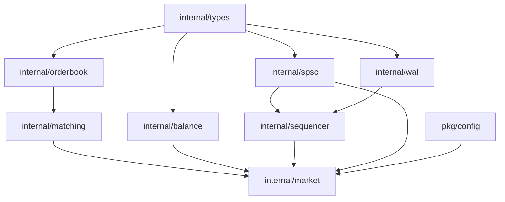

Aturan layering (dijaga oleh house rules): `types ← orderbook ← matching ←
market`; `balance`, `sequencer`, `wal` dirakit oleh `market`. `internal/` privat;
`pkg/` satu-satunya permukaan publik.

---

> **Ringkasan satu kalimat:** sebuah Business Logic Processor deterministik —
> sequencer (urutan + journal + durable-ack), ledger single-writer, dan market
> shard penghasil-fill — yang dihubungkan SPSC ring bergaya Disruptor, ditulis
> ke WAL untuk replay byte-identik, dan dapat di-shard ke core berbeda tanpa
> mengorbankan determinisme.
