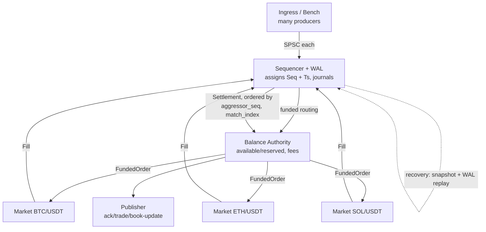

# feat: Spot Order Book Engine (phased, test-gated build)

## Summary

Build the deterministic, event-sourced spot order-book engine specified in `docs/designs/spot-orderbook-engine-design.md` as ten dependency-ordered, independently-landable phases. Each phase ships one component with its tests and only counts as done when `go vet`, `go test`, and `-race` (concurrency units) pass; the final performance phase adds a zero-alloc benchmark check. Single-node durability (WAL + snapshot + recovery) is built; clustering, backup/DR, and any HTTP gateway are out of scope.

---

## Problem Frame

The design doc is a complete spec but couples matching, balance, durability, and determinism tightly, and its hot-path performance work is Linux-specific while development happens on macOS arm64. A single-shot build would be hard to verify and would block on an unverifiable performance layer. The work needs an ordering that proves correctness and determinism incrementally on the dev machine, with platform-bound performance deferred to the end and the cluster/backup layers descoped (see origin: `docs/brainstorms/2026-06-13-spot-orderbook-engine-requirements.md`).

---

## Key Technical Decisions

- **Phase = independently-landable, test-gated unit.** Each of the ten units maps to one brainstorm phase and lands as one atomic commit. A unit is done only when `go vet ./...`, `go test ./...`, and `go test -race ./...` (for units with concurrency) pass; U10 additionally requires `-benchmem` showing 0 allocs/op on hot paths. Red blocks the next unit (origin R21).
- **Conventions-only from the boilerplate; engine per the design-doc layout.** Peripheral structure (`pkg/config`, `pkg/logger`, `tests/`, `Makefile`, `scripts/`) follows `boilerplate-gin-dat`; the engine core follows design §11. No Gin/GORM/controllers and no logging or allocation on the hot path (origin R22, R23).
- **128-bit intermediate for money math; reservation rounds up.** `price * qty` is computed via a 128-bit intermediate (`math/bits` mul/div) over scaled `int64`; reservation rounds in the never-under-reserve direction and includes worst-case taker fee (origin R3, R11).
- **Maker/taker fees fixed at config; taker-side carried on `Fill`.** Both rates `>= 0`, no runtime mutation (so replay is deterministic), credited to a per-asset fee account. The aggressor/taker side is a field on the `Fill` value rather than re-derived during settlement (origin R11; resolves an origin open fork).
- **Amend and self-trade semantics.** Amend: price-change or qty-increase is cancel/replace with a new `Seq` at the back of the queue; qty-decrease is applied in place keeping priority. STP: on a self-match, stop that pair and cancel the aggressor remainder; resting order untouched; no fill emitted (origin R6, R7).
- **Recovery verified by logical deep-equality.** The recovery-determinism test reconstructs and compares state semantically (balances incl. fee account, book levels + FIFO order + best bid/ask, `lastPrice`, final `Seq`), not by byte-identical snapshots — Go map iteration is unordered (origin R20). Physical arena layout and free-list order are deliberately **not** part of the determinism contract; no engine behavior (matching outcome, fill ordering, settlement) may depend on slot identity or free-list order. U9 guards this with a follow-on-stream test (feed a fresh engine and a snapshot+replayed engine an identical follow-on stream; assert both outputs stay deep-equal).
- **Correctness first; performance last; platform code build-tagged.** Units U1–U9 target correctness and run fully on macOS. U10 adds zero-alloc benchmarks, `SetGCPercent(-1)`, and core pinning behind Linux build tags with darwin no-op stubs, plus the open-loop load harness (origin R24).
- **Stop triggering split across two units.** Trigger detection and conversion are unit-tested in isolation at the matching unit (U4) via an injection callback; full re-injection through the sequencer is wired at the engine-assembly unit (U8) — avoids building the sequencer early just to test stops (origin R8). Two determinism rules pin the contract: (1) simultaneously-triggered stops (one fill crossing multiple thresholds) are activated in a **total order by the resting stop order's `Seq` ascending** (design §9), never by map/book iteration order; (2) activated stops are **derived internal events, not separately journaled** — replay regenerates them because `lastPrice` evolution and stop-table scan order are pure functions of the already-journaled command stream, and the sequencer advances `Seq` for these synthetic commands identically on live and replay paths. U4's green gate is therefore **provisional** with respect to global ordering, which is only fully exercised at U7/U8/U9.

---

## High-Level Technical Design

Single deterministic state machine over one ordered command log. Many producers fan in to a single sequencer (round-robin SPSC, not a CAS MPSC queue); every component is a single-writer goroutine connected by SPSC rings.



Determinism contract (origin R13): one `Seq` source (sequencer only), timestamp captured once, fills ordered by `(aggressor_seq, match_index)`, no wall-clock or randomness in component logic.

---

## Output Structure

```
orderbook/                          # module github.com/yanuar/orderbook
├── go.mod
├── Makefile                        # make test / build / race
├── .env.example
├── cmd/
│   ├── engine/main.go              # wiring (U8); core pinning (U10)
│   └── bench/main.go               # open-loop load harness (U10)
├── scripts/                        # dev/CI helpers (U1)
├── internal/
│   ├── types/                      # Command, Fill, Price/Qty, enums, money helpers (U2)
│   ├── spsc/                       # generic + concrete rings (U2)
│   ├── orderbook/                  # arena, levels, price ladder, free-list (U3)
│   ├── matching/                   # price-time + 8 order types + STP (U4)
│   ├── balance/                    # ledger, reserve/settle/release, fees (U5)
│   ├── wal/                        # mmap append, CRC, segments, replay (U6)
│   ├── sequencer/                  # Seq, MPSC fan-in, fill ordering (U7)
│   ├── market/                     # shard wrapper (U8)
│   └── platform/                   # pin_linux.go / pin_darwin.go (U10)
├── pkg/
│   ├── config/                     # struct from env/flags (U1)
│   └── logger/                     # log/slog wrapper (U1)
└── tests/
    ├── integration/                # §13.2 scenarios (U9)
    ├── property/                   # §13.3 fuzz/invariants (U9)
    └── fixtures/                   # seed books, scenarios (U9)
```

The per-unit `**Files:**` lists are authoritative; the tree is a scope declaration the implementer may adjust.

---

## Requirements

Carried from the origin requirements doc; grouped by concern. R-IDs match the origin.

**Engine scope & topology**
- R1. Three market shards (BTC/USDT, ETH/USDT, SOL/USDT) over a shared balance authority, one single-writer goroutine per component, SPSC ring links; markets config-driven defaulting to these three.
- R2. Spot only — no margin/leverage/positions.
- R3. Fixed-point `int64` money at scale `1e8`; `price*qty` via 128-bit intermediate; reservation rounds to never under-reserve.

**Order types & matching**
- R4. Strict price-time (FIFO) priority.
- R5. All eight order types with design §9 semantics (Limit/GTC, Market, IOC, FOK, Post-Only, Iceberg, Stop, Stop-Limit).
- R6. Amend: reprice/qty-up = cancel-replace (new `Seq`, back of queue); qty-down = in place, priority kept; reserved balance adjusted.
- R7. Self-trade prevention: cancel aggressor remainder on self-match; resting untouched; no fill emitted.
- R8. Stop/Stop-Limit triggering by `lastPrice`, re-injected as a new command through the sequencer in deterministic order.

**Balance & fees**
- R9. `available`/`reserved` ledger per `account|asset`; reserve on accept, settle on fill, release on cancel; reject on insufficient.
- R10. Deposit/Withdraw adjust `available` (withdraw rejects if insufficient).
- R11. Configurable maker/taker fees `>= 0`; taker = aggressor, maker = resting; fees to a per-asset fee account; reservation includes worst-case taker fee.
- R12. No negative balance in any state.

**Durability & determinism**
- R13. Deterministic state machine per design §3.
- R14. WAL: mmap append, length-prefixed + CRC framing, group-commit, fixed segments, atomic committed offset.
- R15. Snapshot: pause-and-snapshot recording last applied `Seq`.
- R16. Single-node recovery: load snapshot + replay WAL (CRC verify, truncate tail torn write, halt on `Seq` gap).

**Testing & verification**
- R17. Co-located white-box unit tests per package (design §13.1).
- R18. Integration tests under `tests/integration/` (design §13.2 scenarios).
- R19. Property/fuzz tests under `tests/property/` with invariants and same-seed determinism (design §13.3).
- R20. Recovery-determinism test by logical deep-equality.
- R21. Per-unit gate: `go vet` + `go test` + `go test -race` green before advancing; U10 adds `-benchmem` 0 allocs/op.

**Repo & conventions**
- R22. Module `github.com/yanuar/orderbook` rooted at the repo; layout per design §11.
- R23. `pkg/config` from env/flags; `pkg/logger` via `log/slog`; no heavy deps; hot path never logs/allocates.
- R24. Performance phase: zero-alloc hot path, `SetGCPercent(-1)`, Linux-tagged core pinning + darwin stubs, `cmd/bench` open-loop 100k-TPS harness with coordinated-omission correction.

---

## Implementation Units

Ten units, one per brainstorm phase, dependency-ordered. Each is a phase that must be tested and verified before the next begins (R21).

### U1. Phase 0 — Scaffold

- **Goal:** Stand up the module, repo skeleton, peripheral conventions, and build tooling so later units have a green baseline.
- **Requirements:** R22, R23.
- **Dependencies:** none.
- **Files:** `go.mod`, `Makefile`, `.env.example`, `pkg/config/config.go`, `pkg/config/config_test.go`, `pkg/logger/logger.go`, `cmd/engine/main.go` (stub), `scripts/.gitkeep`, `tests/integration/.gitkeep`, `tests/property/.gitkeep`, `tests/fixtures/.gitkeep`.
- **Approach:** `go mod init github.com/yanuar/orderbook`. `pkg/config` is a plain struct loaded from env/flags (markets, ring sizes, WAL path, price/qty scales, maker/taker fee rates). `pkg/logger` wraps `log/slog`. `Makefile` targets: `test` (`go vet` + `go test ./...`), `race` (`go test -race ./...`), `build`. Stub `cmd/engine/main.go` that compiles.
- **Patterns to follow:** boilerplate `pkg/config`, `pkg/logger`, `Makefile` conventions — adapted to stdlib (no Viper/Logrus).
- **Test scenarios:** config loads defaults when env unset; config overrides from env (markets list, ring size, fee rates) parse correctly; invalid fee rate (negative) rejected at load.
- **Verification:** `make test` runs green on an otherwise-empty tree; `make build` produces the engine binary.

### U2. Phase 1 — Core types + SPSC ring

- **Goal:** Fixed-point money types with rounding helpers and the lock-free SPSC ring buffer.
- **Requirements:** R3, R13 (POD, no-pointer types), R17 (co-located white-box unit tests — established here and carried structurally through U2–U7).
- **Dependencies:** U1.
- **Files:** `internal/types/types.go`, `internal/types/money.go`, `internal/types/money_test.go`, `internal/spsc/ring.go`, `internal/spsc/ring_test.go`.
- **Approach:** Define all engine-transported POD up front so later units never have to widen a WAL-serialized, ring-transported struct: `Command`, `Fill` (carrying the taker-side field), `FundedOrder` (the post-reservation envelope balance routes to shards), `Ack`, `Price`/`Qty`/IDs, and the `Side`/`OrderType`/`TIF`/`Flags`/`CmdType` enums as fixed-size structs (design §4). `Command` and `Ack` include a bench-only `ClientTsNanos int64` for latency correlation (design §18.5); it is never read by engine logic or WAL semantics, so it does not affect determinism. `money.go` provides `quote = price*qty/QtyScale` via 128-bit intermediate (`math/bits` mul/div) with explicit rounding (round-down for settlement quote, round-up for reservation). SPSC ring is cache-line padded, power-of-two capacity, stores by value (design §5); provide concrete `RingCommand`/`RingFill`/`RingFunded` alongside the generic.
- **Patterns to follow:** design §4 and §5 code sketches (directional).
- **Test scenarios:** money round-down vs round-up at exact boundaries and at rounding-prone values; 128-bit path for large `price*qty` that overflows `int64`, including the case where `price*qty/QtyScale` itself would exceed `int64` so the implementer bounds it before `bits.Div64` (which panics on quotient overflow); reservation never under-reserves vs settlement quote. Ring: push/pop FIFO; full returns false; empty returns false; wraparound across `mask`; **`-race`** concurrent single-producer/single-consumer run.
- **Verification:** `go test -race ./internal/spsc/...` and `go test ./internal/types/...` green.

### U3. Phase 2 — Order book structure

- **Goal:** Arena-backed book with price-ladder levels, intrusive FIFO lists, free-list, and id index.
- **Requirements:** R4 (structure supporting price-time), R6 (in-place amend support).
- **Dependencies:** U2.
- **Files:** `internal/orderbook/book.go`, `internal/orderbook/book_test.go`.
- **Approach:** `[]orderNode` arena indexed by `uint32` (no pointers), intrusive doubly-linked FIFO per level, price-ladder arrays for bids/asks with sparse fallback, `free` slot recycling, `idIndex` map, `bestBid`/`bestAsk` tracking. All allocation at startup. Provide insert / cancel / amend-in-place (qty-down) / lookup primitives; cross-level matching lives in U4.
- **Patterns to follow:** design §8.
- **Test scenarios:** insert maintains per-level FIFO order (oldest→newest); cancel removes and recycles the slot to the free-list; best bid/ask update on insert and on cancel of the touch level; `idIndex` stays consistent after insert/cancel/amend; amend qty-down keeps queue position; free-list reuse does not corrupt neighbor nodes; empty-book best bid/ask sentinel handling.
- **Verification:** `go test ./internal/orderbook/...` green; FIFO/free-list invariants asserted.

### U4. Phase 3 — Matching engine + all order types + STP

- **Goal:** Price-time matching core plus all eight order types, amend repricing, and self-trade prevention.
- **Requirements:** R4, R5, R6, R7, R8 (trigger detection/conversion in isolation).
- **Dependencies:** U3.
- **Files:** `internal/matching/match.go`, `internal/matching/stops.go`, `internal/matching/match_test.go`, `internal/matching/stops_test.go`.
- **Approach:** Aggressor sweeps best opposing levels FIFO emitting `Fill`s with `(AggressorSeq, MatchIndex)` and the taker side set. `MatchIndex` is a `uint32` that resets per aggressor (cannot wrap within one aggressor's fills). Per-type behavior per design §9, covering all eight types including Stop-Limit (triggers to a Limit at its limit price, vs Stop which triggers to Market). STP: on encountering the aggressor's own resting order, stop the pair and cancel the aggressor remainder. Stop/Stop-Limit triggering detects threshold crossing on `lastPrice` and converts to Market/Limit; activation is delivered through a **preallocated emission sink** (a method on a fixed receiver or a caller-owned ring), not a freshly-captured per-call closure, so U10's zero-alloc gate stays reachable. The sequencer re-injection is wired in U8, so this unit is testable in isolation — but its green gate is provisional on the U7 global-ordering contract.
- **Technical design:** directional — `match(aggressor)` loop per design §9; trigger activations written to a non-escaping sink, not a `func(Command)` closure allocated per call.
- **Patterns to follow:** design §9 pseudocode.
- **Test scenarios (table-driven per type):** Limit partial-fill-then-rest and full-fill; Market sweeps multiple levels and cancels remainder. `Covers AE1.` FOK with insufficient depth rejects with no execution, book unchanged; FOK with sufficient depth fills fully. `Covers AE2.` Post-Only that would cross rejects; non-crossing rests. `Covers AE3.` Iceberg replenishes `display` from `hidden` and re-queues at back (priority lost). `Covers AE4.` buy-stop activates as a new command via the sink when `lastPrice` crosses `stopPrice` and matches as a market order; sell-stop symmetric. Stop-Limit activates the same way but matches as a limit order at its limit price (buy and sell). `Covers AE5.` amend qty-down keeps priority; amend price re-queues with new `Seq`. `Covers AE6.` self-match stops the pair, cancels aggressor remainder, resting untouched, no fill emitted. IOC cancels remainder, nothing rests. Ordering contract: a scripted multi-aggressor sequence emits `(AggressorSeq, MatchIndex)` tuples that form the exact total order settlement will consume (pins the contract at the producing site, not only at U7).
- **Verification:** `go test ./internal/matching/...` green; every order type and STP covered.

### U5. Phase 4 — Balance authority + fees

- **Goal:** Single-writer ledger with reserve/settle/release, deposit/withdraw, and maker/taker fees.
- **Requirements:** R9, R10, R11, R12, R3 (rounding).
- **Dependencies:** U2.
- **Files:** `internal/balance/ledger.go`, `internal/balance/fees.go`, `internal/balance/ledger_test.go`.
- **Approach:** `map[account|asset]Balance{available, reserved}` made large at startup. Balance consumes a **single tagged input stream** (`BalanceEvent{kind, ...}` carrying reserve-command vs settle-fill vs release on one ring) so reservation (`Seq` order) and settlement (`(aggressor_seq, match_index)` order) interleave in one fixed, deterministic order — not two separate rings, which would reintroduce nondeterministic interleaving. Reserve on order accept: a **limit** buy reserves `price*qty` plus worst-case taker fee; a **market** buy reserves the account's full available quote balance, settles the actual swept quote, and releases the remainder (no price means no tighter bound exists at accept time); sell reserves base qty. Settle on fill (taker pays taker fee, maker pays maker fee, both credited to per-asset fee account). Release on cancel. Reject on insufficient available. Deposit/Withdraw adjust `available`.
- **Patterns to follow:** design §7.
- **Test scenarios:** reserve then settle then release returns to expected balances; insufficient available rejects without mutation; deposit increases available; withdraw rejects when insufficient; reservation rounding never under-reserves (incl. fee); balance never goes negative across a random op sequence; an interleaved reserve/settle stream in a fixed order yields the "unsettled proceeds not spendable" outcome; market buy reserves the full available quote, sweeps multiple price levels, and post-settlement the released remainder restores `available` exactly (zero conservation drift). `Covers AE8.` taker and maker fees credited to fee account and per-asset value (users + fee account) conserved across a settled trade; fee rounding direction tested.
- **Verification:** `go test ./internal/balance/...` green; conservation and never-negative invariants asserted.

### U6. Phase 5 — Write-Ahead Log + snapshot + replay

- **Goal:** Durable command journal with CRC framing, segments, snapshot, and replay.
- **Requirements:** R14, R15, R16.
- **Dependencies:** U2, U3, U5 (snapshot serializes book + ledger state).
- **Files:** `internal/wal/wal.go`, `internal/wal/record.go`, `internal/wal/snapshot.go`, `internal/wal/wal_test.go`.
- **Approach:** mmap-backed append (via `golang.org/x/sys/unix`), length-prefixed records with natural-aligned header + CRC32 over payload, fixed-size segments, atomically-published commit offset, group-commit (`Fdatasync` on linux; darwin lacks `fdatasync`, so use `Fsync` under a darwin build path). Snapshot serialization is **owned by the components it captures**: `orderbook` and `balance` each expose `Snapshot(w)`/`Restore(r)` over their own internals (arena/ledger are unexported, so `wal/snapshot.go` cannot reach them generically); `wal/snapshot.go` orchestrates the encode/decode and records the last applied `Seq`. **Durability invariant:** a snapshot at `Seq=S` may only be published after the WAL is durably committed through `S` (so recovery never finds a snapshot ahead of the WAL tail). Replay seeks past snapshot `Seq`, verifies CRC (truncate tail torn write), checks `Seq` contiguity (halt on gap). mmap is the macOS-supported subset of `x/sys/unix` (no hugepages here — that is U10/Linux).
- **Patterns to follow:** design §6.
- **Test scenarios:** append→read round-trip preserves records; CRC mismatch detected; truncated/torn record at tail truncated and replay stops cleanly; `Seq` gap halts replay; replay over snapshot + tail rebuilds an identical record stream; segment roll-over preserves continuity; snapshot at `S` with a simulated crash leaving WAL durable only to `S-k` recovers to the intended state (the durability invariant prevents an accidental gap-halt).
- **Verification:** `go test ./internal/wal/...` green; corruption and torn-write paths covered.

### U7. Phase 6 — Sequencer + fan-in

- **Goal:** The single ordering authority: assign `Seq`/timestamp, journal, fan in producers, order fills, drive settlement.
- **Requirements:** R13, R14 (journal call), R8 (re-injection ordering rule).
- **Dependencies:** U6.
- **Files:** `internal/sequencer/sequencer.go`, `internal/sequencer/sequencer_test.go`.
- **Approach:** Single goroutine loop (design §6.1): drain fill rings first (ordered by `(aggressor_seq, match_index)`) and emit settlements, then poll producer rings round-robin, assign monotonic `Seq` + capture `TsNanos` once, journal to WAL, route to balance. Define the re-injection entry point stops will use (wired in U8): synthetic stop-activation commands advance `Seq` identically on live and replay paths and are not separately journaled (replay regenerates them).
- **Patterns to follow:** design §6.1 loop.
- **Test scenarios:** `Seq` strictly monotonic and contiguous across mixed producers; timestamp captured once and embedded (no re-read on replay); fill-before-command drain order yields deterministic interleaving; settlement applied in `(aggressor_seq, match_index)` order regardless of fill arrival order; a stop activation triggered during a recorded run is regenerated at the identical `Seq` after snapshot+replay; **`-race`** multi-producer fan-in.
- **Verification:** `go test -race ./internal/sequencer/...` green; determinism asserted.

### U8. Phase 7 — Market shard + engine assembly

- **Goal:** Wrap orderbook+matching+rings as a market shard and wire the full engine, completing stop re-injection.
- **Requirements:** R1, R8 (full re-injection through sequencer).
- **Dependencies:** U4, U5, U7.
- **Files:** `internal/market/shard.go`, `internal/market/shard_test.go`, `cmd/engine/main.go`.
- **Approach:** `shard` owns a book + matching loop + inbound funded-order ring + outbound fill ring and updates `lastPrice`. `cmd/engine` constructs sequencer, balance, three shards, publisher, and the SPSC links, and routes `marketID → shard`. Stop activations now flow back through the sequencer's re-injection entry point (deterministic new `Seq`). No core pinning yet.
- **Patterns to follow:** design §2, §10, §11 wiring.
- **Test scenarios:** a shard processes a scripted funded-order stream and emits expected fills; `lastPrice` updates drive a stop activation that re-enters via the sequencer and matches; routing sends a command to the correct shard; engine runs a scripted multi-command stream end-to-end (deposit → order → fill → settle).
- **Verification:** `go test ./internal/market/...` green; engine binary runs the scripted stream to completion.

### U9. Phase 8 — Integration + property/fuzz suite

- **Goal:** Full-engine integration scenarios and property/fuzz coverage with global invariants and recovery determinism.
- **Requirements:** R18, R19, R20, R12 (invariants).
- **Dependencies:** U6, U8.
- **Files:** `tests/integration/engine_test.go`, `tests/integration/recovery_test.go`, `tests/property/invariants_test.go`, `tests/fixtures/` (seed scenarios).
- **Approach:** Spin up the full engine with BTC/ETH/SOL/USDT assets across the three markets. Integration scenarios per design §13.2; property/fuzz per §13.3 generating random mixed-type load across many accounts/markets and asserting invariants every step plus same-seed determinism. Same-seed determinism is asserted over the **sequenced log** (post-`Seq` replay), not over live multi-producer fan-in — round-robin SPSC fan-in is intentionally not bit-reproducible across runs, so the property harness feeds commands through a single deterministic feeder (or fixed poll order) for the same-seed claim to be meaningful.
- **Test scenarios:** `Covers AE7.` cross-market balance — shared USDT can't be double-reserved across BTC/USDT and ETH/USDT; second order rejected. Parallel matching across all three markets produces correct trades. Order types end-to-end (FOK reject, Post-Only reject, Iceberg replenish, Stop trigger by price move, IOC remainder-cancel). Cancel releases reserved back to available. A single fill that crosses ≥2 resting stops' thresholds activates them in resting-`Seq` order, identical across two same-seed runs. A re-injected stop acting as taker against multiple makers (with a partial self-match) has identical `AggressorSeq`/taker-side and fee attribution across two same-seed replays. `Covers AE9.` random load → snapshot+WAL → kill → replay → reconstructed state logically deep-equal (balances incl. fee account, books + FIFO + best bid/ask, `lastPrice`, final `Seq`); then feed both the fresh and the replayed engine an identical follow-on stream and assert outputs stay deep-equal (guards against physical-layout-dependent divergence). Global invariants every step: no negative balance; reserved == locked funds across open orders; per-asset value conserved (users + fee account); no crossed resting levels, intact linked lists. Same-seed property run twice yields identical output.
- **Verification:** `go test ./tests/...` and `go test -race ./tests/...` green; invariants hold across the fuzz run.

### U10. Phase 9 — Performance hardening + load harness

- **Goal:** Zero-alloc hot path, GC-off session controls, Linux core pinning with darwin stubs, and the open-loop load harness.
- **Requirements:** R24, R21 (benchmem gate).
- **Dependencies:** U8 (engine assembled), U9 (correctness proven).
- **Files:** `internal/platform/pin_linux.go`, `internal/platform/pin_darwin.go`, `internal/spsc/ring_bench_test.go`, `internal/matching/match_bench_test.go`, `internal/balance/ledger_bench_test.go`, `cmd/bench/main.go`.
- **Approach:** `platform` exposes `LockToCore`/`Mlock`-style calls implemented with `SchedSetaffinity`/hugepages under `//go:build linux` and as no-ops under `//go:build darwin`. Engine session sets `debug.SetGCPercent(-1)` and manual GC at idle. `cmd/bench` is an open-loop generator (intended-time scheduling, busy-wait pacing) feeding the ingress ring, recording latency to HdrHistogram with `RecordCorrectedValue`, with the load model from design §18.3 and backpressure counting.
- **Execution note:** macOS exercises the darwin no-op stubs and functional benchmarks; Linux-only pinning/hugepage paths are validated on Linux.
- **Patterns to follow:** design §14, §18.
- **Test scenarios:** `Ring.Push/Pop`, one `match()` on a filled book, one reserve/settle — each `-benchmem` shows 0 allocs/op; darwin stubs are no-ops and compile; load harness reaches sustained throughput and reports p50/p99/p99.9 plus backpressure; a measured session shows `NumGC` unchanged.
- **Verification:** `go test -bench . -benchmem ./...` shows 0 allocs/op on the hot-path benchmarks; `cmd/bench` produces a throughput + latency report.

---

## Scope Boundaries

### Deferred for later (plausibly later, not v1)
- High availability: Raft replication, odd-node cluster, leader election, failover, `internal/cluster`, `internal/dedup` (design §16).
- Backup & DR: WAL archival to object storage, offsite snapshots, PITR, restore verification (design §17).
- Ledger/order-book scale-out (per-account hash sharding, per-market multi-group Raft).
- Maker rebates (negative maker fees), runtime-mutable fee schedules.
- Non-pausing (shadow consumer) snapshots.

### Outside this product's identity (v1)
- Network gateway / HTTP/REST API — engine is in-process plus a benchmark harness.
- Margin, leverage, derivatives, positions — spot only.
- Gin/GORM/controller-service-repository layering over the hot path.

### Deferred to Follow-Up Work
- None — the ten units cover the full brainstorm scope; no adjacent refactors exist in a greenfield tree.

---

## Risks & Dependencies

- **128-bit arithmetic correctness.** Manual `math/bits` mul/div is error-prone; the U2 rounding/overflow tests are the guardrail and must be written before the matching/balance units depend on it.
- **mmap portability.** `golang.org/x/sys/unix` mmap behaves differently across darwin/linux; U6 uses only the portable subset, deferring hugepages to U10's Linux path.
- **Determinism leaks.** Any wall-clock read, map-order dependence, or randomness in component logic breaks replay; the U7 and U9 determinism tests are the detection net (logical deep-equality, same-seed reruns).
- **Dependencies:** `golang.org/x/sys` (mmap, Linux scheduling); an HdrHistogram library (U10 only). No Viper/Logrus/GORM. Go 1.25.6 on macOS arm64 for verification.

---

## Open Questions (Deferred to Implementation)

- Exact 128-bit mul/div implementation and the precise fee-reservation rounding code (U2).
- WAL group-commit tuning (records-per-sync vs µs window) and segment size defaults (U6).
- Price-ladder bounds per market and the dense-vs-sparse fallback threshold (U3).
- Snapshot serialization format (recovery compares logically, so canonical encoding isn't required for correctness) (U6).

---

## Sources / Research

- `docs/brainstorms/2026-06-13-spot-orderbook-engine-requirements.md` — origin requirements (R1–R24, AE1–AE9, scope boundaries, key decisions).
- `docs/designs/spot-orderbook-engine-design.md` — authoritative spec; §3 determinism, §4 types, §5 spsc, §6 wal/sequencer/recovery, §7 balance, §8 orderbook, §9 matching/order-types, §11 layout/build-order, §13 testing, §14/§18 performance. §16/§17 (HA/DR) intentionally out of scope.
- `github.com/bonarizki-dat/boilerplate-gin-dat` — peripheral repo conventions only (`pkg/config`, `pkg/logger`, `tests/`, `Makefile`, `scripts/`); HTTP layering not applied to the engine.
