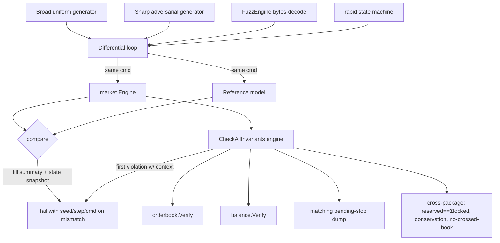

# feat: Invariant & Fuzz Test Harness

## Summary

Build the full §7 correctness harness from `docs/designs/invariant-fuzz-testing-guide.md` over the engine's existing v1 features: a differential reference model (oracle), a complete `CheckAllInvariants` checked after every command, Go native fuzz plus a `rapid` state-machine layer, a permanent regression corpus, and recovery tests. Work is sequenced by the guide's Appendix impact order — conservation and reserved==Σlocked first, then overflow/FOK rollback, then the reference model as the umbrella, then fuzz/rapid/recovery/CI.

---

## Problem Frame

The engine moves money: one wrong fill or leaked unit is a real loss. The testing guide defines ~50 invariants and a three-layer defense (unit tables → invariant checks → differential oracle), but only the thinnest slice exists. `tests/property/invariants_test.go` checks non-negative balances (INV-BAL-01), per-asset conservation (INV-BAL-04), and no-crossed-book (INV-OB-01), and only every 200 commands — so a violation can't be pinned to the command that caused it. There is no reference model, so a wrong fill that still balances passes silently. Stop, Stop-Limit, Iceberg, Cancel, and Amend are never exercised by the generator. The guide's own Appendix calls the reference model "the umbrella that catches the rest" — its absence is the largest gap.

Research confirmed the engine surface this harness builds on: `Engine` exposes `Submit`, `Drain`, `Step`, `ApplyJournaled`, `EnableStops`, `Ledger()`, `Shard(m).Book()`, `MarketIDs()`, `Acks()`, `Seq()`. The WAL `Replay` already handles torn-tail, gaps, and corruption cleanly, and `Config.Journal` accepts a real `*wal.Writer`. Stops are held off-book with only `PendingStops() int` exposed, and `EnableStops()` is opt-in. There is no `Engine.Snapshot()/Restore()` — which scopes INV-DET-02 out (see Scope Boundaries).

---

## Requirements

Traceability to origin (`docs/brainstorms/2026-06-13-invariant-fuzz-harness-requirements.md`).

**Invariant infrastructure**
- R1. Each engine package exposes one `Verify() error` checking its own structural invariants, returning the first violation with context (origin R5).
- R2. A composite `CheckAllInvariants(engine)` implements every applicable §3 invariant and is invoked after every command in the differential and property loops, not at intervals (origin R4, R6, R7).

**Reference model & differential**
- R3. A reference model implements all eight order types plus Cancel and Amend-down with engine-matching semantics, validated against hand-written examples (origin R1, R2).
- R4. A differential loop runs engine and model on an identical stream, asserting fill-summary equality, state-snapshot equality, and `CheckAllInvariants` after each command, failing with seed + step + command (origin R3).

**Generators, fuzz, corpus**
- R5. A broad uniform generator and a sharp adversarial-biased generator, both pure functions of a seed with logged seeds, cover all eight order types plus Cancel and Amend-down (origin R8).
- R6. Every guide §6 adversarial scenario has an explicit hand-written seed test (origin R9).
- R7. A Go native `FuzzEngine` and a `rapid` state-machine test drive the differential loop with shrinking; fixed bugs add permanent regression seeds under `tests/property/testdata/fuzz/` (origin R10, R11).

**Determinism & recovery**
- R8. Determinism is asserted on the engine alone: same-seed byte-identical state and fill order by `(aggressorSeq, matchIndex)` (origin R12).
- R9. Recovery tests assert full-WAL-replay equivalence and torn-tail crash-consistency using a real `*wal.Writer` and `ApplyJournaled`; metamorphic properties (cancel-all, zero-reserved, subset-replay) hold (origin R13 partial, R14). Mid-stream snapshot equivalence (INV-DET-02) is deferred — see Scope Boundaries.

**Directed coverage**
- R10. Arithmetic invariants INV-ARI-01..06 and per-order-type semantics have directed unit tests covering positive, negative, and edge cases (origin R6, R7; positive/negative/edge per project convention).

**CI**
- R11. PR CI runs the differential loop, `rapid` defaults, and a short native-fuzz slice as a required gate; a separate nightly workflow runs long fuzz and soak, reported but non-blocking (origin Key Decision "CI runs short in PR, long at night").

---

## Key Technical Decisions

- **Oracle matches state + aggregated fill summary, not per-fill ordering.** Keeps the model slow-but-obviously-correct (sorted slices + maps) rather than a second engine. Exact fill ordering is verified separately on the engine alone via determinism (R8) (see origin Key Decisions).

- **`rapid` is a test-only dependency; production stays zero-dep.** `pgregory.net/rapid` (no transitive deps) is imported only from `_test.go`, so `go build ./cmd/engine` never links it. Provides automatic shrinking to a minimal reproducer (see origin Key Decisions).

- **Two generators share one oracle and one `CheckAllInvariants`.** Broad uniform feeds differential/determinism; sharp adversarial-biased hunts bugs by producing crossing-prone prices, near-empty balances, small-display icebergs, near-trigger stops, and cancel/amend of live orders (see origin Key Decisions).

- **Hybrid `Verify()` surface.** Each package self-checks its internals (orderbook: arena/free-list, FIFO links, idIndex; ledger: reserved consistency) behind one `Verify() error`; `tests/property` composes them plus the cross-package money invariants over `Dump()`. This is the only structure that lets the differential loop call structural checks after every command without leaking arena internals into the public API (see origin Key Decisions).

- **A pending-stop enumeration is added to complete INV-BAL-03.** Stops are off-book but hold reservations (INV-STP-06), so reserved==Σlocked must include them. The matcher gains a deterministic stop dump (account/side/price/qty). This extends the test surface; it is not a new engine feature.

- **INV-DET-02 deferred, not down-scoped silently.** Mid-stream snapshot+replay equivalence needs `Engine.Snapshot()/Restore()`, which does not exist and is a new engine feature the brainstorm excluded. Recovery this round covers INV-DET-01 (full replay) and INV-DET-03 (torn-tail), which the existing WAL fully supports.

---

## High-Level Technical Design

The harness is layered: generators feed identical command streams to the engine and the oracle; the differential loop compares their outputs and runs `CheckAllInvariants` (which composes each package's `Verify()`) after every command.



The recovery path is separate: a real `*wal.Writer` journals commands; recovery replays via `ApplyJournaled` into a fresh engine and asserts `digest(replayed) == digest(original)`, with a torn-tail variant that truncates the final segment bytes.

---

## Output Structure

```
internal/
  orderbook/verify.go         + verify_test.go
  balance/verify.go           + verify_test.go
  matching/stops.go           (add StopDump) ; stops_test.go extended
tests/
  refmodel/
    model.go                  reference oracle
    model_test.go             hand-written validation of the oracle
  property/
    invariants.go             CheckAllInvariants + cross-package checks
    generators.go             broad + sharp generators
    differential.go           differential loop
    differential_test.go      seed-driven differential runs
    adversarial_test.go       explicit §6 seeds
    determinism_test.go       same-seed + fill-order
    recovery_test.go          full-replay + torn-tail + metamorphic
    fuzz_test.go              FuzzEngine
    statemachine_test.go      rapid
    testdata/fuzz/            permanent regression corpus
.github/workflows/
  ci.yml                      (add short fuzz gate)
  nightly.yml                 (new: long fuzz + soak)
```

Per-unit `**Files:**` are authoritative; this tree is the expected shape.

---

## Implementation Units

Grouped in four phases by the Appendix impact order.

### Phase 1 — Invariant foundation

### U1. Per-package `Verify()` and pending-stop enumeration

- **Goal:** Expose each package's structural invariants behind a single `Verify() error`, and let stops be enumerated for balance reconciliation.
- **Requirements:** R1; supports R2.
- **Dependencies:** none.
- **Files:** `internal/orderbook/verify.go`, `internal/orderbook/verify_test.go`, `internal/balance/verify.go`, `internal/balance/verify_test.go`, `internal/matching/stops.go`, `internal/matching/stops_test.go`.
- **Approach:** `orderbook.Book.Verify()` checks INV-OB-02 (price ordering + best cache), OB-03 (FIFO link reciprocity, no cycles, traversal length == node count), OB-04 (level.totalQty == Σ display), OB-05 (every arena slot reachable XOR free-listed — no leak), OB-06 (idIndex == open set), OB-07 (ID uniqueness), OB-08 (time priority), OB-09 (0 < remaining ≤ original). `balance.Ledger.Verify()` checks INV-BAL-01 (non-negative) and reserved == Σ internal reservation records per (acct,asset). Add `matching.Engine.StopDump() []StopView` returning pending stops in deterministic Seq order (account, side, price, qty) so INV-BAL-03 can include off-book reservations.
- **Patterns to follow:** mirror the deterministic, allocation-conscious style of `internal/orderbook/dump.go` and `internal/balance/dump.go`; return first violation with context like the guide §4.3.
- **Test scenarios:**
  - Positive: a hand-built book with two price levels and FIFO chains passes `Verify()`; a ledger after reserve/settle passes.
  - Negative (inject via internal test helpers): corrupted `next/prev` link, an arena slot both reachable and free-listed, an idIndex entry for a removed order, a reserved total that disagrees with reservation records — each returns the matching INV-OB-*/INV-BAL-* error string.
  - Edge: empty book, single order, a level emptied to zero, an iceberg with hidden>0 (remaining counts hidden, display ≤ remaining).
  - `StopDump`: empty, one stop, many stops returned in Seq order; deterministic across runs.
- **Verification:** `go test ./internal/orderbook/ ./internal/balance/ ./internal/matching/` passes; each `Verify()` returns a specific error for each injected corruption.

### U2. `CheckAllInvariants` composite + cross-package money invariants

- **Goal:** One entry point the differential and property loops call after every command.
- **Requirements:** R2 (origin R4, R6, R7).
- **Dependencies:** U1.
- **Files:** `tests/property/invariants.go`, `tests/property/invariants_test.go` (extends the existing partial checker).
- **Approach:** `CheckAllInvariants(e *market.Engine, netDeposits map[AssetID]int64) error` calls `Book.Verify()` for each market and `Ledger.Verify()`, then asserts cross-package invariants over dumps: INV-BAL-03 (reserved == Σ locked over all open resting orders via `Book.Dump()` plus pending stops via `StopDump()` — buy locks `ceil(quote(price, remaining))`, sell locks `remaining`), INV-BAL-04 (Σ(available+reserved) + fees == netDeposits per asset, including the fee account), INV-OB-01 (no crossed book). Returns the first violation wrapped with its INV-ID.
- **Patterns to follow:** the existing `checkInvariants` / `digest` helpers in `tests/property/invariants_test.go`; reuse `types.Notional` for locked-quote math so reservation rounding matches the ledger.
- **Test scenarios:**
  - Positive: after a deposit prelude and a mix of resting + filled + pending-stop orders, `CheckAllInvariants` passes.
  - Negative: a deliberately mismatched netDeposits map trips INV-BAL-04; a hand-forced reserved/locked mismatch trips INV-BAL-03.
  - Edge: zero orders (only deposits), all orders cancelled (reserved back to 0, INV-MET-02), iceberg with hidden reserve included in locked.
- **Verification:** `go test ./tests/property/` green; the checker localizes a forced violation to the correct INV-ID.

### Phase 2 — Oracle & differential

### U3. Reference model (oracle)

- **Goal:** A slow-but-obviously-correct model producing per-command state + aggregated fill summary for all order types.
- **Requirements:** R3 (origin R1, R2).
- **Dependencies:** none (uses `internal/types` only).
- **Files:** `tests/refmodel/model.go`, `tests/refmodel/model_test.go`.
- **Approach:** `Apply(cmd types.Command) FillSummary` and `Snapshot() State` over sorted-slice books + map ledger. Model the engine's policies exactly: price-time matching at maker price, FOK all-or-nothing with pre-check before any mutation, Post-Only reject-on-cross (no state change), IOC/Market never rest with remainder cancelled, Iceberg display/hidden with replenish queued at the back of the level, Stop/Stop-Limit trigger on last-trade movement re-injected as new orders, self-trade prevention cancelling the aggressor remainder, and market-buy `MaxQuote` spend cap. `FillSummary` aggregates filled qty per order and fee per asset (not per-fill ordering). `State` mirrors the canonical shapes of `BalDump` + `RestingDump` for direct comparison.
- **Patterns to follow:** semantics defined in `internal/matching/match.go` and `stops.go`; reservation/settlement rounding in `internal/balance/ledger.go` and `internal/types/money.go` (reserve ceil, settle floor).
- **Test scenarios (R2 — validate the oracle itself):**
  - Positive: hand-written examples per order type with known outcomes (a crossing limit fills at maker price; an iceberg replenishes and loses priority; a stop triggers and re-injects).
  - Negative: FOK one-unit-short returns zero fills and unchanged snapshot; post-only crossing returns rejected with unchanged snapshot.
  - Edge: empty opposite book (market/IOC zero fills), exact-fit balance, self-trade prevention pair.
- **Verification:** `go test ./tests/refmodel/` green; every hand-written example matches the documented expected outcome.

### U4. Differential loop + two generators

- **Goal:** Drive engine and oracle on identical streams and compare every step.
- **Requirements:** R4, R5 (origin R3, R8).
- **Dependencies:** U2, U3.
- **Files:** `tests/property/generators.go`, `tests/property/differential.go`, `tests/property/differential_test.go`.
- **Approach:** Two pure-of-seed generators producing a deposit prelude + command stream over all eight order types plus Cancel and Amend-down. The broad generator is uniform over wide ranges; the sharp generator biases toward interesting states (prices clustered at mid so orders cross, balances near depletion, small display icebergs, stops near trigger, cancel/amend targeting live order IDs). `runDifferential(t, seed, steps)` applies each command to both, compares `FillSummary` and `Snapshot`, and runs `CheckAllInvariants`, failing with seed/step/command on any mismatch. The harness calls `EnableStops()` so Stop/Stop-Limit are exercised.
- **Patterns to follow:** existing `genStream` and seed/`Drain` flow in `tests/property/invariants_test.go`; keep generators free of wall-clock and map-iteration-order leakage (seeded PRNG only).
- **Test scenarios:**
  - Positive: broad generator over several fixed seeds × thousands of steps passes the differential loop.
  - Negative/edge: sharp generator over several seeds with high cross/cancel/stop density passes; a deliberately broken oracle clone is detected by the loop (guards loop sensitivity).
  - Determinism of generators: same seed → identical stream.
- **Verification:** `go test ./tests/property/ -run Differential` green; loop reports seed/step on a forced divergence.

### Phase 3 — Fuzz, corpus, determinism

### U5. Directed arithmetic & per-order-type tests

- **Goal:** Cover invariants fuzz shouldn't be relied on to find.
- **Requirements:** R10 (origin R7).
- **Dependencies:** U2.
- **Files:** `internal/types/money_test.go` (extend), `internal/matching/match_test.go` and `internal/matching/stops_test.go` (extend).
- **Approach:** Directed tables for INV-ARI-01 (no overflow near int64 max), ARI-02 (reservation ceil), ARI-03 (settlement floor ≤ reserved), ARI-04 (rounding residue accounted), ARI-05 (scale consistency), ARI-06 (remaining monotonic non-increasing). Per-order-type tables (GTC/IOC/FOK/Market/Post-Only/Iceberg/Stop/Stop-Limit/Cancel/Amend-down) with explicit positive/negative/edge rows.
- **Patterns to follow:** existing `internal/types/money_test.go` and `internal/matching/match_test.go` table style.
- **Test scenarios:**
  - Positive: representative valid inputs produce exact expected results per type.
  - Negative: overflow inputs rejected (`ReasonOverflow`); FOK-unfillable rejected with no mutation; post-only cross rejected; cancel of unknown id is a no-op.
  - Edge: int64-max neighborhood, inexact `quote()` both rounding directions, exact-fit and one-unit-short balances, empty opposite book, iceberg replenish boundary.
- **Verification:** `go test ./internal/types/ ./internal/matching/` green; coverage spans all three categories per suite.

### U6. Native fuzz, rapid state machine, adversarial seeds & corpus

- **Goal:** Coverage-guided and structured property testing with shrinking and a permanent regression corpus.
- **Requirements:** R6, R7 (origin R9, R10, R11).
- **Dependencies:** U3, U4.
- **Files:** `go.mod` (add `pgregory.net/rapid`, test-only), `tests/property/fuzz_test.go`, `tests/property/statemachine_test.go`, `tests/property/adversarial_test.go`, `tests/property/testdata/fuzz/` (corpus dir with seed inputs).
- **Approach:** `FuzzEngine` decodes `[]byte` into a command stream (tolerating malformed bytes) and runs the differential loop. The `rapid` state machine drives new-order/cancel/amend/deposit actions with `CheckAllInvariants` every step and automatic shrinking. `adversarial_test.go` encodes one explicit seed per guide §6 row (exact-fit balance, one-unit-short, joint-over-balance, cross-market same account, int64-max price/qty, inexact rounding, FOK one-short rollback, post-only exact-touch, iceberg replenish priority loss, immediate-trigger stop, one trade triggering many stops, stop-triggers-stop, thousands same-price, cancel unknown/filled/cancelled, empty opposite book). Establish the convention that every fixed bug drops its failing input into `testdata/fuzz/` permanently.
- **Patterns to follow:** guide §4.4 (`FuzzEngine`) and §4.5 (`rapid`) sketches; reuse U4's `runDifferential`.
- **Test scenarios:**
  - Positive: `go test -run FuzzEngine` (corpus replay) and the `rapid` check pass on a clean engine.
  - Negative/edge: each §6 seed exercises its target invariant and passes; malformed fuzz bytes decode without panic.
  - Regression: a seeded sample corpus input under `testdata/fuzz/` runs and passes.
- **Verification:** `go test ./tests/property/` green including `rapid`; `go test -run '^$' -fuzz=FuzzEngine -fuzztime=10s ./tests/property/` runs without failures; `go build ./cmd/engine` does not link `rapid`.

### U7. Determinism assertions

- **Goal:** Lock determinism on the engine itself, including exact fill ordering the oracle doesn't model.
- **Requirements:** R8 (origin R12).
- **Dependencies:** U4.
- **Files:** `tests/property/determinism_test.go`.
- **Approach:** Two runs of the same seed produce byte-identical `digest` (INV-DET-01). Assert fill order is deterministic by `(aggressorSeq, matchIndex)` (INV-DET-04, INV-MAT-08) by collecting fills via `Acks()`/fill capture across two runs and comparing the exact sequence.
- **Patterns to follow:** existing `TestSameSeedProducesIdenticalState` and `digest` in `tests/property/invariants_test.go`.
- **Test scenarios:**
  - Positive: same seed twice → identical digest and identical fill order.
  - Negative: different seeds diverge (sensitivity guard, mirrors existing `TestDifferentSeedsDiverge`).
  - Edge: a stop-heavy stream still produces identical re-injection ordering across runs.
- **Verification:** `go test ./tests/property/ -run Determinism` green.

### Phase 4 — Recovery & CI

### U8. Recovery: full-replay, torn-tail, metamorphic

- **Goal:** Prove the journaled path recovers exactly, and metamorphic properties hold.
- **Requirements:** R9 (origin R13 partial, R14).
- **Dependencies:** U2, U4.
- **Files:** `tests/property/recovery_test.go`.
- **Approach:** Run a stream through an engine whose `Config.Journal` is a real `*wal.Writer` (temp dir). Replay the WAL into a fresh engine via `wal.Replay` + `Engine.ApplyJournaled`, assert `digest(replayed) == digest(original)` and `CheckAllInvariants` (INV-DET-01 journaled). Torn-tail (INV-DET-03): truncate the final segment's last bytes, replay, assert it stops cleanly and the rebuilt state satisfies all invariants. Metamorphic: cancel-all returns each account to net-deposit ± realized (INV-MET-01), an account with no open orders has zero reserved (INV-MET-02), subset-replay equals full replay (INV-MET-04).
- **Patterns to follow:** `wal.Replay` torn-tail/gap semantics in `internal/wal/replay.go`; `Engine.ApplyJournaled` and the `Config.Journal` seam in `internal/market/engine.go`.
- **Test scenarios:**
  - Positive: full WAL replay reproduces the original digest.
  - Negative/edge: torn final record → clean stop + valid invariants; a mid-log byte corruption is detected as corrupt (not silently accepted).
  - Metamorphic: cancel-all zeroes reserved; subset-replay equals full replay.
- **Verification:** `go test ./tests/property/ -run Recovery` green.

### U9. CI wiring — PR gate + nightly soak

- **Goal:** Run short in PR, long at night.
- **Requirements:** R11.
- **Dependencies:** U4, U6, U7, U8 (targets must exist).
- **Files:** `.github/workflows/ci.yml` (add a fuzz step), `.github/workflows/nightly.yml` (new).
- **Approach:** Add a required PR step running the differential loop, the `rapid` default check, and a short `-fuzztime` slice per fuzz target. Add a scheduled nightly workflow running a long `-fuzztime` and a soak (extended differential step count), reported but not blocking PRs.
- **Patterns to follow:** the existing job shape in `.github/workflows/ci.yml` (lint/test/race/bench).
- **Test scenarios:** `Test expectation: none -- CI configuration; validated by the workflow running green on the existing test targets.`
- **Verification:** PR workflow runs the new gate and passes; nightly workflow is scheduled and runs the long targets.

---

## Scope Boundaries

**Carried from origin (`Outside this round`):**
- Tick/lot rejection (INV-ARI-07) — N/A in v1; the engine has no tick/lot validation.
- ClientReqID idempotency (INV-IDM-01/02) — N/A in v1; `ClientReqID` is unused by engine logic; deferred with failover.
- Amend-up / price-change (INV-AMD-02) — N/A; only amend-down exists in the engine surface.
- Implementing new engine features generally — out of scope; this round builds the harness over existing behavior.

### Deferred to Follow-Up Work
- **Mid-stream snapshot + replay equivalence (INV-DET-02).** Requires `Engine.Snapshot()/Restore()` (serialize ledger + every book to sections, rebuild from them), which does not exist and is a new engine feature. Land it as a separate plan when snapshot/restore is built; U8 already covers full-WAL-replay and torn-tail recovery.

---

## Risks & Dependencies

- **Oracle drift.** The reference model (U3) must match engine policies (FOK rollback, iceberg replenish, STP, market-buy cap) or the differential loop produces false positives. Mitigation: R2 hand-written validation of the oracle before it gates anything; keep the model semantics-only (no perf tricks).
- **`CheckAllInvariants` cost.** O(open-orders) per command → O(n²) per run. Accepted: differential/`rapid` streams are bounded (hundreds–low thousands). Long soak uses bounded streams too.
- **First third-party dependency.** Adding `pgregory.net/rapid` introduces the repo's first `go.mod` dependency (test-only). It has no transitive deps and never links into the production binary; CI zero-alloc and lint gates are unaffected.
- **Stop reservation reconciliation.** INV-BAL-03 completeness depends on the U1 `StopDump`; if a stop's reservation shape differs from a resting order's, the locked-amount computation in U2 must account for it (stops hold their reservation from acceptance, INV-STP-06).

---

## Sources & Research

- `docs/designs/invariant-fuzz-testing-guide.md` — §3 invariant taxonomy, §4 harness design, §6 adversarial scenarios, §7 checklist, Appendix priority order.
- `docs/brainstorms/2026-06-13-invariant-fuzz-harness-requirements.md` — origin requirements doc.
- `tests/property/invariants_test.go` — existing harness (`genStream`, `digest`, partial `checkInvariants`) extended by U2/U4/U7.
- `internal/wal/replay.go`, `internal/wal/snapshot.go`, `internal/wal/record.go` — `Replay` torn-tail/gap/corrupt handling; generic snapshot section helpers (no engine-level snapshot/restore).
- `internal/market/engine.go` — `Config.Journal`, `ApplyJournaled`, `EnableStops`, public accessors used by the harness.
- `internal/matching/match.go`, `internal/matching/stops.go` — `Result` fields (`STP`, `Rejected`, `Reason`, `Pending`), off-book stop table, `PendingStops()`.
- `internal/balance/ledger.go`, `internal/balance/dump.go` — reservation lifecycle (`Reserve`/`Settle`/`Release`/`AmendReduce`/`OrderBudget`), `Dump()` shapes.
- `internal/orderbook/dump.go` — `RestingDump` canonical view used for state comparison.
- No `docs/solutions/` or `AGENTS.md` present — no institutional learnings or extra standards to honor.
