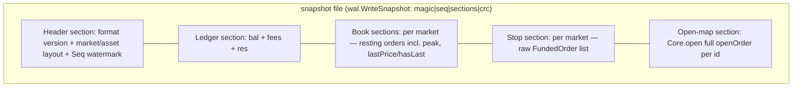
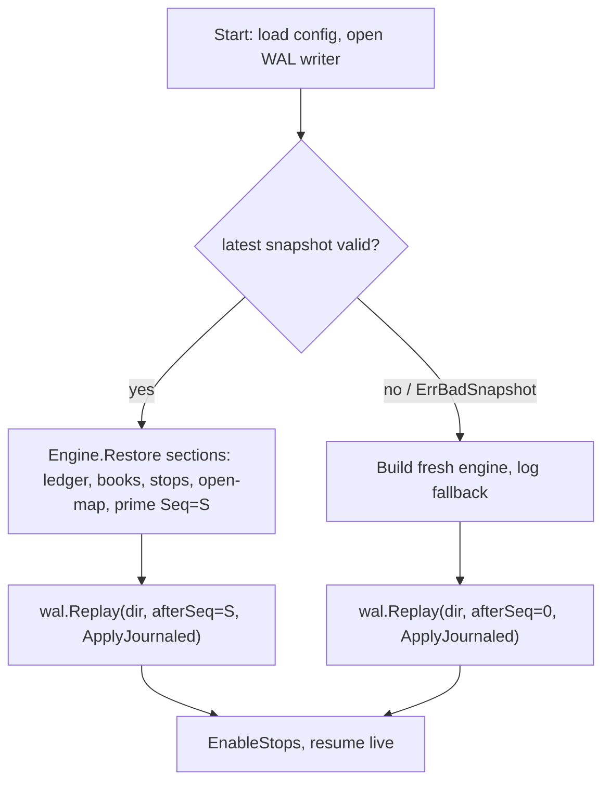

# feat: Engine Snapshot/Restore + INV-DET-02

## Summary

Build a production-grade `Engine.Snapshot()` / `Engine.Restore()` for the spot
engine: capture the complete resumable state at a `Seq` watermark, and on restart
load the latest snapshot then replay only the WAL tail (`Seq > S`). Each state
component (ledger incl. reservations, order books, matching stop table,
`Core.open` map, sequencer watermark) serializes its own section and restores via
a direct constructor — no replay through the matching path. The full lifecycle
ships: snapshot cadence, snapshot-file retention/GC, and a corrupt-snapshot
fallback to full replay from `Seq` 0. INV-DET-02 (snapshot+tail-replay ≡ full
replay) lands as the proof, after the canonical state digest is extended to cover
the components it currently omits.

---

## Problem Frame

Recovery today is full WAL replay from `Seq` 0 (`internal/wal/replay.go`,
exercised by `tests/property/recovery_test.go`). Correct, but restart cost grows
linearly with command history. The design always intended `WAL + snapshot +
replay` (design §6.4–6.5) to bound this; only the byte-level container exists
(`internal/wal/snapshot.go`: `WriteSnapshot`/`ReadSnapshot` over
`(seq, [][]byte sections)`). Nothing produces sections from live state and
nothing restores them, so INV-DET-02 is deferred, not down-scoped
(`docs/plans/2026-06-13-002-feat-invariant-fuzz-harness-plan.md:67`;
`tests/CLAUDE.md:59`). The engine therefore carries an untested corner of its
determinism contract — exactly what the testing guide forbids shipping.

Research confirmed the work is larger than "serialize the books": several state
components cannot be reconstructed indirectly. The sequencer has no watermark
setter; the ledger's per-order `res` map is written only by `Reserve` (which also
mutates balances, so it can't be replayed cleanly); `RestingDump` is lossy on
iceberg `peak`; and `Core.open` can't be rebuilt from the book because the book
stores resting `typ` as `Limit`, losing the Stop/StopLimit distinction `amend`
needs. These drive the serialize-direct approach and the per-component units
below.

---

## Key Technical Decisions

- KTD1. **Serialize-direct reconstruction, not replay-through-`Submit`.** Each
  component captures its own state and is rebuilt by a direct constructor. The
  forcing constraint is the ledger: `balance.Reserve` derives the reserved amount
  *and* mutates `bal`, so replaying reservations would double-count balances
  (`internal/balance/ledger.go:110`). Direct restore also keeps reconstruction
  off the matching path entirely, which is cleaner and deterministic.
  `Book.Insert` (`internal/orderbook/book.go:127`) is already a pure
  rest-without-matching primitive, so book restore needs no new matching code.

- KTD2. **Logical reconstruction reproduces byte-identical canonical state.**
  `Book.Dump()` is layout-independent and emits FIFO head→tail; `Book.Insert`
  appends at the level tail. Re-inserting in Dump order therefore rebuilds
  identical time priority (`internal/orderbook/dump.go:19`,
  `internal/orderbook/book.go:138`). No arena/free-list byte serialization.

- KTD3. **The completeness contract is the correctness surface.** A faithful
  snapshot section set must carry, beyond books+ledger: the matcher **stop
  table** (raw `FundedOrder` per pending stop, incl. `Seq` for activation
  ordering), `Core.open` (full `openOrder` per id), iceberg **`peak`** (not
  derivable after a partial refill), the book's **`lastPrice`/`hasLast`** (read
  by stop triggers), and the **`Seq` watermark**. Each is its own unit so each
  gets its own tests.

- KTD4. **Extend the canonical digest (R13) before trusting INV-DET-02.** The
  equality oracle `engineState(e).Canonical()` covers only balances, fees, and
  resting orders (`tests/property/differential.go:22`, `tests/refmodel/state.go`).
  Two engines could digest-equal while differing in pending stops, open-map, or
  iceberg `peak`. INV-DET-02 is meaningful only after the digest is extended to
  include them. Without KTD4, the test passes hollow.

- KTD5. **WAL is full history; corrupt snapshot → full replay from `Seq` 0.**
  Snapshots are a pure restart-speed optimization. WAL segments are kept from
  `Seq` 0 (never GC'd in v1), so the fallback is always reachable. Only
  *snapshot files* are GC'd (keep last K). (see origin: Key Decisions)

- KTD6. **Snapshot is a versioned durability contract, taken at a command
  boundary.** Capture only after `Drain` (quiesced, serial v1 topology), encode
  deterministically with a format version, and publish (rename into place) only
  after the WAL is durable through `S` — so recovery never finds a snapshot ahead
  of the WAL tail (`internal/wal/snapshot.go:21`).

- KTD7. **Sequencer watermark must be primed on restore.** `ApplyJournaled`
  bypasses sequencing and never advances the counter, so tail replay alone leaves
  the sequencer at 0. Restore sets the counter to the snapshot watermark via a new
  `sequencer` setter; tail replay then continues contiguously
  (`internal/sequencer/sequencer.go:46`).

---

## High-Level Technical Design

Snapshot file = the existing `wal` container wrapping ordered, versioned
sections. Each owning package encodes/decodes its own section (respecting the
`types ← orderbook ← matching ← market` layering; `balance`/`sequencer`/`wal`
wired by `market`).

Restart recovery sequence (`cmd/engine`):

Reconstruction is direct: `balance.Restore` sets maps without `Reserve`; a
four-field book restore primitive re-rests in Dump order (FIFO); stops injected
directly into each shard's matching engine; `Core.open` rebuilt from its section;
sequencer counter primed to `S`.

---

## Implementation Units

Grouped into three phases. Build order is U1 → U5 (seams + per-component
serialize/restore), then U6 → U8 (assembly + determinism proof), then U9 → U11
(lifecycle + restart wiring).

### Phase 1 — State seams and per-component serialize/restore

### U1. Sequencer watermark setter

- **Goal:** Prime the sequencer counter to the snapshot watermark so post-restore
  commands continue contiguously, and expose a WAL durability seam so snapshots
  publish only after the WAL is durable through `S`.
- **Requirements:** R3, R5, R6.
- **Dependencies:** none.
- **Files:** `internal/sequencer/sequencer.go`, `internal/sequencer/sequencer_test.go`,
  `internal/market/engine.go` (thin `Engine` accessors).
- **Approach:** Add an exported setter (e.g. `SetSeq(types.Seq)`) on
  `*Sequencer` that assigns the unexported counter, plus a `market.Engine` method
  to reach it during restore. Guard against misuse: only valid before live
  stepping resumes. No change to `Step`/`Seq` semantics. **Also add a durability
  seam:** today the engine holds its journal only as `sequencer.Journal` (`Append`
  only) and cannot reach `wal.Writer.Sync()` (`internal/wal/wal.go:88`), so KTD6's
  "publish only after WAL durable through `S`" cannot be enforced. Add `Sync()
  error` to the `Journal` interface (or hand `Engine.Snapshot` a flush func) and a
  `market.Engine` method that flushes — group-commit means `Append` alone is not
  yet durable.
- **Patterns to follow:** existing `Seq()` getter at `internal/sequencer/sequencer.go:73`;
  `internal/wal/wal.go:88` (`Writer.Sync`).
- **Test scenarios:**
  - Happy path: `SetSeq(S)` then `Seq()` returns S; the next sequenced command
    receives `S+1`.
  - Edge: `SetSeq(0)` on a fresh sequencer is a no-op-equivalent (counter stays 0).
  - Edge: setting to a value then stepping preserves contiguity across the boundary.
  - Happy path: after `Append` + the new `Sync()`, records are durable on disk
    (re-open/replay sees them) — the flush seam actually flushes.
- **Verification:** sequencer reports the primed watermark and subsequent
  `Step()` continues from `S+1`; the durability seam flushes appended records.

### U2. Ledger snapshot section + direct restore

- **Goal:** Serialize and rebuild the full ledger state — `bal`, `fees`, and the
  per-order `res` map — without invoking `Reserve`.
- **Requirements:** R1, R5; advances completeness contract (KTD3).
- **Dependencies:** none.
- **Files:** `internal/balance/snapshot.go` (new), `internal/balance/snapshot_test.go`
  (new), `internal/balance/ledger.go` (reservation dump accessor).
- **Approach:** Add a reservation dump (acct, asset, remaining, side per
  `OrderID`) that serializes the `res` map **verbatim by key-set** — every entry
  including `remaining == 0`. A fully-settled-but-unreleased order keeps a
  zero-remaining `res` entry (`Settle` decrements in place; only `Release`
  deletes, `internal/balance/ledger.go:178,251`); `Dump()`'s zero-filtering must
  NOT be applied to `res`, or restore orphans the reservation and a later
  `Release` fails silently — invisible to `Verify()`. Encode a ledger section
  (count-prefixed `bal`, `fees`, `res` records, little-endian). Add a
  package-internal `Restore(cfg, bals, fees, reservations)` constructor that sets
  the three maps directly — it must NOT call `Reserve` (which co-mutates `bal`).
  Restore reads `remaining` / `Reserved` as **opaque int64s carried from the
  snapshot**; it never recomputes them from price×qty via `Notional`/`Fee`
  (reserve rounds up — recomputing would drift vs the stored value, and
  `AmendReduce` post-restore recomputes against it). Decode rebuilds via that
  constructor.
- **Patterns to follow:** `internal/balance/dump.go` ordering discipline (sorted,
  deterministic); count-prefix framing from `internal/wal/snapshot.go:42`;
  little-endian style from `internal/wal/record.go:35`.
- **Test scenarios:**
  - Happy path: ledger with deposits + active reservations + accrued fees →
    encode → decode → `Verify()` passes and `Dump()` matches the original.
  - Covers ledger half of AE3. Edge: a restored ledger satisfies `Σ res.remaining
    == bal.Reserved` per (acct,asset) — i.e. `Verify()` holds exactly
    (`internal/balance/verify.go:24`).
  - Edge: empty ledger (no balances, no reservations) round-trips to empty.
  - Edge: a fully-settled-but-unreleased order (`res.remaining == 0`) round-trips
    by key-set, and a later `Release`/cancel for it succeeds (not orphaned).
  - Edge: snapshot after an `AmendReduce`, restore, then amend again → the
    resulting `remaining` is byte-identical to full replay (no re-rounding drift).
  - Negative: a truncated/short ledger section is rejected cleanly (decode error),
    no partial map mutation.
- **Verification:** round-trip preserves `Dump()` output and `Verify()` passes;
  invariants INV-BAL-02/03/04 hold on the restored ledger.

### U3. Order book snapshot section + restore

- **Goal:** Serialize each book's resting orders (with the fields `RestingDump`
  drops) plus `lastPrice`/`hasLast`, and rebuild via FIFO re-insertion.
- **Requirements:** R1, R5, R8; iceberg fidelity (KTD3).
- **Dependencies:** none.
- **Files:** `internal/orderbook/snapshot.go` (new),
  `internal/orderbook/snapshot_test.go` (new), `internal/orderbook/book.go`
  (fuller dump accessor if needed).
- **Approach:** Add a snapshot dump carrying per resting order: `Side`, `Price`,
  `ID`, `Account`, `Tif`, `Flags`, and all four quantity fields — `remaining`,
  `display`, `hidden`, `peak`; plus the book's `lastPrice`/`hasLast`. `typ` is
  always `Limit` for resting orders, so it is not serialized. `Book.Insert` is
  **insufficient**: it accepts only `Qty`+`Display` and derives `hidden = Qty -
  display`, `peak = display` (`internal/orderbook/book.go:148`), but a mid-refill
  iceberg has four independent quantity fields that cannot be rebuilt from two
  inputs — restoring via `Insert` sets the next refill chunk to the
  partially-consumed `display`, not the original `peak`. Add a restore primitive
  (e.g. `Book.InsertRestored` or `Peak`/`Hidden` fields on `NewResting`) that sets
  all four fields directly, asserting `display + hidden == remaining`. Re-rest in
  Dump (FIFO head→tail) order, then restore `lastPrice`/`hasLast`.
- **Patterns to follow:** `internal/orderbook/dump.go:19` (FIFO order);
  `internal/orderbook/book.go:127` (`Insert` — the tail-append primitive to mirror);
  `internal/orderbook/consume.go:59` (refill semantics the restored `peak`/`hidden`
  must preserve).
- **Test scenarios:**
  - Happy path: a book with multiple price levels and FIFO queues → round-trip →
    `Dump()` identical, and time priority within each level preserved.
  - Edge: iceberg restored mid-chunk (`display` < `peak`, `hidden` > 0)
    reconstructs all four quantity fields; `display + hidden == remaining` holds
    and the next refill chunk equals the original `peak`, not the current
    `display`.
  - Edge: `lastPrice`/`hasLast` survive restore (a book that has traded vs one
    that never has).
  - Edge: empty book round-trips to empty; arena/free-list integrity (INV-OB-05)
    holds after restore.
  - Negative: truncated book section rejected cleanly; no partial insert.
- **Verification:** restored book digests identically and INV-OB-01/05 hold;
  iceberg refill chunk size matches pre-snapshot behavior.

### U4. Stop table snapshot section + restore

- **Goal:** Serialize each shard's pending Stop/StopLimit orders and rebuild them
  in the matching engine.
- **Requirements:** R1, R5; stop activation ordering (KTD3).
- **Dependencies:** none.
- **Files:** `internal/matching/snapshot.go` (new),
  `internal/matching/snapshot_test.go` (new), `internal/matching/stops.go`
  (fuller dump / restore accessor).
- **Approach:** `StopView` (`internal/matching/stops.go:34`) is lossy (missing
  `Tif`, `Flags`, `DisplayQty`, `MaxQuote`). Serialize the raw `FundedOrder` per
  pending stop instead. Decode injects them **directly** into the engine's `stops`
  slice (mirroring `addStop`, `internal/matching/stops.go:52`) — NOT via
  `Submit`/`Core.newOrder`, which would re-`Reserve` against the already-restored
  ledger (dup-guard reject) and re-touch `Core.open` (per KTD1). **Stop restore
  must make zero ledger calls.** Preserve originating `Seq` — `triggerStops` sorts
  by it for deterministic activation (`internal/matching/stops.go:86`).
- **Patterns to follow:** `internal/matching/stops.go:52` (`addStop` — the direct
  inject to mirror).
- **Test scenarios:**
  - Happy path: several pending stops across both sides → round-trip → identical
    `StopDump()` (incl. `Seq` order).
  - Covers AE2. Edge: after restore, driving the book to the trigger price
    activates the stop with the same activation `Seq` and resulting fills as full
    replay would (INV-STP-04 ordering preserved across a multi-stop trigger).
  - Edge: a stop whose `StopPrice` is already on the trigger side of the restored
    `lastPrice` (boundary `last == StopPrice`) activates with the same `Seq` as
    full replay — i.e. `Drain` left no crossable-untriggered stop, or restore
    handles it. (Guards the restore-vs-first-tail-command activation boundary.)
  - Edge: stop-market-buy retains `MaxQuote` so its budget reconstructs correctly.
  - Negative: stop restore makes zero ledger calls (no re-reservation).
  - Edge: empty stop table round-trips to empty.
  - Negative: truncated stop section rejected cleanly.
- **Verification:** restored stops trigger identically to full replay; activation
  ordering deterministic.

### U5. Open-map snapshot section + restore

- **Goal:** Serialize `Core.open` so post-restore cancel/amend release funds
  correctly for both resting orders and pending stops.
- **Requirements:** R1, R5; reservation lifecycle (KTD3).
- **Dependencies:** none.
- **Files:** `internal/market/snapshot.go` (new — open-map codec lives with the
  Core that owns it), `internal/market/snapshot_open_test.go` (new).
- **Approach:** Encode `Core.open` as one record per `OrderID` carrying the full
  `openOrder` (`market`, `account`, `side`, `ordType`, `price`, `qty`). It cannot
  be reconstructed from the book — the book stores resting `typ` as `Limit`,
  losing the Stop/StopLimit distinction `amend` needs
  (`internal/market/engine.go:16`, `:149`). Serialize in deterministic key order
  (sort by `OrderID`) so map iteration never leaks into bytes. Decode rebuilds the
  map directly.
- **Patterns to follow:** `internal/market/engine.go:128` / `:107` (how `open` is
  populated for resting vs pending-stop); deterministic-ordering discipline from
  `internal/balance/dump.go`.
- **Test scenarios:**
  - Happy path: open-map with resting-limit and pending-stop entries → round-trip
    → identical map.
  - Edge: deterministic byte output regardless of insertion order (encode twice
    from differently-ordered maps with the same contents → identical bytes).
  - Covers AE3. Integration (with U2): after restore, a `CmdCancel` for a restored
    resting order releases its reservation correctly (INV-BAL-03/07 hold).
  - Negative: truncated open-map section rejected cleanly.
- **Verification:** restored `open` drives correct cancel/amend release; no
  map-order nondeterminism in the bytes.

### Phase 2 — Assembly and determinism proof

### U6. Engine.Snapshot() / Restore() assembly

- **Goal:** Wire the per-component sections (U2–U5) and the watermark (U1) into a
  single versioned snapshot via the existing `wal` container, with capture at a
  command boundary.
- **Requirements:** R1, R2, R3, R4, R5, R6, R7, R8.
- **Dependencies:** U1, U2, U3, U4, U5.
- **Files:** `internal/market/snapshot.go` (extend), `internal/market/engine.go`
  (methods + internal accessors), `internal/market/snapshot_test.go` (new).
- **Approach:** Add a header section: format version, **market/asset layout AND
  the money-scale config the ledger integers were computed under (`QtyScale`,
  `FeeScale`, `MakerFee`, `TakerFee`, and the full asset list)**, and the `Seq`
  watermark. The serialized `bal`/`res`/`fees` are integers under the
  snapshot-time scales/rates, so a config change between snapshot and restart
  would silently mis-price every restored reservation and tail-replay fill —
  Restore rejects on ANY header mismatch → `ErrBadSnapshot` → fallback (U11).
  `Engine.Snapshot()` runs after `Drain` (R2), forces WAL durability through `S`
  via the U1 sync seam (R3 — group-commit means `Append` alone is not yet
  durable), gathers sections in a fixed order, and writes via `wal.WriteSnapshot`
  (R1). `Engine.Restore(seq, sections)` validates the header, rebuilds ledger →
  books → stops → open-map, primes the sequencer to `seq` via U1 (R5, KTD7), then
  runs a post-rebuild self-check (`ledger.Verify()` + book invariants) before
  returning (R8, U11). Restore runs with `SuppressStops` so tail replay does not
  re-trigger journaled stops. Deterministic encode (R4): identical logical state →
  identical bytes.
- **Patterns to follow:** `internal/wal/snapshot.go:24` (container);
  `internal/market/engine.go:289` (`Drain`), `:272` (`ApplyJournaled`), `:276`
  (`EnableStops`); `internal/balance/verify.go:24` (`Verify`).
- **Test scenarios:**
  - Happy path: snapshot a populated engine → fresh engine `Restore` → state-equal
    (extended digest, U7) to the original.
  - Edge: deterministic bytes — snapshot the same logical state twice → identical
    files.
  - Edge: unknown/older format version is rejected with a clear error (R4).
  - Edge: market-layout mismatch (config changed) is detected, not silently
    mis-restored.
  - Edge: money-scale/fee config mismatch (`QtyScale`/`FeeScale`/`MakerFee`/
    `TakerFee` or the asset list differs) is likewise rejected → `ErrBadSnapshot`.
  - Negative: a section decode failure aborts restore without leaving a
    half-built engine.
  - Edge: a snapshot taken immediately after a multi-stop activation cascade has a
    watermark equal to the last journaled `Seq` and an empty reinject ring (no
    in-flight activation captured) — quiescence holds (R-Risk7).
- **Verification:** restored engine equals snapshot-time engine under the extended
  digest; all INV-* hold immediately post-restore, before any tail replay (R8).

### U7. Extend canonical state equality (R13)

- **Goal:** Make the equality oracle cover every completeness-contract component
  so INV-DET-02 cannot pass hollow. The current digest covers only balances, fees,
  and resting orders, and only the *aggregate* `Reserved` per acct|asset — so two
  engines can digest-equal while diverging on per-order money state.
- **Requirements:** R13 (enables R12).
- **Dependencies:** U3, U4, U5 (reuses their dump surfaces).
- **Files:** `tests/refmodel/state.go`, `tests/property/differential.go`,
  `tests/refmodel/*_test.go` as needed.
- **Approach:** Extend `refmodel.State` with deterministic, sorted views for: the
  stop table; the open-map including **per-order `qty` and `ordType`** (amend
  branch selection depends on them, `internal/market/engine.go:149`); **per-order
  reservation `remaining`** (the current digest covers only aggregate `Reserved`,
  so a same-account self-trade with the same aggregate but a different per-order
  split is invisible yet drives live `OrderBudget`/`Release`/`AmendReduce`);
  iceberg **`peak`/`hidden`**; and the book's **`lastPrice`/`hasLast`**. Update
  `engineState()` to populate them; keep `Canonical()` layout-independent and
  sorted. Until per-order `res.remaining`, `open.qty`, and the U6 money-scale
  header are all covered, KTD4's "cannot pass hollow" is not yet true — these
  close it.
- **Patterns to follow:** `tests/property/differential.go:22`,
  `tests/refmodel/state.go` rendering and sort discipline.
- **Test scenarios:**
  - Sensitivity: two engines differing only in a pending stop now produce
    different `Canonical()` (previously equal).
  - Sensitivity: two engines differing only in iceberg `peak` (same `display`/
    `remaining`) now differ.
  - Sensitivity: identical aggregate `Reserved` but different per-order
    `res.remaining` split (same-account self-trade) now differ.
  - Sensitivity: two engines differing only in a restored `open.qty` now differ.
  - Regression: existing differential and determinism suites still pass with the
    extended digest.
- **Verification:** the digest distinguishes every completeness-contract component
  including per-order money fields; existing INV-DET-01/03 and differential tests
  stay green.

### U8. INV-DET-02 property test + Snapshot/Restore unit coverage

- **Goal:** Assert snapshot+tail-replay ≡ full replay over randomized streams, and
  cover Snapshot/Restore with positive/negative/edge units plus a regression seed.
- **Requirements:** R12, R14.
- **Dependencies:** U6, U7.
- **Files:** `tests/property/recovery_test.go` (extend),
  `tests/property/snapshot_test.go` (new if cleaner), `testdata/fuzz/` (regression
  seed).
- **Approach:** Mirror `TestRecoveryFullReplayEquivalence`
  (`tests/property/recovery_test.go:62`): journal a randomized N-command stream,
  snapshot at a mid-stream `Seq` S (0 < S < N), `Restore` into a fresh
  (`SuppressStops`) engine, then `wal.Replay(dir, S, …→ApplyJournaled)` for the
  tail, and assert state-equal (extended digest, U7) to a full replay of `[0, N]`.
  Log the PRNG seed for reproducibility. Add a permanent regression seed under
  `testdata/fuzz/` for any bug fixed during this work.
- **Execution note:** Start from the failing INV-DET-02 equivalence assertion,
  then make U2–U7 satisfy it.
- **Patterns to follow:** `tests/property/recovery_test.go` (`journalStream`,
  `replayInto`, `CheckAllInvariants`); deterministic logged-seed convention from
  `CLAUDE.md`.
- **Test scenarios:**
  - Covers AE1. Happy path: random stream, snapshot at random S → restore+tail ≡
    full replay `[0,N]` under the extended digest, across many seeds.
  - Edge: S = 1 (snapshot at the very first command) and S = N-1 (snapshot just
    before the tail).
  - Edge: stream containing pending stops at S, and an iceberg mid-refill at S
    (the two subtlest components).
  - Edge: snapshot at S where the WAL max `Seq ≤ S` (no tail) → restore alone ≡
    full replay.
  - Negative/regression: the captured regression seed reproduces and passes.
- **Verification:** INV-DET-02 holds across randomized seeds and edge `S`;
  `CheckAllInvariants` passes on the restored+replayed engine.

### Phase 3 — Lifecycle and restart wiring

### U9. Config surface for snapshots

- **Goal:** Add env-driven config for snapshot cadence (count- and time-based),
  retention, and path.
- **Requirements:** R9, R10.
- **Dependencies:** none.
- **Files:** `pkg/config/config.go`, `pkg/config/config_test.go`, `.env.example`.
- **Approach:** Add fields (e.g. `SnapshotEveryN int64`, `SnapshotIntervalSecs
  int64`, `SnapshotRetainK int64`, `SnapshotPath string`) wired in `Load` with
  `OB_SNAPSHOT_EVERY` / `OB_SNAPSHOT_INTERVAL` / `OB_SNAPSHOT_RETAIN` /
  `OB_SNAPSHOT_PATH` keys via the existing `envInt`/`getenv` helpers, defaults in
  `Default()` (`SnapshotPath` defaults to `./data/snapshots`, distinct from
  `WALPath` `./data/wal` so snapshot discovery and `wal.Replay`'s `*.wal` glob
  never scan each other's files; `SnapshotIntervalSecs` defaults to `3600` = 1h).
  `SnapshotEveryN` and `SnapshotIntervalSecs` are **independent triggers**;
  `0` disables that trigger so an operator can run purely count-based, purely
  time-based, or both. `Validate()` rules: K ≥ 1, non-empty path, and at least one
  of N / interval > 0 (both 0 = no automatic snapshots). Mirror the existing
  flat-config pattern.
- **Patterns to follow:** `pkg/config/config.go:28` (`Default`), `:46` (`Load`),
  `:85` (`Validate`).
- **Test scenarios:**
  - Happy path: env vars parsed into the right fields; defaults applied when unset
    (incl. `SnapshotIntervalSecs` = 3600).
  - Edge: `OB_SNAPSHOT_EVERY=0` with `OB_SNAPSHOT_INTERVAL=3600` is valid
    (time-only cadence); the reverse (`INTERVAL=0`, `EVERY=1000`) is valid too.
  - Negative: both `OB_SNAPSHOT_EVERY=0` and `OB_SNAPSHOT_INTERVAL=0`, or
    `OB_SNAPSHOT_RETAIN=0`, rejected by `Validate`.
  - Edge: unset `OB_SNAPSHOT_PATH` falls back to the `./data/snapshots` default,
    distinct from `WALPath`.
- **Verification:** config loads and validates the new fields; bad values rejected.

### U10. Snapshot cadence + retention/GC

- **Goal:** Trigger snapshots automatically — count-based, time-based, or both —
  and bound snapshot-file growth, while honoring the WAL-durability publish
  ordering.
- **Requirements:** R9, R10, R3.
- **Dependencies:** U6, U9.
- **Files:** `internal/market/snapshot.go` (cadence/retention helpers) or a new
  `internal/market/snapshotter.go`, `internal/market/snapshotter_test.go` (new).
- **Approach:** Drive `Engine.Snapshot()` when **either** trigger fires —
  `SnapshotEveryN` applied commands **or** the `SnapshotIntervalSecs` wall-clock
  interval has elapsed (whichever first) — plus a final snapshot on graceful
  shutdown (the §6.4 pause-and-snapshot, safe under single-writer). The cadence
  check lives in the engine's step driver (the run loop introduced in U11) and
  fires on the single sequencer goroutine: on a trigger it stops accepting ingress,
  `Drain`s to a quiesced boundary, then snapshots — so cadence never races the
  writer. (Build U11's run-loop scaffolding before this cadence integration.)
  **Determinism note:** the wall-clock interval check reads real time, but this is
  safe — the snapshot is a read-only capture that gets no `Seq`, is never journaled
  to the WAL, and does not touch matching/balance state, so it cannot leak
  wall-clock into deterministic state (unlike `ClockFunc`, which is captured per
  command at the sequencer). Inject the clock source so tests can drive the
  interval deterministically. Name snapshot files by `Seq` watermark; retention
  keeps the last K files and deletes older ones. Publish (rename into place) only
  after the WAL is durable through `S` via the U1 sync seam (R3, KTD6). WAL
  segments are never GC'd (KTD5).
- **Patterns to follow:** `internal/wal/snapshot.go:24` (atomic write+rename);
  `internal/market/engine.go:289` (`Drain` for the pause boundary).
- **Test scenarios:**
  - Happy path: after N commands a snapshot file appears at the right watermark;
    on shutdown a final snapshot is written.
  - Happy path: with the (injected) clock advanced past `SnapshotIntervalSecs` and
    no new command count threshold reached, a time-triggered snapshot still fires
    at the next command boundary.
  - Edge: time-only config (`SnapshotEveryN=0`) snapshots purely on the interval;
    count-only config (`SnapshotIntervalSecs=0`) never time-triggers.
  - Edge: with K retained, the K+1th snapshot deletes the oldest; exactly K files
    remain, newest watermarks kept.
  - Edge: a snapshot is published only after the WAL is durable through its
    watermark (no snapshot ahead of the WAL tail).
  - Negative: a write failure (e.g. bad path) surfaces an error and does not
    corrupt existing snapshots (tmp+rename leaves prior file intact).
- **Verification:** cadence and retention behave per config; published snapshots
  never lead the WAL.

### U11. Startup recovery wiring + corrupt-snapshot fallback

- **Goal:** Wire `cmd/engine` to load the latest valid snapshot, replay the WAL
  tail, and fall back to full replay from `Seq` 0 on a corrupt/missing snapshot.
- **Requirements:** R7, R11.
- **Dependencies:** U6, U9, U10.
- **Files:** `cmd/engine/main.go`, `cmd/engine/recovery.go` (new if it keeps
  `main` thin), `tests/integration/recovery_startup_test.go` (new).
- **Approach:** Replace the build-and-discard startup
  (`cmd/engine/main.go:19`, where `cfg.WALPath` is currently unused) with: open
  the WAL writer and pass as `market.Config.Journal`; find the latest snapshot in
  `SnapshotPath`; `wal.ReadSnapshot` → `Restore` (with `SuppressStops`). Treat a
  **logically-invalid-but-CRC-clean** snapshot as corrupt: after rebuild, Restore
  runs `ledger.Verify()` and book self-checks (`display + hidden == remaining`,
  INV-OB-01/05) and returns `ErrBadSnapshot` on failure (a future encoder bug can
  write a byte-valid, CRC-clean, logically-wrong snapshot; without this self-check
  the fallback never fires and the engine loads poisoned money state). On
  `ErrBadSnapshot`, header mismatch (U6), or no snapshot, build fresh and
  full-replay from 0, logging the fallback (R11); `wal.Replay(dir, afterSeq=S,
  …→ApplyJournaled)` for the tail; then `EnableStops` and resume live.
- **Prerequisite:** introduce the minimal `cmd/engine` run loop (ingress →
  `seq.Step`) and a signal-driven graceful-shutdown path — neither exists today
  (startup currently builds and discards the engine). "Resume live" and U10's
  shutdown-snapshot both depend on it; keep it minimal (v1 has no gateway) but
  build it here rather than assuming it.
- **Patterns to follow:** `tests/property/recovery_test.go:40` (`replayInto`
  template — swap `afterSeq=0` for the watermark); `internal/wal/replay.go:27`
  (`afterSeq` contract, returns nil when log max ≤ afterSeq);
  `internal/market/engine.go:276` (`EnableStops`); `internal/balance/verify.go:24`
  (`Verify`).
- **Test scenarios:**
  - Happy path: snapshot + WAL tail on disk → startup restores and replays the
    tail → state-equal to full replay; invariants hold.
  - Covers AE4. Negative: latest snapshot fails CRC (`ErrBadSnapshot`) → startup
    skips it, full-replays from 0, rebuilt state passes `CheckAllInvariants`, and
    the fallback is logged (not silent).
  - Edge: no snapshot present → full replay from 0 (unchanged behavior).
  - Edge: snapshot watermark ahead of / equal to WAL tail → restore alone, no
    tail applied.
  - Edge: market-layout or money-scale config mismatch between snapshot and config
    is detected and handled (fallback or refuse), not silently mis-restored.
  - Negative: a hand-crafted CRC-valid snapshot that violates `ledger.Verify()`
    (or book `display + hidden == remaining`) triggers the logged fallback, not a
    poisoned engine.
- **Verification:** restart produces state-equal results to full replay; both
  byte-corrupt and logically-corrupt snapshots trigger a logged fallback;
  `cfg.WALPath`/`SnapshotPath` are honored.

---

## Acceptance Examples (carried from origin)

- AE1. Mid-stream equivalence — covered by U8.
- AE2. Untriggered stop survives restore — covered by U4 (stop restore) + U8 (end
  to end).
- AE3. Reservation integrity after restore — covered by U2 + U5.
- AE4. Corrupt snapshot falls back — covered by U11.

---

## Scope Boundaries

In scope: full Snapshot/Restore, cadence, snapshot-file retention/GC,
corrupt-snapshot fallback, INV-DET-02, and the digest extension (R13), for the
serial v1 topology.

Out of scope (carried from origin):
- WAL truncation behind snapshots; walk-back-to-previous-snapshot fallback.
- Shadow / non-pausing snapshot.
- Parallel-topology snapshotting (`market.ParallelEngine`).

### Deferred to Follow-Up Work

- Tick/lot rejection and amend-up / price-change hardening (separate brainstorm).
- Seeding `docs/solutions/` via `/ce-compound` after this lands — the codec
  byte-layout contract, the canonical map-ordering decision, the
  reservation-reconstruction pitfall, and the iceberg-`peak` subtlety are all
  worth recording (the learnings base is currently empty).

---

## Risks & Dependencies

- R-Risk1. **Iceberg reconstruction** is the subtlest correctness point — an
  orderNode has four independent quantity fields (`remaining`/`display`/`hidden`/
  `peak`) but `Insert` derives two from two inputs, so a mid-refill iceberg can't
  round-trip through `Insert`. Mitigation: a four-field restore primitive (U3)
  asserting `display + hidden == remaining`, plus refill-chunk equality (U3, U8).
- R-Risk2. **Ledger `Verify()` is an exact cross-check** (`Σ res == reserved`);
  any drift in reservation reconstruction (e.g. re-rounding) fails it. Mitigation:
  serialize `res` contents directly and never re-derive via `Reserve` (KTD1, U2).
  Note CLAUDE.md: reservation rounds up, settlement rounds down — restore must not
  re-round.
- R-Risk3. **Map-order nondeterminism** leaking into snapshot bytes would break R4
  and INV-DET. Mitigation: every section encodes in sorted key order; U5/U6 assert
  byte-determinism.
- R-Risk4. **Sequencer priming** — forgetting to set the watermark (KTD7) yields a
  sequencer at 0 after restore, breaking contiguity for live operation. Mitigation:
  U1 + U6 restore step; integration coverage in U11.
- R-Risk5. **Config drift between snapshot and restart is silent money corruption.**
  `MarketID` is positional AND the ledger integers were computed under snapshot-time
  `QtyScale`/`FeeScale`/`MakerFee`/`TakerFee`. A changed scale/fee/asset-layout would
  mis-price every restored reservation and tail-replay fill, CRC-clean. Mitigation:
  serialize market/asset layout AND money-scale config in the header; reject any
  mismatch → fallback (U6, U11).
- R-Risk6. **A CRC-clean-but-logically-corrupt snapshot bypasses the fallback.**
  CRC/version/layout checks don't catch a byte-valid snapshot with inconsistent
  state (e.g. `Σ res ≠ Reserved`). Mitigation: Restore runs `ledger.Verify()` + book
  self-checks post-rebuild and hard-fails to `ErrBadSnapshot` → fallback (U6, U11),
  not just a test assertion.
- R-Risk7. **Quiescence after `Drain` must be proven, not assumed.** Stop activations
  are re-injected commands; a snapshot taken mid-cascade would capture un-journaled
  in-flight state the WAL tail re-derives (double-apply). Mitigation: `Snapshot()`
  asserts the reinject ring and ingress are empty and the watermark equals the last
  journaled `Seq` (U6); test snapshots taken immediately after a multi-stop cascade
  (U6, U8).
- Dependency: snapshot format becomes a durability contract — version it from day
  one (R4, KTD6); changing it later requires a version bump, like the WAL format.

---

## Sources & Research

- `internal/wal/snapshot.go:24` — `WriteSnapshot`/`ReadSnapshot` container +
  "publish only after WAL durable through S" invariant.
- `internal/wal/replay.go:27` — `Replay(dir, afterSeq, fn)`; tail-replay contract.
- `internal/market/engine.go:16,40,187,224,272,276,289,314` — `openOrder`,
  `Core.open`, `Engine`/`Config`, `NewEngine`, `ApplyJournaled`, `EnableStops`,
  `Drain`, `Seq`.
- `internal/sequencer/sequencer.go:46,73` — unexported counter, `Seq()` getter; no
  setter (U1).
- `internal/balance/ledger.go:50,110` — `Ledger` maps (`bal`/`fees`/`res`);
  `Reserve` co-mutates `bal` (KTD1). `internal/balance/verify.go:24` — `Verify()`
  cross-check. `internal/balance/dump.go:26` — `Dump()`.
- `internal/orderbook/book.go:58,127,138` — `Book`/`orderNode`, `Insert`
  rest-without-matching, FIFO tail append. `internal/orderbook/dump.go:19` —
  layout-independent FIFO dump. `internal/orderbook/consume.go:59` — iceberg
  refill.
- `internal/matching/match.go:27,86` & `stops.go:10,34,52,86` — per-shard `stops`,
  lossy `StopView`, `addStop`, `triggerStops` Seq-ordering.
- `internal/types/codec.go:12`, `internal/wal/record.go:35` — little-endian/CRC
  codec style to mirror.
- `pkg/config/config.go:16,28,46,85` — flat env config + `Default`/`Load`/`Validate`.
- `cmd/engine/main.go:19,47` — current build-and-discard startup; `WALPath` unused.
- `tests/property/differential.go:22`, `tests/refmodel/state.go`,
  `tests/property/recovery_test.go:16,40,62` — canonical digest + recovery test
  templates.
- `docs/designs/spot-orderbook-engine-design.md:293` (§6.4/6.5);
  `docs/designs/invariant-fuzz-testing-guide.md:156` (INV-DET-02);
  `docs/plans/2026-06-13-002-feat-invariant-fuzz-harness-plan.md:67` (deferral).
