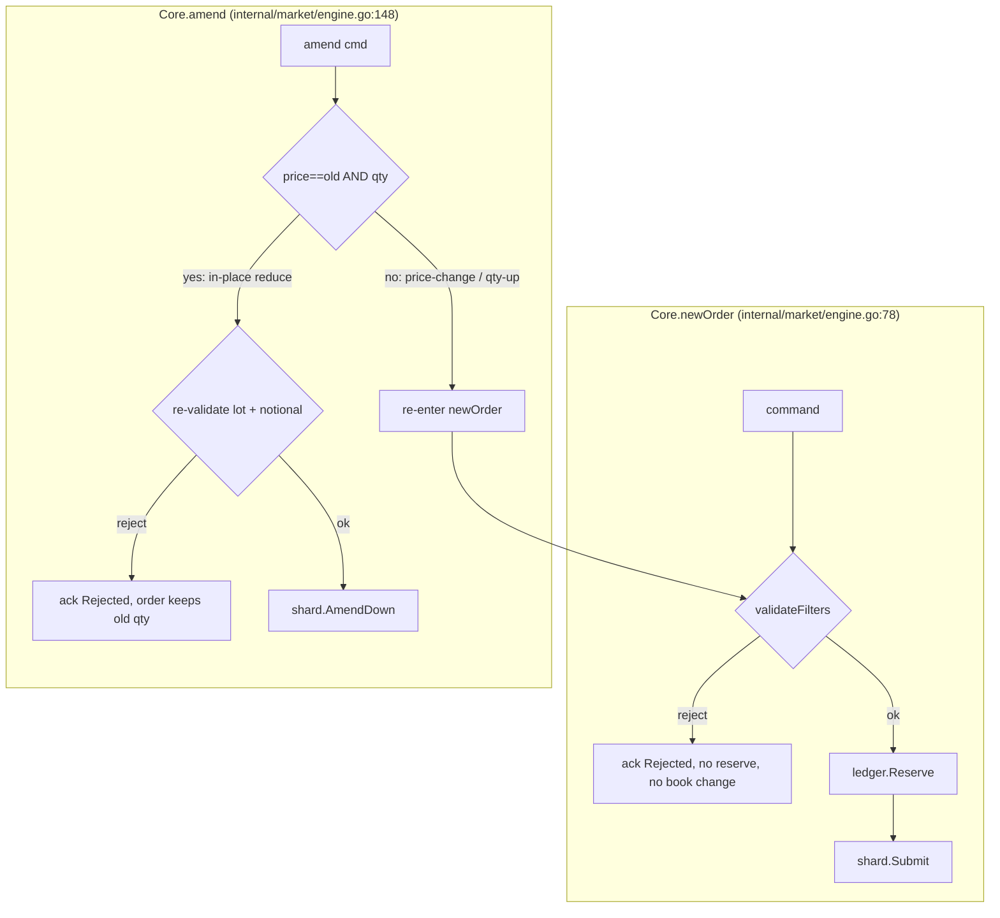

# feat: Per-Market CEX-Style Order Filters

## Summary

Add per-market order-validation filters matching a centralized exchange's
static symbol filters: price (`tickSize`, `minPrice`, `maxPrice`), lot
(`stepSize`, `minQty`, `maxQty`) with a separate market-order lot filter, and
`minNotional` / `maxNotional`. Orders are validated at submit time, before fund
reservation; violations are rejected with a per-group reason and zero state
mutation. Filters are mandatory per market, and a new invariant guarantees the
book never holds a filter-invalid resting order. Market-order notional reuses
the engine's existing per-market last-trade price as its reference.

---

## Problem Frame

The engine accepts any price/quantity expressible at the global `PriceScale` /
`QtyScale`. There is no price tick, lot step, minimum size, or minimum value —
`balance.MarketSpec` carries only base/quote assets (`internal/balance/ledger.go:24`),
and `types.RejectReason` has no filter values (`internal/types/types.go:164`).
Off-tick prices and dust orders rest cleanly on the book. Every real CEX rejects
these, and `tests/CLAUDE.md:70` currently lists tick/lot rejection
(`INV-ARI-07`) as explicitly out of scope for v1 — this plan reverses that. The
correctness contract already reserves the invariant: `INV-ARI-07 — Tick & lot`
in `docs/designs/invariant-fuzz-testing-guide.md:69`.

---

## Requirements Traceability

Carried from origin (`see origin: docs/brainstorms/2026-06-14-cex-order-filters-requirements.md`):

- R1–R3 (filter set, mandatory per-market config, startup-only) → U1.
- R4–R7 (validation rules, reject-no-mutation, pre-reserve) → U3.
- R8–R11 (order-type application: limit / market / stop / stop-limit / iceberg) → U3.
- R12 (last-trade reference price) → KTD1, U3 (reuses existing state — no new persistence).
- R13–R14 (amend inherits validation; amend-down re-validates) → U3, U4.
- R15 (resting-order filter invariant) → U6.
- R16 (determinism preserved; rejected commands journaled and re-reject) → KTD2, KTD5.
- R17 (reference-model parity, positive/negative/edge units, fuzz seeds) → U5, U6, U7.
- Key decision "reject reasons per filter group" → KTD4, U2.

---

## Key Technical Decisions

- **KTD1 — Reuse `Book.lastPrice` for market-order notional.** The per-market
  last-trade price already exists (`internal/orderbook/book.go:71`), is set on
  every fill (`internal/matching/match.go:170`), already snapshots/restores
  (`internal/orderbook/snapshot.go`), is already in the determinism fingerprint
  (`internal/market/snapshot.go`), and is already mirrored in the reference
  model (`tests/refmodel/model.go:107`). Market-order notional reads
  `Book.LastPrice()`; no new persisted state, no snapshot/restore change. This
  collapses the origin's "extend snapshot/restore" dependency.

- **KTD2 — Filter config is static, not snapshot state.** Filters are read once
  at startup (consistent with the config-is-startup-only rule) and reconstructed
  from the same config on restore, so replay stays byte-identical without
  serializing them. `FilterSpec` is defined once in `pkg/config` and is the
  single source the test harness derives both engine and model configs from, so
  the differential oracle cannot drift.

- **KTD3 — Validate before reserve; mirror the early-reject pattern.**
  Validation runs at the top of `Core.newOrder` before `c.ledger.Reserve`
  (`internal/market/engine.go:87`), returning a reject with no reservation and
  no book mutation — the same shape as the Post-Only early reject
  (`internal/matching/match.go:112`). Amend price-change / qty-increase re-enters
  `newOrder` and inherits validation; amend-down re-validates explicitly (U4).

- **KTD4 — Per-group reject reasons.** Add `ReasonPriceFilter`, `ReasonLotSize`,
  `ReasonMarketLotSize`, `ReasonNotional` to the `RejectReason` block
  (`internal/types/types.go:167`). No reason→string map exists in the repo;
  none is added.

- **KTD5 — Implement `INV-ARI-07`, broadened, with integer-only math.** The
  reserved invariant becomes "every resting order satisfies its market's static
  filters," asserted after every command in `CheckAllInvariants`
  (`tests/property/invariants.go:40`) against each resting order's `Remaining`
  (covers limit, iceberg, and resting stop-limit remainders; market orders never
  rest), plus display-qty validity for icebergs. All checks are integer
  fixed-point — no floats — and the submit-path validator stays allocation-free
  (benchmarks gate `internal/matching` / `internal/balance`). Notional uses the
  existing overflow-safe value multiply (`INV-ARI-01` / `INV-ARI-05`), never a
  naïve `price*qty`.

- **KTD6 — No-reference boundary is fail-open and mirrored.** When a market has
  no last trade (`hasLast == false`), the market-order notional check (both min
  and max) is skipped; only the market lot filter gates the order. Engine and
  model must apply this identically.

- **KTD7 — `maxNotional` applies to market orders symmetrically.** Resolves an
  origin deferred question: `maxNotional` gates market orders via the last-trade
  reference, same fail-open rule as `minNotional` (KTD6).

- **KTD8 — Per-market filter config, mandatory.** A per-market filter block is
  added to `Config` (`pkg/config/config.go:14`) with per-symbol env keys, parsed
  in `Load` and enforced in `Validate` (`pkg/config/config.go:111`): every
  `Markets` entry must supply a complete filter set; `tickSize`/`stepSize` > 0;
  `minPrice ≤ maxPrice`, `minQty ≤ maxQty`, `minNotional ≤ maxNotional`;
  `minPrice` aligned to `tickSize` and `minQty` aligned to `stepSize`. Startup
  fails loudly otherwise.

---

## High-Level Technical Design

Filter application by order type (the dispatch `validateFilters` implements):

| Order type | Price filter | Lot filter | Notional |
|---|---|---|---|
| Limit | limit price | `LOT_SIZE` | on `limitPrice × qty` |
| Market | — (no price) | `MARKET_LOT_SIZE` | via last-trade ref (fail-open) |
| Stop-limit | trigger **and** limit price | `LOT_SIZE` | on `limitPrice × qty` |
| Stop-market | trigger price | `MARKET_LOT_SIZE` | via last-trade ref (fail-open) |
| Iceberg | limit price | `LOT_SIZE` on total **and** display on-step + `≥ minQty` | on `limitPrice × total` |

Submit-path hook and the amend split:

*Directional guidance for reviewers — not implementation specification.*

---

## Implementation Units

### U1. FilterSpec type and mandatory per-market config

- **Goal:** Define the per-market filter shape and enforce it at startup.
- **Requirements:** R1, R2, R3; KTD8.
- **Dependencies:** none.
- **Files:** `pkg/config/config.go`, `pkg/config/config_test.go`, `.env.example`.
- **Approach:** Add a `FilterSpec` struct (price tick/min/max, lot step/min/max,
  market-lot step/min/max, min/max notional — all `int64` at the existing
  scales). Add a per-market filter collection to `Config` keyed by market
  symbol. Parse per-symbol env keys in `Load` following the `envInt`/`envUint`
  helpers (`pkg/config/config.go:155`); since all current keys are global, add a
  per-symbol key parser. Extend `Validate` (`pkg/config/config.go:111`) with the
  completeness and consistency checks in KTD8, returning `fmt.Errorf("config: ...")`
  in the existing style.
- **Patterns to follow:** existing `Validate()` market loop
  (`pkg/config/config.go:116`), `envInt`/`envUint` parse helpers.
- **Test scenarios:**
  - Positive: a config with complete, consistent filters for every market passes `Validate`.
  - Negative: missing filter block for a declared market → error naming the market.
  - Negative: `tickSize == 0` / `stepSize == 0` / negative value → error.
  - Edge: inverted bounds (`minPrice > maxPrice`, `minQty > maxQty`, `minNotional > maxNotional`) → error.
  - Edge: `minPrice` not a multiple of `tickSize`, `minQty` not a multiple of `stepSize` → error.
  - Edge: per-symbol env key parsing round-trips for a two-market config.
- **Verification:** `pkg/config` tests cover accept + each rejection; a market without a filter block cannot start the engine.

### U2. RejectReason constants and FilterSpec wiring into Core

- **Goal:** Make filter specs reachable at the validation point and add the
  reject reasons, without yet adding validation logic.
- **Requirements:** R7 (reasons), KTD4; threads R1 into the engine.
- **Dependencies:** U1.
- **Files:** `internal/types/types.go`, `internal/market/engine.go`,
  `cmd/engine/main.go`.
- **Approach:** Add `ReasonPriceFilter`, `ReasonLotSize`, `ReasonMarketLotSize`,
  `ReasonNotional` to the `RejectReason` block (`internal/types/types.go:167`).
  Add a `filters map[types.MarketID]config.FilterSpec` (or a local filter type to
  avoid an `internal → pkg` import cycle — decide at implementation; see Deferred)
  to `market.Config` (`internal/market/engine.go:197`) and to `Core`
  (`internal/market/engine.go:37`), populated in `NewEngine`
  (`internal/market/engine.go:226`). Extend the `pkg/config → market.Config`
  translation in `cmd/engine` to carry the filter map alongside the
  `MarketID → MarketSpec` build.
- **Patterns to follow:** how `market.Config.Markets` is threaded to shards and
  the ledger (`internal/market/engine.go:243`, `:270`).
- **Test scenarios:** `Test expectation: none -- pure plumbing + enum additions;
  behavior is exercised by U3.` (compile + existing suites stay green).
- **Verification:** `Core` holds the per-market filter map after `NewEngine`; no
  behavior change yet.

### U3. Submit-time filter validation in Core.newOrder

- **Goal:** Reject filter-violating orders before reservation, across all order
  types.
- **Requirements:** R4, R5, R6, R7, R8, R9, R10, R11, R12; KTD3, KTD5, KTD6, KTD7.
- **Dependencies:** U2.
- **Files:** `internal/market/engine.go`, `internal/market/engine_filter_test.go` (new).
- **Approach:** Add `validateFilters(cmd) types.RejectReason` and call it at the
  top of `newOrder` before `c.ledger.Reserve` (`internal/market/engine.go:87`);
  on a non-`ReasonNone` result, `ack` rejected and return with no reservation /
  no book mutation. Dispatch per the HTD table: price filter on the applicable
  price(s), the correct lot filter (limit vs market), notional via order price
  or `shard.Book().LastPrice()` for market/stop-market (fail-open when
  `!hasLast`), and iceberg display-qty validity. Use the existing overflow-safe
  value multiply for notional (KTD5). Keep the function allocation-free.
- **Patterns to follow:** Post-Only early reject (`internal/matching/match.go:112`);
  last-price read by stop triggering (`internal/matching/stops.go:62`).
- **Execution note:** Implement test-first — a failing per-order-type validation
  table before wiring the dispatch.
- **Test scenarios:**
  - Covers AE1. Off-tick limit price → `ReasonPriceFilter`, no reservation, no book change.
  - Covers AE2. Limit qty not a multiple of `stepSize` → `ReasonLotSize`.
  - Covers AE3. Limit `notional < minNotional` → `ReasonNotional`.
  - Covers AE4 (boundary). Order at exactly `minNotional` and exactly `maxQty` with all else valid → accepted.
  - Covers AE5. Market order on a never-traded market → notional skipped, accepted when lot-valid.
  - Covers AE6. Market order with last-trade ref where reference notional `< minNotional` → `ReasonNotional`.
  - Covers AE7. Stop-limit with off-tick trigger but on-tick limit → rejected.
  - Covers AE8. Iceberg with valid total but `displayQty < minQty` → rejected.
  - Market order qty below `MARKET_LOT_SIZE` `minQty` → `ReasonMarketLotSize`.
  - Market order with reference notional `> maxNotional` → `ReasonNotional` (KTD7); same order on never-traded market → accepted (fail-open).
  - Edge: price/qty at `int64`-overflow neighborhood for notional → no overflow, correct verdict.
  - Negative: every rejection path leaves balances and book byte-identical to pre-command.
- **Verification:** each order type accepts valid and rejects each violation with
  the correct reason; no partial mutation on any reject.

### U4. Amend-down re-validation

- **Goal:** Prevent an in-place quantity reduction from leaving a filter-invalid
  resting order.
- **Requirements:** R13, R14; KTD3.
- **Dependencies:** U3.
- **Files:** `internal/market/engine.go`, `internal/market/engine_filter_test.go`.
- **Approach:** In the in-place reduce branch of `Core.amend`
  (`internal/market/engine.go:156`, `cmd.Price == oo.price && cmd.Qty < oo.qty`),
  re-validate the new qty against the applicable lot filter and notional (price
  unchanged → price filter unaffected) before `sh.AmendDown`. On reject, `ack`
  rejected and leave the order at its prior qty. The price-change / qty-increase
  branch (`internal/market/engine.go:168`) already re-enters `newOrder` (U3) — no
  change needed there.
- **Patterns to follow:** existing amend branch structure
  (`internal/market/engine.go:148`).
- **Test scenarios:**
  - Covers AE9. Amend-down that drops `notional` below `minNotional` → rejected, order keeps old qty.
  - Covers AE10. Amend that changes price to off-tick → rejected via the newOrder path.
  - Amend-down to an off-`stepSize` qty → rejected.
  - Positive: amend-down to a still-valid qty → accepted, time priority preserved.
  - Negative: rejected amend-down leaves remaining/display/hidden and reservation unchanged.
- **Verification:** no amend can produce a resting order that violates U6's invariant.

### U5. Reference-model mirror

- **Goal:** Make the differential oracle reject for exactly the same inputs as
  the engine.
- **Requirements:** R16, R17; KTD2, KTD6.
- **Dependencies:** U1 (FilterSpec as shared source).
- **Files:** `tests/refmodel/model_match.go`, `tests/refmodel/model.go`,
  `tests/property/generators.go`.
- **Approach:** Add the identical filter check at the top of the model's
  `newOrder` (`tests/refmodel/model_match.go:49`) before `m.reserve`, returning
  early (model reject = no state change). Mirror the amend-down re-validation in
  the model's `amend` (`tests/refmodel/model_match.go:109`). Market-order
  notional reads `m.last[o.market]` (`tests/refmodel/model.go:107`) with the same
  fail-open boundary. Make `engineCfg()` and `modelCfg()`
  (`tests/property/generators.go:31`, `:39`) derive their per-market `FilterSpec`
  from one shared literal so they cannot drift (the harness's cardinal rule,
  `tests/property/generators.go:13`).
- **Patterns to follow:** existing model/engine mirroring of the amend split and
  last-price tracking (`tests/refmodel/model_match.go:212`).
- **Test scenarios:**
  - Differential: a stream mixing on-filter and off-filter orders produces identical accept/reject and identical state at every step.
  - Edge: market-order notional on a never-traded market matches between engine and model (both fail-open).
  - Negative: deliberately diverging the model filter spec makes `runDifferential` fail (guards the shared-source wiring).
- **Verification:** `make differential` passes; engine and model never diverge on filtered streams.

### U6. INV-ARI-07 resting-order filter invariant

- **Goal:** Assert after every command that no resting order violates its
  market's filters.
- **Requirements:** R15, R16; KTD5.
- **Dependencies:** U1, U5.
- **Files:** `tests/property/invariants.go`, `tests/property/invariants_test.go`,
  `tests/property/differential.go`.
- **Approach:** Implement `INV-ARI-07` inline in `CheckAllInvariants`
  (`tests/property/invariants.go:40`), iterating markets and resting orders via
  the existing `Book().Dump()` loop shape (`tests/property/invariants.go:84`).
  For each resting order assert price on-tick + in-range, `Remaining` on-step +
  in-range, notional in-range, and iceberg display on-step + `≥ minQty`. Thread
  the per-market filter specs into the checker (extend the `Inspectable` /
  `Driver` surface at `tests/property/invariants.go:17` and
  `tests/property/differential.go:13`, or pass as a parameter). Return a
  descriptive `fmt.Errorf("INV-ARI-07: ...")`.
- **Patterns to follow:** the per-resting-order INV-BAL-03 loop
  (`tests/property/invariants.go:84`); single-corruption assertion style in
  `tests/property/invariants_test.go`.
- **Test scenarios:**
  - Positive: a book built only from accepted orders passes `INV-ARI-07` after every command.
  - Negative: injecting one off-tick / off-lot / sub-min-notional resting order makes `INV-ARI-07` fire with a descriptive message.
  - Edge: iceberg with a hidden remainder — assert against `Remaining`, not `Display`; pending off-book stops are excluded from the resting check.
- **Verification:** `INV-ARI-07` runs after every command in the differential and
  rapid drivers and catches a single injected corruption.

### U7. Filter-aware generators, fuzz seeds, and doc alignment

- **Goal:** Exercise filters under coverage-guided fuzzing and record the scope
  reversal.
- **Requirements:** R17.
- **Dependencies:** U3, U4, U5, U6.
- **Files:** `tests/property/generators.go`, `tests/property/fuzz_test.go`,
  `tests/property/statemachine_test.go`,
  `tests/property/testdata/fuzz/` (new seeds), `tests/CLAUDE.md`,
  `docs/designs/invariant-fuzz-testing-guide.md`.
- **Approach:** Widen the price/qty generators (`tests/property/generators.go:107`)
  to emit both on-filter and off-filter values so rejection paths fire under
  fuzzing. Add permanent regression seeds under
  `tests/property/testdata/fuzz/` for the boundary cases (off-tick, off-lot,
  exact-min-notional, one-unit-short, separate market-lot, market-order notional
  with and without a last price). Flip `tests/CLAUDE.md:70` from "out of scope"
  to in-scope and note `INV-ARI-07` is now implemented; reconcile the guide line
  (`docs/designs/invariant-fuzz-testing-guide.md:69`) if its wording needs
  broadening to the full static filter set.
- **Patterns to follow:** existing fuzz seed convention and the "every fixed bug
  adds a permanent seed" rule (CLAUDE.md).
- **Test scenarios:**
  - Fuzz: `FuzzEngine` runs with filter-aware input and surfaces no differential divergence or invariant violation over the CI slice.
  - Regression: each new seed under `testdata/fuzz/` replays deterministically and stays green.
  - Edge: rapid state machine reaches off-filter inputs and they are rejected consistently.
- **Verification:** `make property` and `make fuzz` pass; `tests/CLAUDE.md` no
  longer marks tick/lot rejection out of scope.

---

## Scope Boundaries

### In scope

All four static filter groups across limit, market, stop, stop-limit, and
iceberg orders; both amend paths; mandatory per-market config; the broadened
`INV-ARI-07`; full three-layer test coverage.

### Outside this feature's identity (carried from origin)

- Snap / round-to-valid behavior — reject-only is the chosen identity.
- Any change to amend's time-priority semantics — validation is added to the
  existing paths only.

### Deferred for later (carried from origin)

- `PERCENT_PRICE_BY_SIDE` dynamic price bands.
- `ICEBERG_PARTS` cap on iceberg slices.
- `MAX_NUM_ORDERS` / `MAX_NUM_ALGO_ORDERS` per-account caps.
- Runtime-mutable filters (config stays startup-only).

### Deferred to Follow-Up Work

- Bootstrap `docs/solutions/` via `/ce-compound` after merge — no institutional
  learnings base exists yet; threading the first per-market config and adding a
  `RejectReason` are reusable learnings worth capturing.

---

## System-Wide Impact

- **Config / ops:** introduces the first *per-market* config; operators must set
  a complete filter block per market or the engine refuses to start.
- **Test + config migration:** because filters are mandatory, every market in
  existing config **and** in the test suite must declare filters before those
  suites pass — a deliberate, breaking migration (U1 + U5).
- **Hot path:** `validateFilters` sits on the submit path; it must stay
  allocation-free so the zero-alloc benchmark gate on `internal/matching` /
  `internal/balance` keeps passing.
- **Determinism oracle:** no new snapshot field (KTD1); the existing
  `lastPrice` fingerprint already covers the only state the feature reads.

---

## Risks & Mitigations

- **Oracle drift** (engine vs model filter specs diverge) → derive both from one
  shared `FilterSpec` source; U5 includes a negative test that divergence is
  caught.
- **Notional overflow** on `price × qty` near `int64` max → use the existing
  overflow-safe value multiply (`INV-ARI-01`); fuzz near the boundary (U3, U7).
- **Hot-path allocation regression** → keep the validator POD/branch-only; rely
  on the existing bench gate.
- **Fixed-point modulo off-by-one** for tick/lot at scale → exact-boundary and
  off-by-one unit tests (U1, U3).
- **Fail-open masking dust** on a never-traded market → accepted per origin
  assumption; the only exposure is a single below-min-notional market order
  before the first trade.

---

## Sources & Research

- Origin: `docs/brainstorms/2026-06-14-cex-order-filters-requirements.md`.
- Correctness contract: `docs/designs/invariant-fuzz-testing-guide.md:69`
  (`INV-ARI-07`), `:63` (`INV-ARI-01` overflow), `:67` (`INV-ARI-05` scale).
- Validation hook: `internal/market/engine.go:78` (`newOrder`, reserve at `:87`),
  `:148` (`amend`, in-place reduce at `:156`).
- Reject pattern: `internal/matching/match.go:112` (Post-Only early reject).
- Last-trade reference: `internal/orderbook/book.go:71`, set at
  `internal/matching/match.go:170`, read at `internal/matching/stops.go:62`,
  mirrored at `tests/refmodel/model.go:107` / `tests/refmodel/model_match.go:212`.
- Config: `pkg/config/config.go:111` (`Validate`), `:155` (`envInt`/`envUint`),
  market wiring in `cmd/engine`.
- Harness: `tests/property/invariants.go:40` (`CheckAllInvariants`), `:84`
  (resting-order loop), `tests/property/differential.go:13`/`:102`,
  `tests/property/generators.go:31`/`:39` (engine/model cfg), `:13` (no-drift
  rule), `tests/property/testdata/fuzz/` (regression seeds).
- Scope reversal: `tests/CLAUDE.md:70`.

---

## Open Questions (Deferred to Implementation)

- **`internal → pkg` import direction for `FilterSpec`.** Whether `market`
  imports `config.FilterSpec` directly or a small filter type is defined in
  `internal/types` and `config` maps onto it — resolve when wiring U2 to respect
  the existing layering (`types ← orderbook ← matching ← market`).
- **Exact name of the overflow-safe value/`quote()` helper** used for notional —
  confirm against the reservation/settlement path when implementing U3.
- **Guide wording** — whether `INV-ARI-07`'s text in
  `docs/designs/invariant-fuzz-testing-guide.md:69` should be broadened beyond
  "tick & lot" to the full static set, or a sub-point added.
