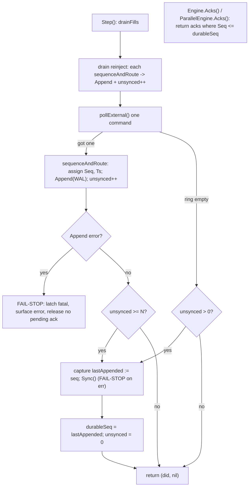
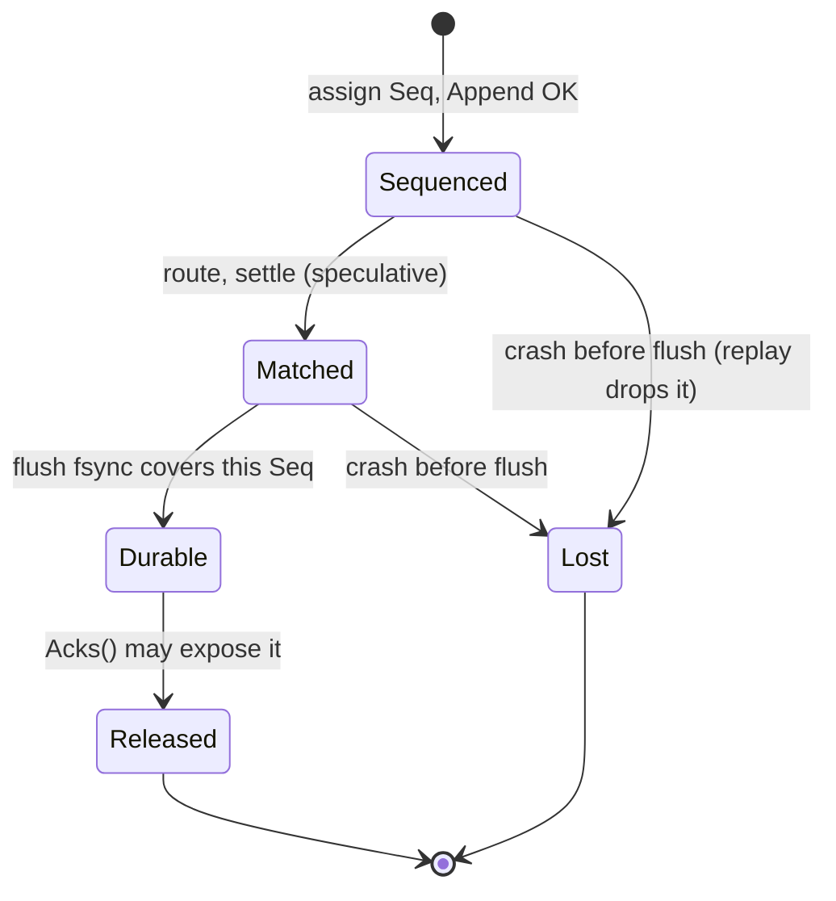

# feat: Durable-Ack Barrier

## Summary

Make the engine withhold every ack until its command is durable on disk.
Matching and settlement stay speculative and in-memory; acks are released only
after a drain-driven group-commit `fsync` advances a `durableSeq` watermark, and
any WAL `Append`/`Sync` failure fail-stops the engine. Research narrowed the
scope: `ClientReqID` is already journaled and the snapshot path already forces
WAL durability, so those become verify-and-test rather than build.

---

## Problem Frame

The sequencer journals fire-and-forget and acks immediately
(`internal/sequencer/sequencer.go:160-171`):

```go
_ = s.journal.Append(...)   // error discarded; bytes only in the page cache
s.router.OnCommand(*c)      // matches, settles, and acks right away
```

Two defects live there. The `Append` error is dropped (`_ =`), so a failed write
(disk full, segment-roll error) still matches and acks a command that replay will
never see. And even on success the bytes sit in the OS page cache —
`wal.Sync()` is the `fsync` and currently fires **only at snapshot cadence**
(`cmd/engine/main.go:82-98` steps then calls `snap.Maybe`; the live loop has no
per-batch flush). A crash between ack and the next snapshot leaves a client
holding an ack for an order the restarted engine never saw.

`Engine.Acks()` (`internal/market/engine.go:345`) returns the full ack slice with
no durability gate. Together these violate the determinism contract (core
principle #2: every `Seq` is journaled, replay is a straight re-application) and
LMAX principle #7 ("persist before release output"). This is the one mapped LMAX
gap that is a correctness hole rather than a performance refinement
(see origin: `docs/brainstorms/2026-06-14-durable-ack-barrier-requirements.md`).

---

## Key Technical Decisions

- **Watermark and flush live in the sequencer.** The sequencer owns the `Step`
  loop and the `Journal`, so `durableSeq`, the unsynced-record counter, the flush
  cap `N`, and the flush call belong there. The `Engine` reads `DurableSeq()` to
  gate ack release. Chosen over an engine-owned watermark, which would duplicate
  the loop's knowledge of when records are appended.

- **Speculative match, gate output (carried from origin).** Matching and
  settlement run in-memory when the command is routed; only the externally
  observable ack is gated on `durableSeq`. A crash discards speculative state and
  replay rebuilds from the durable log alone.

- **Fail-stop surfaces a fatal error through the loop, not a panic.** `Step`
  gains an error return; a non-nil `Append`/`Sync` error latches a terminal state
  in the sequencer, stops `Run`, and is surfaced to the engine wiring for
  operator intervention. No pending ack is released on fail-stop. Chosen over
  `panic` so the host process controls shutdown and the error is testable.

- **Drain-driven flush with a count cap (carried from origin).** A flush
  (`Sync` → advance `durableSeq` → release pending acks) fires when the external
  input ring drains empty with unsynced records pending, or when the unsynced
  count reaches cap `N`, whichever comes first. Reproduces the LMAX batching
  effect with no timer or clock read. `N` is a tunable fixed by benchmarking, not
  hardcoded.

- **The watermark is output-side only.** `durableSeq`, the counter, and flush
  timing never get journaled and never affect `Seq` assignment, captured
  timestamps, or fill ordering, so replay is invariant to `N`. The flush issues
  no new WAL records — only `fsync` — so the on-disk log is byte-identical
  regardless of batch boundaries.

- **`Journal` interface stays minimal; `Sync` is detected, not required.** The
  engine already probes `journal.(interface{ Sync() error })`
  (`internal/market/engine.go:358`). The sequencer reuses that optional-`Sync`
  pattern so the no-op in-memory journal (tests, replay) needs no change.

- **`ClientReqID` requirement is already satisfied.** `Command.ClientReqID`
  exists (`internal/types/types.go:97`) and is journaled via the fixed
  little-endian struct codec (`internal/types/codec.go:12-23`). No WAL-format bump
  is needed. Dedup-set enforcement stays deferred (see Scope Boundaries).

---

## High-Level Technical Design

Live-path control flow with the barrier in place. Matching is speculative; the
ack gate is the only thing waiting on durability.

Every `sequenceAndRoute` — external command **and** reinjected stop activation —
appends a record and increments `unsynced`, so the flush trigger covers both
paths (the reinject leak the review caught).



`durableSeq` is set to the `Seq` captured **before** the `Sync()` call, never
re-read from `s.seq` afterward — otherwise an uncounted append could let the
watermark over-claim coverage the fsync did not include.

Durability state machine for a single command's `Seq`:



---

## Requirements

Traceability to origin requirements
(`docs/brainstorms/2026-06-14-durable-ack-barrier-requirements.md`).

- R1. No ack with `Seq > durableSeq` is observable through `Engine.Acks()` (or
  its successor accessor). Maps origin R1, R3.
- R2. Matching and settlement may run before durability; their effects reach the
  outside world only through the gated ack. Maps origin R2.
- R3. A flush captures the last-appended `Seq`, performs `Sync()`, then advances
  `durableSeq` to that captured value (never re-read from `s.seq` afterward) and
  makes pending acks at or below it observable, in that order. Maps origin R4.
- R4. Flush fires when the input ring drains empty with unsynced records pending,
  or when the unsynced count reaches cap `N`. Every sequenced record — external
  command and reinjected stop activation alike — increments the unsynced count.
  Maps origin R5.
- R5. `durableSeq`, the unsynced counter, and flush timing are never journaled
  and never influence `Seq`, timestamps, or fill order; replay is byte-identical
  across `N` values. Maps origin R6.
- R6. A non-nil `Append` or `Sync` error fail-stops the engine: matching halts,
  no pending ack is released, and a fatal error is surfaced to the host. The
  `_ =` on the append path is removed. Maps origin R7, R8.
- R7. Recovery proceeds from the durable log only; the undurable tail is handled
  by existing torn-tail truncation. Maps origin R9.
- R8. A snapshot's `Seq` never exceeds `durableSeq` — a snapshot never persists
  speculative state the WAL cannot back. Maps origin R10. (Largely satisfied by
  the existing `SyncJournal`-before-publish path; this requirement is the
  regression assertion.)
- R9. `ClientReqID` remains journaled and round-trips through WAL replay; no
  dedup logic reads it. Maps origin R11. (Satisfied by existing code; this
  requirement is the regression assertion.) Origin R11 also asked to "version the
  WAL format" — but the WAL record header (`internal/wal/record.go:15-69`) carries
  no format-version field, and none is needed here: `ClientReqID` is already a
  fixed-size field in the `Command` struct encoded whole by `binary.Write`
  (`internal/types/codec.go:12-23`), so it is already on disk with no layout
  change. The versioning clause is therefore a no-op for this work; a future
  layout change would need a version scheme, which is out of scope.

---

## Implementation Units

### U1. Fail-stop on journal failure

- **Goal:** Stop the engine on any `Append`/`Sync` error instead of discarding it.
- **Requirements:** R6.
- **Dependencies:** none (foundation for U2).
- **Files:** `internal/sequencer/sequencer.go`, `internal/sequencer/sequencer_test.go`.
- **Approach:** `sequenceAndRoute` returns the `Append` error rather than `_ =`.
  `Step` returns `(bool, error)`; a non-nil error latches a terminal `fatal`
  field on the `Sequencer` and is returned. `Run` exits its loop on a latched
  fatal. Once latched, no further `Step` work and no pending-ack release occurs.
  Surface the error to callers (the engine wiring consumes it in U5).
- **Execution note:** Start with a failing test that injects an `Append` error
  and asserts the engine halts with no ack released — `internal/sequencer/CLAUDE.md`
  already lists "journal append failure handling" as required negative coverage.
- **Patterns to follow:** existing `fakeJournal` in
  `internal/sequencer/sequencer_test.go:11-13`; extend it with an error-injecting
  variant.
- **Test scenarios:**
  - Happy path: `Append` succeeds → `Step` returns `(true, nil)`, command routed.
  - Error path: `Append` returns error on the Nth command → `Step` returns that
    error, sequencer latches fatal, subsequent `Step` calls are no-ops.
  - Error path: `Sync` returns error during flush → fail-stop, no pending ack
    released.
  - Edge: fatal latched → `Run` returns promptly; `DurableSeq` does not advance
    past the last successful flush.
- **Verification:** the failing-journal test halts the engine with zero acks
  released beyond the last durable `Seq`; `make test` green.

### U2. Durable watermark and drain-driven group-commit

- **Goal:** Track `durableSeq` and flush the WAL on ring-drain or count cap.
- **Requirements:** R3, R4, R5.
- **Dependencies:** U1.
- **Files:** `internal/sequencer/sequencer.go`, `internal/sequencer/sequencer_test.go`.
- **Approach:** add `durableSeq types.Seq` and `unsynced int` to `Sequencer`, and
  an unexported `defaultFlushCap` constant inside `internal/sequencer` (not a
  `Config` field — origin defers benchmark-driven tuning of `N`; a constant
  satisfies R4/R5 with no premature API surface and is trivially promoted later).
  Increment `unsynced` on **every** successful `sequenceAndRoute` — inside the
  reinject drain loop and the `pollExternal` branch alike — so stop activations
  cannot append-and-ack without being counted. Flush when `pollExternal` returns
  no command and `unsynced > 0`, or when `unsynced >= defaultFlushCap`. `flush()`
  captures the current `seq` into a local, detects the optional `Sync() error` on
  the journal (mirroring `internal/market/engine.go:358`), calls it, then sets
  `durableSeq` to the captured local and zeroes `unsynced`. `journalSync()`
  returns `nil` when the journal exposes no `Sync` method (the no-op in-memory
  journal), and `flush()` still advances `durableSeq` on that `nil` return — so
  no-op-journal engines (every property/differential test) advance the watermark
  normally. Expose `DurableSeq()`. Flushing emits no records, so the WAL byte
  stream is unchanged.
- **Step return contract:** a flush-only tick folds its work into the existing
  `did` flag, but once the ring is empty and `unsynced` reaches `0`, the next
  `Step` returns `(false, nil)` — so `Drain` (`for e.seq.Step()`) terminates with
  `durableSeq == Seq`, and the `cmd/engine`/`concurrent_test` `!worked` checks
  still see a terminal `false`. Pin this explicitly; it is load-bearing for U3.
- **Technical design (directional, not specification):**
  ```text
  Step() (did bool, err error):
    did = drainFills()
    for reinject.Pop(&c):                       // stop activations
      if err := sequenceAndRoute(&c); err != nil { return false, err }
      unsynced++; did = true
    if c, ok := pollExternal(); ok {
      if err := sequenceAndRoute(&c); err != nil { return false, err }
      unsynced++; did = true
    } else if unsynced > 0 {
      if err := flush(); err != nil { return false, err }   // ring drained
      did = true
    }
    if unsynced >= defaultFlushCap {
      if err := flush(); err != nil { return false, err }
      did = true
    }
    return did, nil

  flush():
    last := seq                          // capture BEFORE Sync
    if err := journalSync(); err != nil { return err }   // nil if no Sync method
    durableSeq = last; unsynced = 0
  ```
- **Patterns to follow:** the optional-`Sync` type assertion in
  `internal/market/engine.go:358`; `SetSeq`/`Seq` accessor style for `DurableSeq`.
- **Test scenarios:**
  - Happy path: stream of `> N` commands → flush fires at `unsynced == N` before
    the ring empties; `durableSeq` advances to the Nth `Seq`.
  - Edge: one pending command, ring then empty → flush fires immediately;
    `durableSeq == Seq`.
  - Edge (reinject): a stop activation sequenced while the ring is otherwise empty
    increments `unsynced` and is flushed before the engine goes idle — its ack is
    not stranded above `durableSeq`.
  - Edge: empty engine, no pending records → no `Sync` call (no spurious fsync).
  - Edge (no-op journal): after `Drain` on the in-memory journal, `DurableSeq()
    == Seq()` — the watermark advances without a real `Sync`.
  - Edge: `defaultFlushCap` of 1 (test override) → flush every command.
  - Negative: `Sync` error → propagates as fail-stop (shared with U1).
  - Determinism: same stream under two cap values → identical journaled bytes and
    identical final `Seq`.
- **Verification:** unit tests show `durableSeq` advancing on both triggers and
  via the reinject path; no fsync on an idle engine; no-op journal watermark
  tracks `Seq` after `Drain`.

### U3. Ack-release gate

- **Goal:** Expose only acks at or below `durableSeq`, in both topologies.
- **Requirements:** R1, R2.
- **Dependencies:** U2.
- **Files:** `internal/market/engine.go`, `internal/market/parallel.go`,
  `internal/market/engine_test.go`.
- **Approach:** `Engine.Acks()` filters `core.acks` to `Seq <= e.seq.DurableSeq()`.
  Because `Engine.Drain()` (`internal/market/engine.go:320-323`) steps until no
  work remains, the final drain empties the ring and triggers a flush, so after
  `Drain()` `durableSeq == Seq` and `Acks()` returns the full set — existing
  tests that `Drain()` before reading acks are unaffected. Keep the single
  `Acks()` accessor (no speculative second accessor). Apply the **same one-line
  filter to `ParallelEngine.Acks()`** (`internal/market/parallel.go`): the
  watermark lives on the shared `*Sequencer`, so both topologies read the same
  `DurableSeq()` and cannot diverge — without this, the differential/parallel
  suites would compare a gated accessor against an ungated one. Acks already carry
  `Seq` (`internal/types/types.go:153`) and are appended in order
  (`internal/market/engine.go:201`).
- **Patterns to follow:** existing `Acks()` accessors at
  `internal/market/engine.go:345` and the `ParallelEngine.Acks()` accessor in
  `internal/market/parallel.go`.
- **Test scenarios:**
  - Happy path: submit commands without draining to a flush boundary → `Acks()`
    omits acks above `durableSeq`; after `Drain()` all acks present.
  - Edge: `Drain()` of a full stream → `durableSeq == Seq`, every ack observable
    (no regression for existing callers).
  - Edge: rejected order (insufficient funds) still acked, and its rejection ack
    is gated identically to an accepted ack. Tie the assertion to the same
    drain-then-read invariant check the engine tests already run, since rejection
    does not move balances and `CheckAllInvariants` alone would not catch a leak.
  - Integration: a fill-producing aggressor's ack is withheld until the flush
    covering its `Seq`, then released together.
  - Parity: serial and parallel engines expose the identical gated ack set for the
    same stream (extends the existing digest-equality check).
- **Verification:** `make test` green; neither `Acks()` accessor ever exposes a
  `Seq` beyond `durableSeq`.

### U4. Snapshot-ordering regression assertion

- **Goal:** Lock in that `snapshotSeq <= durableSeq`, and abort a snapshot on a
  fail-stop during its drain.
- **Requirements:** R8.
- **Dependencies:** U1, U2.
- **Files:** `internal/market/snapshotter.go`, `tests/property/snapshot_test.go`.
- **Approach:** `Snapshotter.Snapshot` already calls `Drain` then `SyncJournal`
  before publishing, so the snapshot's `Seq` is durable by construction (the final
  drain triggers the flush, advancing `durableSeq == Seq`). Because U5 makes
  `Drain` return an error, `Snapshot` must now check it and return before calling
  `e.Snapshot(path)` — a fail-stop mid-drain must abort the snapshot, never
  publish a partial or stale one. Add the assertion that a published snapshot's
  recorded `Seq` is `<= durableSeq`.
- **Patterns to follow:** `journalWithSnapshot()` helper at
  `tests/property/recover_test.go:16-54`; `FuzzSnapshotEquivalence` at
  `tests/property/snapshot_test.go:126-140`.
- **Test scenarios:**
  - Happy path: snapshot after a partial (unflushed) batch → snapshot `Seq`
    equals `durableSeq`, never a speculative higher `Seq`.
  - Error path: fail-stop during the snapshot's `Drain` → `Snapshot` returns the
    error and publishes no snapshot file.
  - Determinism: `restore + tail == full replay` (existing INV-DET-02) still holds
    with the watermark in place.
- **Verification:** new assertions pass; no partial snapshot on fail-stop;
  `make property` green.

### U5. Engine wiring surfaces the fatal error

- **Goal:** Propagate fail-stop from the loop to the host process and sweep all
  `Step`/`Drain` callers.
- **Requirements:** R6.
- **Dependencies:** U1.
- **Files:** `cmd/engine/main.go`, `internal/market/engine.go`,
  `cmd/bench/main.go`, `cmd/enginebench/main.go`, `cmd/loadtest/main.go`,
  `cmd/shardbench/main.go`.
- **Approach:** the v1 live loop is `cmd/engine`'s **direct** `eng.Step()` loop
  (`cmd/engine/main.go:82-98`), not `Sequencer.Run` — so the load-bearing change
  is `Engine.Step` returning the sequencer error, which the main loop checks to
  log a fatal, stop stepping (and skip the subsequent `snap.Maybe`), and start
  graceful shutdown. `Sequencer.Run` also exits on a latched fatal for the
  assembled-engine path, but it is not the cmd loop. `Drain` returns an error so a
  fail-stop during drain is observable rather than an infinite no-op loop (U4's
  snapshotter consumes this). Adding the error return to `Step`/`Drain` is a
  breaking signature change; every benchmark harness that calls them must be
  swept — a missed caller surfaces as a compile error. Recovery
  (`internal/market/recover.go`) is unchanged — it replays the durable log, so a
  prior fail-stop's undurable tail is simply absent.
- **Patterns to follow:** the existing loop and `log.Error` usage in
  `cmd/engine/main.go:82-98`.
- **Test scenarios:**
  - Error path: injected `Append` failure mid-run → loop exits, fatal logged,
    `snap.Maybe` not called after the fatal Step, shutdown path runs.
  - Integration: fail-stop then restart via `Recover` → state contains only
    durable commands; no ack for the failed command (origin AE2).
  - Edge: `Drain` encountering a fatal returns the error rather than spinning.
- **Verification:** integration test confirms halt-then-recover rebuilds state
  from the durable log only; all `cmd/*` harnesses compile; `make test` and
  `make race` green.

### U6. Property/differential/fuzz coverage for the barrier

- **Goal:** Extend the mandated three-layer harness for the new behavior.
- **Requirements:** R5, R7, R9.
- **Dependencies:** U2, U3, U5.
- **Files:** `tests/property/recovery_test.go`, `tests/property/invariants_test.go`,
  `tests/property/fuzz_test.go`, `tests/property/testdata/fuzz/FuzzEngine/`.
- **Approach:** add a differential/determinism test that runs the same generated
  stream (`GenSharp`/`GenBroad`, `tests/property/generators.go:96-102`) under two
  flush-cap values and asserts byte-identical final state and identical journaled
  bytes (R5). Since `defaultFlushCap` is unexported (U2), expose a test-only seam
  to override it (an unexported `setFlushCap` test helper in the sequencer
  package, or a per-run field the test sets) — do not promote it to `Config`. Feed
  **identical submit paths** in both runs, varying only the cap, so the comparison
  isn't confounded by `drainSubmit`'s retry-loop stepping at different boundaries.
  Add a crash-after-durable-before-ack scenario: drive a stream, capture
  `durableSeq` mid-batch, simulate stop, `Recover`, and assert replay re-applies
  durable commands while undurable ones are absent (R7, origin AE3 — the
  documented double-apply precondition). Add a WAL round-trip test asserting
  `ClientReqID` survives encode→replay (R9). Add a regression fuzz seed for the
  failing-journal path.
- **Patterns to follow:** `replayInto()` (`tests/property/recovery_test.go:40-57`),
  `CheckAllInvariants` (`tests/property/invariants.go:24`), `RunDifferential`
  (`tests/refmodel` differential entry), `decodeStream`
  (`tests/property/fuzz_test.go:14-64`).
- **Test scenarios:**
  - Determinism: two flush-cap values (via the test seam), same seed → identical
    state digest and identical WAL bytes (R5).
  - Recovery: crash before flush → undurable tail absent after `Recover`; durable
    prefix intact (R7).
  - Recovery: crash after flush, before ack release → durable command re-applied,
    no ack ever observed for it (origin AE3).
  - Round-trip: `ClientReqID` set on a command survives WAL replay unchanged (R9).
  - Fuzz: regression seed for the failing-journal fail-stop path added to the
    corpus.
- **Verification:** `make property`, `make differential`, and a short `make fuzz`
  slice green; new regression seed committed under
  `tests/property/testdata/fuzz/FuzzEngine/`.

---

## Scope Boundaries

**In scope:** fail-stop on WAL failure, the `durableSeq` watermark and
drain-driven group-commit flush, the ack-release gate, the snapshot-ordering and
`ClientReqID` regression assertions, and the harness extensions above.

**Already satisfied (verify-and-test only):** `ClientReqID` is present and
journaled; the snapshot path already forces WAL durability before publishing.

### Deferred to Follow-Up Work

- Dedup-set enforcement (`ClientReqID`-keyed, per-account rolling window). Until
  it lands, crash-recovery plus a retrying client can double-apply a command
  (origin AE3). v1 has no network gateway and no retrying client, so the gap is
  latent — but it is a hard precondition for any real gateway.
- Tuning the flush cap `N` against p50/p99 durable-ack latency and the zero-alloc
  gate. The plan ships `N` as an unexported constant with a safe default; the
  benchmark-driven value and any promotion to `Config` are follow-up.

### Outside v1

- Output disruptor / async publisher, configurable wait strategy, parallel
  sharding activation, multicast / full-Disruptor ring — refinements the LMAX
  reference defers; serial single-node is expected to clear 100k TPS.
- Replication / Raft, failover, backup / DR (out of scope per `CLAUDE.md`). The
  barrier's "persist before output" is the single-node analogue of LMAX's
  journal+replicate sequence barrier; the replicate leg is not part of v1.

---

## System-Wide Impact

- **Determinism contract:** the watermark is output-side and must never leak into
  `Seq`/timestamp/fill ordering. U2 and U6 enforce this with a replay-equivalence
  test across `N`. This is the highest-risk property — a regression here is a
  silent correctness failure.
- **Hot path / zero-alloc:** the flush adds an integer counter and a branch per
  `Step`; no allocations. The `Sync` call is off the per-command path (batched).
  Keep `internal/spsc`, `internal/matching`, `internal/balance` benchmarks
  zero-alloc; the sequencer flush must not allocate.
- **API surface:** `Step`/`Drain` gain error returns and `Run` exits on fatal —
  a breaking change to the sequencer/engine API consumed by `cmd/engine`, the
  benchmark harnesses (`cmd/bench`, `cmd/enginebench`, `cmd/loadtest`,
  `cmd/shardbench`), and the differential/property drivers (`drainSubmit` in
  `tests/refmodel`, `tests/property`). Each caller must handle or propagate the
  error; U5 sweeps the `cmd/*` harnesses and U6 the test drivers.
- **Parallel topology:** the watermark lives on the shared `*Sequencer`, so U3
  gates `ParallelEngine.Acks()` with the same one-line filter — the two topologies
  read the same `DurableSeq()` and stay behaviorally identical. No deferral, no
  stale comment.
- **Idle-loop tail latency:** the live loop sleeps 1ms when a `Step` does no work
  (`cmd/engine/main.go:94`). The flush-on-ring-empty fires within the **same**
  `Step` that drains the last pending command (`did` stays true that tick), so a
  trailing command is durable-acked before the sleep — not delayed a sleep cycle.
  U2's Step-return contract pins this; note it so a future loop refactor doesn't
  reintroduce a tail-latency outlier on quiet-period commands.

---

## Risks & Dependencies

- **Risk: ack-gate breaks existing test expectations.** Tests that read `Acks()`
  without draining to a flush boundary would see fewer acks. Mitigation: `Drain()`
  flushes by construction (ring empties → flush), so drain-then-read callers are
  unaffected; audit any test that reads acks mid-stream.
- **Risk: error-return ripple.** Adding errors to `Step`/`Drain` touches every
  caller including benchmark harnesses. Mitigation: U5 sweeps `cmd/*`; compile
  errors make missed callers obvious.
- **Risk: fail-stop during snapshot drain.** A fatal during `Snapshotter`'s
  `Drain` must abort the snapshot, not publish a partial one. Mitigation: U5
  makes `Drain` return the error; the snapshotter aborts on it.
- **Dependency:** none external. All work is within `internal/sequencer`,
  `internal/market`, `internal/types` (read-only), `cmd/engine`, and
  `tests/property`.

---

## Sources & Research

- Origin: `docs/brainstorms/2026-06-14-durable-ack-barrier-requirements.md`.
- LMAX mapping and deferral rationale:
  `docs/designs/lmax-reference.md` (principle #7, §11);
  `docs/designs/spot-orderbook-engine-design.md` §6.1-6.5, §16.4, §16.6.
- Fire-and-forget append site: `internal/sequencer/sequencer.go:160-171`;
  required negative test noted in `internal/sequencer/CLAUDE.md`.
- WAL `Append` vs `Sync`: `internal/wal/wal.go:62-101`; record framing (no version
  field, CRC over payload): `internal/wal/record.go:15-69`.
- `Command`/`ClientReqID` already present and journaled:
  `internal/types/types.go:78-101`, `internal/types/codec.go:12-23`.
- Ack collection and accessor: `internal/market/engine.go:200-202,344-345`;
  `Ack` carries `Seq`: `internal/types/types.go:153-162`.
- Snapshot durability already forced: `internal/market/engine.go:354-363`,
  `internal/market/snapshotter.go` (Drain → Snapshot → SyncJournal).
- Live loop with no per-batch flush: `cmd/engine/main.go:82-98`.
- Test harness: `tests/property/invariants.go:24` (`CheckAllInvariants`),
  `tests/property/statemachine_test.go` (rapid), `tests/property/fuzz_test.go`
  (`FuzzEngine`), `tests/refmodel` (differential), `tests/property/recover_test.go`
  and `recovery_test.go` (recovery/torn-tail), `tests/property/generators.go`.
