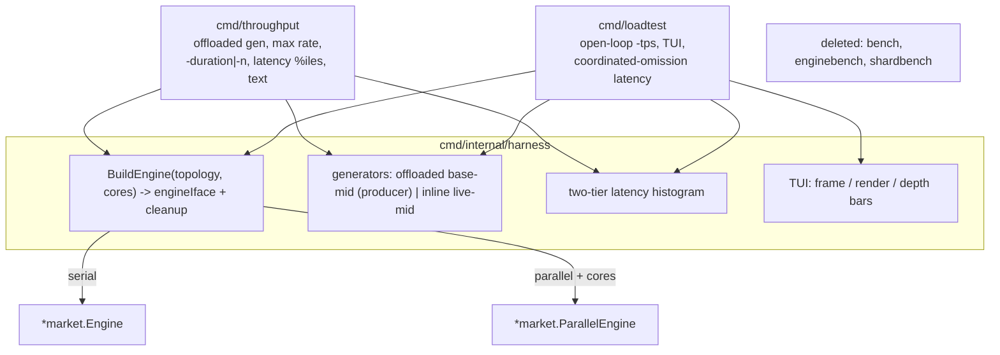
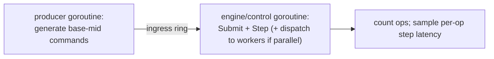

# refactor: Unify Benchmark Harnesses

## Summary

Collapse the four `cmd/` benchmark scaffolds into two purpose-named tools over a
shared kit: `throughput` ("how fast can it go", offloaded generation) and
`loadtest` ("how does it behave at load X", open-loop + live TUI). Each gains a
`-topology serial|parallel` flag so serial and parallel are compared under
identical generation. Sequenced kit → new/rewritten tools → delete the old three
and rewrite the Makefile, so the soon-deleted binaries serve as the validation
oracle and no throwaway refactor is done on them
(see origin: `docs/brainstorms/2026-06-14-benchmark-harness-refactor-requirements.md`).

---

## Problem Frame

`cmd/bench`, `cmd/enginebench`, `cmd/loadtest`, and `cmd/shardbench` each pick a
point in a three-axis space — *topology* (serial/parallel), *what's measured*
(throughput ceiling/latency), *generation* (inline/offloaded) — without the axes
being legible. `bench` and `enginebench` both read as "serial engine throughput"
but report non-comparable numbers (inline-bound vs offloaded ceiling).
`enginebench` (serial, offloaded, ~940k) and `shardbench` (parallel, inline,
~327k) differ on two axes at once, so serial-vs-parallel can't be compared. And
the recent shardbench rewrite triplicated the TUI, histogram, and generator from
`loadtest`. A newcomer can't tell which tool to use or trust a cross-tool number.

---

## Key Technical Decisions

- **Two purpose-named tools, not four** (origin Summary). `throughput` answers
  "how fast"; `loadtest` answers "how does it behave at load X". Names state the
  question.

- **Topology is a flag over a shared engine interface, not separate binaries.**
  The kit defines a minimal interface — `Submit`, `Step`, `Drain`, `Acks`,
  `Seq`, `Shard` — that both `*market.Engine` and `*market.ParallelEngine`
  already satisfy, plus a builder keyed on `-topology serial|parallel` (+
  `-cores` for parallel). `ParallelEngine.Close` is parallel-only, so the builder
  returns the engine plus a cleanup func (no-op for serial) rather than putting
  `Close` on the shared interface.

- **`throughput` offloads generation for both topologies** (origin R1). A
  producer goroutine fills the ingress ring; the engine/control goroutine drains
  it. Holding generation constant across topologies is what makes the numbers
  comparable; the parallel figure will read higher and cleaner than today's
  inline shardbench (~327k), which is the intended fix.

- **`bench`'s deterministic latency role becomes a flag** (origin R3). `throughput`
  takes `-duration` *or* `-n` + `-rngseed` and always reports per-op latency
  percentiles. `throughput -topology serial -n 200000 -rngseed 1` replaces
  `bench`; no third tool.

- **Shared kit under `cmd/internal/harness`** (origin R8). Go's cmd-shared
  convention; internal to the module, not part of the public `pkg/` surface.

- **Kit-first sequencing, no throwaway.** Build the kit, build `throughput`
  (new) and rewrite `loadtest` on it (the `-topology` flag lands here), validate
  both reproduce the current binaries' baseline numbers, then delete the old
  three. Avoids refactoring binaries that are about to be removed; the old
  binaries are the validation oracle until the final delete.

---

## High-Level Technical Design

The kit owns generation, the engine builder, the histogram, and the TUI; the two
tools are thin drivers over it. Topology is a builder input, not a tool boundary.

Throughput's offloaded-generation pipeline (both topologies):

---

## Requirements

Traceability to origin
(`docs/brainstorms/2026-06-14-benchmark-harness-refactor-requirements.md`).

- R1. The shared kit (`cmd/internal/harness`) holds the engine builder, both
  generators, the histogram, and the TUI, with no logic duplicated across tools.
  Maps origin R8, R9.
- R2. `throughput` drives the engine at max rate with offloaded generation, over
  `-topology serial|parallel` (+ `-cores`), under `-duration` or `-n`+`-rngseed`,
  reporting throughput + per-op latency percentiles as text. Maps origin R1-R4.
- R3. `loadtest` paces open-loop at `-tps` with coordinated-omission latency,
  over `-topology serial|parallel` (+ `-cores`, `-market`, `-levels`), rendering
  the live order-book TUI. Maps origin R5-R7.
- R4. `cmd/bench`, `cmd/enginebench`, `cmd/shardbench` are deleted and the
  Makefile targets are rewritten to the two tools. Maps origin R10.
- R5. Each phase builds, lints (`make lint`), and passes tests before the next.
  Maps origin R11.

---

## Implementation Units

### U1. Shared kit — engine builder + interface

- **Goal:** A `cmd/internal/harness` package with the topology-keyed engine
  builder and the minimal engine interface the tools drive.
- **Requirements:** R1.
- **Dependencies:** none.
- **Files:** `cmd/internal/harness/engine.go`, `cmd/internal/harness/engine_test.go`.
- **Approach:** define an `Engine` interface (`Submit`, `Step`, `Drain`, `Acks`,
  `Seq`, `Shard`) satisfied by both `*market.Engine` and `*market.ParallelEngine`
  (verify both already expose these; add nothing to the engine packages).
  `BuildEngine(topology string, groups [][]types.MarketID, cfg Config)` returns
  the interface plus a `cleanup func()` (calls `ParallelEngine.Close` for
  parallel, no-op for serial). Centralize the market/asset spec (BTC/ETH/SOL ×
  USDT) and funding/seeding helpers here.
- **Patterns to follow:** the market/asset setup currently duplicated in
  `cmd/loadtest/main.go` and `cmd/shardbench/main.go`; `market.NewEngine` /
  `market.NewParallelEngine` construction.
- **Test scenarios:**
  - Happy path: `BuildEngine("serial", …)` and `BuildEngine("parallel", groups,
    …)` both return a usable engine; the same seeded command stream produces
    byte-identical canonical state across the two (digest-equality, mirroring the
    existing serial-vs-parallel equivalence test in `internal/market`).
  - Edge: empty/invalid `-topology` string → clear error, not a panic.
  - Edge: `cleanup()` is safe to call for serial (no-op) and stops workers for
    parallel.
- **Verification:** `go test ./cmd/internal/harness/` green; both topologies
  build and seed.

### U2. Shared kit — load generators

- **Goal:** The two generation styles the tools need, in the kit.
- **Requirements:** R1.
- **Dependencies:** U1.
- **Files:** `cmd/internal/harness/gen.go`, `cmd/internal/harness/gen_test.go`.
- **Approach:** an **inline live-mid** generator (reads the book mid via
  `Shard(m).Book()`, for `loadtest`'s realism + TUI; safe between control steps)
  and an **offloaded base-mid** generator (static mid, for `throughput`'s
  producer goroutine — no book reads, no race). Share `makerOffset`/`genQty`/
  `acct` and the maker/taker/cancel mix.
- **Patterns to follow:** `genOrder`/`makerOffset`/`genQty` in
  `cmd/loadtest/main.go` (live-mid) and `cmd/enginebench/main.go` (base-mid).
- **Test scenarios:**
  - Happy path: same seed → identical command stream (determinism), for both
    generator styles.
  - Edge: cancel target underflow on early ids produces a benign unknown-order
    cancel, not a panic (current behavior preserved).
  - Edge: generated maker/taker/cancel ratios match the documented mix over a
    large sample.
- **Verification:** `go test ./cmd/internal/harness/` green; determinism holds.

### U3. Shared kit — latency histogram + TUI

- **Goal:** The two-tier histogram and the live order-book renderer in the kit.
- **Requirements:** R1.
- **Dependencies:** U1.
- **Files:** `cmd/internal/harness/hist.go`, `cmd/internal/harness/hist_test.go`,
  `cmd/internal/harness/tui.go`.
- **Approach:** move the two-tier histogram (fine 10ns + coarse 10µs tiers) and
  the TUI (`frame`, `render`, depth bars, `priceStr`/`qtyStr`/`dur`,
  `displayLoop`) verbatim from the current binaries. The TUI takes a topology/
  worker-layout header string so it serves both tools.
- **Patterns to follow:** the histogram in `cmd/loadtest/main.go` and its
  `loadtest/hist_test.go`; the renderer in `cmd/loadtest/main.go` /
  `cmd/shardbench/main.go`.
- **Test scenarios:**
  - Happy path: percentile lookup returns the correct bucket midpoint across fine
    and coarse tiers (port `hist_test.go`).
  - Edge: empty histogram → zeros, no divide-by-zero; single sample; values in
    the overflow region pin to max.
  - `Test expectation:` the renderer itself is visual — no unit test; exercised
    by running the tools.
- **Verification:** `go test ./cmd/internal/harness/` green; ported histogram
  tests pass.

### U4. `cmd/throughput` — offloaded max-rate driver

- **Goal:** The "how fast can it go" tool over the kit.
- **Requirements:** R2.
- **Dependencies:** U1, U2, U3.
- **Files:** `cmd/throughput/main.go`.
- **Approach:** a producer goroutine fills the ingress ring from the base-mid
  generator; the control goroutine drains (`Submit`+`Step`, dispatching to
  workers when parallel). Flags: `-topology serial|parallel`, `-cores`,
  `-duration` | `-n` (+ `-rngseed`), `-users`. Sample per-op step latency into
  the kit histogram; report throughput + percentiles as a text summary (no TUI).
  Absorbs `enginebench` (serial), `shardbench`'s ceiling role (parallel), and
  `bench` (`-n -rngseed`).
- **Patterns to follow:** `cmd/enginebench/main.go` producer/engine split;
  `cmd/bench/main.go` fixed-count + warmup + per-op latency.
- **Test scenarios:**
  - `Test expectation: none` for `main` wiring (a measurement scaffold; verified
    by running). Helper logic lives in the kit (U1-U3) and is unit-tested there.
- **Verification:** `throughput -topology serial -duration 15s` reproduces the
  current `enginebench` figure (~940k order of magnitude); `-topology serial -n
  200000 -rngseed 1` is reproducible run-to-run and prints latency percentiles;
  `-topology parallel -cores "0;1,2"` runs and reports a single end-to-end rate;
  `make lint` clean.

### U5. Rewrite `cmd/loadtest` on the kit

- **Goal:** The "how does it behave at load X" tool over the kit, gaining
  topology.
- **Requirements:** R3.
- **Dependencies:** U1, U2, U3.
- **Files:** `cmd/loadtest/main.go`.
- **Approach:** replace loadtest's inline TUI/histogram/generator with kit calls;
  keep open-loop pacing (`intended = start + i/rate`) and coordinated-omission
  latency. Add `-topology serial|parallel` + `-cores`; keep `-tps`, `-duration`,
  `-users`, `-market`, `-levels`. Live-mid generation + TUI book reads happen
  between control steps (race-safe for parallel, per the verified shardbench
  finding).
- **Patterns to follow:** current `cmd/loadtest/main.go` pacing loop;
  `cmd/shardbench/main.go` parallel-engine driving + between-steps book reads.
- **Test scenarios:**
  - `Test expectation: none` for `main` wiring (scaffold; verified by running and
    under `-race` for the parallel path).
- **Verification:** `loadtest -topology serial -tps 200000` reproduces current
  loadtest behavior (TUI + summary); `loadtest -topology parallel -cores "0;1,2"`
  runs clean under `go run -race` (no data race on book reads); `make lint`
  clean.

### U6. Delete old binaries and rewrite the Makefile

- **Goal:** Collapse to the two tools and update the build surface + docs.
- **Requirements:** R4, R5.
- **Dependencies:** U4, U5.
- **Files:** delete `cmd/bench/`, `cmd/enginebench/`, `cmd/shardbench/`; edit
  `Makefile`, `cmd/CLAUDE.md`.
- **Approach:** remove the three command directories. Rewrite the Makefile:
  replace the `bench`, `enginebench`, `shardbench` targets with `throughput`
  (wiring `-topology`, `-cores`, `-duration`/`-n`, `-users`) and keep a
  `loadtest` target (wiring `-tps`, `-topology`, `-cores`, `-users`, `-market`,
  `-levels`); update `.PHONY` and reuse the existing `TPS`/`DURATION`/`USERS`/
  `MARKET`/`LEVELS`/`CORES` override vars. Fold the pre-existing uncommitted
  Makefile tuning (TPS/shardbench duration) into the rewrite. Update `cmd/CLAUDE.md`
  to describe the two tools.
- **Patterns to follow:** current Makefile target style and override-var
  convention (`make loadtest TPS=… CORES=…`).
- **Test scenarios:**
  - `Test expectation: none` (build-surface + deletion). Verified by build.
- **Verification:** `go build ./...` succeeds with the three directories gone;
  `make throughput`, `make loadtest` both launch the right tool; `make lint`
  clean; no dangling references to the deleted binaries (grep `cmd/CLAUDE.md`,
  Makefile, docs).

---

## Phased Delivery

- **Phase A — kit (U1, U2, U3):** new package, no binary changes; ships green
  with its own unit tests. U2 and U3 can land in parallel after U1.
- **Phase B — tools (U4, U5):** build `throughput`, rewrite `loadtest`; the
  `-topology` flag and the comparability fix land here. Old binaries still exist
  as the validation oracle.
- **Phase C — collapse (U6):** delete the three, rewrite the Makefile and
  `cmd/CLAUDE.md`.

---

## Scope Boundaries

**In scope:** the shared kit, the two tools with `-topology`, deleting the three
old binaries, and the Makefile + `cmd/CLAUDE.md` rewrite.

### Deferred to Follow-Up Work

- Parallelizing the balance authority / control path — the only route past the
  serial throughput ceiling. This refactor measures topologies more clearly; it
  does not change the engine (origin "Deferred for later").

### Outside this refactor

- New metric classes beyond throughput + latency (flame graphs, per-market
  breakdowns, allocation tracing) — the zero-alloc bench gate and `go test
  -bench` already cover allocation.
- HTML/web output for the harnesses — terminal text + TUI only.

---

## System-Wide Impact

- **Developers / CI:** binary and Makefile-target names change
  (`bench`/`enginebench`/`shardbench` → `throughput`; `loadtest` kept). Confirmed
  free to break — nothing external depends on them. The `make` surface is the
  primary touchpoint; U6 keeps the override-var names so muscle memory for
  `TPS`/`CORES`/etc. survives.
- **No engine/runtime impact:** changes are confined to `cmd/`; the engine
  packages are imported, not modified. The kit interface must be satisfied by the
  existing `*market.Engine` / `*market.ParallelEngine` surface without adding
  methods to those types.

---

## Risks & Dependencies

- **Risk: kit interface doesn't cover both engines cleanly** (`Close` is
  parallel-only). Mitigation: builder returns a `cleanup func()`, keeping `Close`
  off the shared interface (KTD).
- **Risk: parallel `loadtest` races on book reads.** Mitigation: reads stay
  between control steps where the synchronous control↔worker handshake leaves
  workers idle; verify under `go run -race` (U5) — already validated for the
  current shardbench.
- **Risk: silent behavior drift from the old binaries.** Mitigation: the old
  three are kept until U6 and used as the baseline oracle — `throughput` must
  reproduce `enginebench`/`bench` figures and `loadtest` its current behavior
  before deletion.
- **Dependency:** none external; Go stdlib + existing engine packages only.

---

## Sources & Research

- Origin: `docs/brainstorms/2026-06-14-benchmark-harness-refactor-requirements.md`.
- Current harnesses (this session's reads): `cmd/bench/main.go`,
  `cmd/enginebench/main.go`, `cmd/loadtest/main.go`, `cmd/shardbench/main.go`.
- Shared-engine surface: `internal/market/engine.go` (`Submit`/`Step`/`Drain`/
  `Acks`/`Seq`/`Shard`) and `internal/market/parallel.go` (same + `Close`;
  synchronous control↔worker dispatch that makes between-steps book reads
  race-safe).
- Conventions: `cmd/CLAUDE.md` (bench scaffolds: helpers unit-tested, `main` via
  integration; coordinated-omission correctness; generation off the engine core).
- Baselines to reproduce: enginebench ~940k (serial, offloaded), loadtest @1M
  target ~470k, shardbench full-engine ~327k (this session's measurements).
