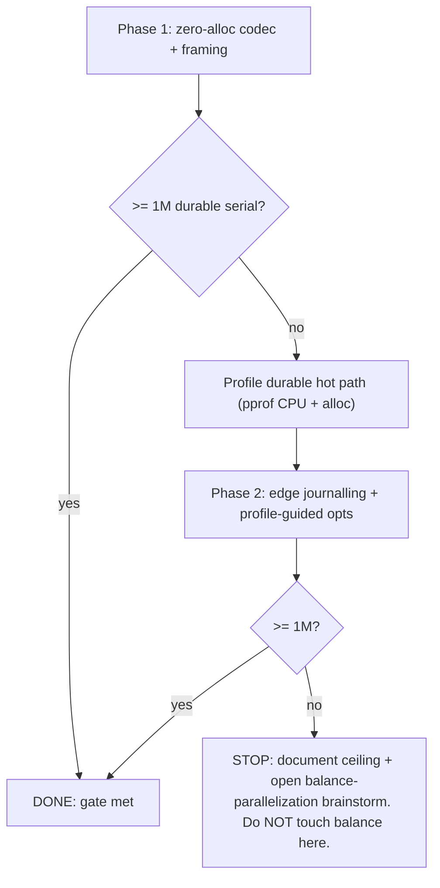

# feat: LMAX-Fast Serial Hot Path (1M TPS Durable)

## Summary

Push the durable serial path to ≥1M cmd/s by trimming the single business thread
the LMAX way — zero-alloc byte-identical command codec first, then (only if the
measured number is short) edge journalling and a profile-guided optimization
loop — while keeping the single-writer balance authority untouched. 1M durable
serial is a **hard gate**; if the in-scope levers can't reach it, the plan stops
and escalates to a separate balance-parallelization brainstorm
(see origin: `docs/brainstorms/2026-06-14-lmax-hotpath-1m-tps-requirements.md`).

---

## Problem Frame

The serial engine tops out at ~940k cmd/s (no-op journal); the durable path is
lower. LMAX hit ~6M on one business thread by keeping it pure business logic and
pushing journalling to a parallel edge consumer. Our single-writer balance is
already LMAX-aligned; the gap is work LMAX kept *off* its thread:

- `internal/types/codec.go` `EncodeCommand` uses reflective `binary.Write` into a
  fresh `bytes.Buffer`, and `internal/sequencer/sequencer.go` `sequenceAndRoute`
  calls it **unconditionally** per command — so the ceiling already pays a
  reflective encode + allocation every command, even with the no-op journal.
- On the durable path, `internal/wal/record.go` `encodeRecord` allocates again
  per record, and the sequencer does the `Write` syscall inline — both things
  LMAX's separate journaller kept off the business thread.

The fix is the LMAX move: faster single writer (kill reflection + allocation),
journalling at the edge — never sharding the balance authority.

---

## Key Technical Decisions

- **Hand-rolled codec, byte-identical, no format bump.** Replace reflective
  `binary.Write` with a manual little-endian encoder writing `Command` fields in
  declaration order, packed — exactly what `encoding/binary` produces — into a
  caller-supplied buffer (zero alloc). It must be **byte-for-byte identical** to
  the current encoder so existing WALs replay unchanged; a differential + fuzz
  test is the gate. `DecodeCommand` stays (replay isn't the hot path), but gains
  a zero-alloc sibling only if profiling later demands it.

- **Zero-alloc through the whole durable encode path.** The codec writing into a
  reusable buffer is wasted if the WAL re-allocates, so `wal.Writer.Append` also
  goes zero-alloc (reusable framing buffer). Both are required for the durable
  zero-alloc gate (origin scope call-out, confirmed in-scope).

- **Measurement-driven, hard-gated escalation.** Each phase ends in a real
  `throughput -topology serial` measurement against a **real WAL**. Order:
  (1) codec → measure; (2) if <1M, **profile** to locate the dominant remaining
  cost — don't assume; (3) apply the indicated lever (edge journalling and/or
  residual single-thread opts) → re-measure; (4) loop until 1M or the in-scope
  levers are exhausted. Only then stop and escalate.

- **Edge journalling = LMAX input-disruptor, preserving the barrier.** When it
  fires, encode + write + fsync move off the sequencer onto a single parallel
  consumer that reads commands in `Seq` order and advances `durableSeq`. The
  durable-ack barrier's ack gate stays on `durableSeq`, so persist-before-output
  and fail-stop are unchanged — only *where* journalling runs moves.

- **Balance authority is untouched.** Its parallelization is the escalation exit
  (a separate brainstorm), never modified in this plan.

---

## High-Level Technical Design

Per-command work on the sequencer (business) thread — what each lever removes:

```mermaid
flowchart TB
  subgraph now["Today (durable serial)"]
    a1["assign Seq, Ts"] --> a2["EncodeCommand: REFLECT + bytes.Buffer alloc"]
    a2 --> a3["encodeRecord: make([]byte) alloc"]
    a3 --> a4["os.File.Write (syscall)"]
    a4 --> a5["route -> reserve -> match -> settle -> ack"]
    a5 --> a6["periodic fsync (group-commit)"]
  end
  subgraph p1["After Phase 1 (codec + framing)"]
    b1["assign Seq, Ts"] --> b2["EncodeInto reusable buf: ZERO alloc, no reflect"]
    b2 --> b3["Append into reusable frame buf: zero alloc"]
    b3 --> b4["os.File.Write (syscall, still on thread)"]
    b4 --> b5["route -> match -> settle -> ack"]
  end
  subgraph p2["After Phase 2 (edge journalling, if needed)"]
    c1["assign Seq, Ts"] --> c2["hand raw command to journaller ring"]
    c2 --> c5["route -> match -> settle -> ack (speculative)"]
    j1["journaller consumer: encode + write + fsync; advance durableSeq"]
  end
```

Gate ladder (each box ends in a serial-durable measurement):

---

## Requirements

Traceability to origin
(`docs/brainstorms/2026-06-14-lmax-hotpath-1m-tps-requirements.md`).

- R1. Hand-rolled little-endian command encoder, zero bytes allocated per
  command, byte-identical to the current `EncodeCommand`. Maps origin R1, R2.
- R2. The durable encode path (command codec + WAL record framing) is zero-alloc
  under a bench gate, in the style of the existing `spsc`/`matching`/`balance`
  gates. Maps origin R1, R3.
- R3. `throughput` can drive a **real WAL** (group-commit) so the 1M gate is
  measured against real durability. Maps origin R4, R5.
- R4. Durable serial throughput **≥ 1,000,000 cmd/s** on the reference machine
  (8-core arm64) via `throughput -topology serial` with a real WAL — the hard
  gate. Maps origin R8, Success Criteria.
- R5. If the gate is unmet after the codec, profile and apply edge journalling
  and/or further single-thread optimizations, re-measuring after each, until 1M
  or in-scope levers are exhausted. Maps origin R6, R8.
- R6. Edge journalling preserves the durable-ack barrier: no ack released above
  `durableSeq`; replay byte-identical regardless of where journalling runs;
  fail-stop still halts on a journaller write/sync error. Maps origin R7.
- R7. The balance authority is unchanged; if 1M is unreachable in scope, document
  the ceiling + escalation pointer rather than modifying it. Maps origin R8.
- R8. Differential, property, and fuzz coverage: byte-identity (hand-rolled vs
  reflective) and codec round-trip are fuzzed; the existing engine-vs-refmodel
  differential, recovery determinism, and replay-of-existing-WAL all stay green.
  Maps origin R2, R9.
- R9. Full suite green at the end (`make lint test race property` + short fuzz),
  and relevant `CLAUDE.md` updated. Maps origin R9, R10.

---

## Implementation Units

### U1. Zero-alloc byte-identical command codec

- **Goal:** A reflection-free, zero-alloc command encoder matching the current
  byte layout exactly.
- **Requirements:** R1, R8.
- **Dependencies:** none.
- **Files:** `internal/types/codec.go`, `internal/types/codec_test.go`,
  `internal/types/codec_fuzz_test.go`.
- **Approach:** add an encoder that writes each `Command` field in declaration
  order as packed little-endian into a caller-supplied `[]byte` (e.g.
  `AppendCommand(dst []byte, c Command) []byte` or `EncodeInto(buf []byte) int`),
  reproducing exactly what `binary.Write(&buf, LittleEndian, &c)` emits (no
  padding — `encoding/binary` packs fields). Keep `EncodeCommand` as a thin
  wrapper over it for compatibility; `DecodeCommand` unchanged. Read the exact
  `Command` field set and enum widths during implementation; the byte-identity
  test is the safety net, not a hand-audit.
- **Execution note:** Start with the byte-identity differential test (new encoder
  vs current `EncodeCommand`) failing before the encoder exists.
- **Patterns to follow:** the existing `codec.go` layout contract; the zero-alloc
  bench style in `internal/balance/ledger_bench_test.go`.
- **Test scenarios:**
  - Covers AE1. Differential: for every `CmdType` and a fuzzed field spread,
    hand-rolled output is byte-for-byte equal to `binary.Write` output.
  - Round-trip: `DecodeCommand(handEncode(c)) == c` for every `CmdType`
    (extends `TestCommandEncodeDecodeRoundTrip`).
  - Fuzz: `FuzzCommandCodec` — random bytes → `Command` → assert
    hand-encode == reflective-encode and decode round-trips; permanent seed under
    `testdata/fuzz/`.
  - Edge: `ClientReqID`/`ClientTsNanos` set; `int64`-max fields; every enum at
    its max value.
- **Verification:** byte-identity + round-trip + fuzz green; encoder is zero-alloc
  (next unit's bench), reflection removed from the hot path.

### U2. Zero-alloc sequencer + WAL framing wiring

- **Goal:** Remove per-command allocation across the durable encode path end to
  end, with a gate.
- **Requirements:** R2, R8.
- **Dependencies:** U1.
- **Files:** `internal/sequencer/sequencer.go`,
  `internal/sequencer/sequencer_bench_test.go`, `internal/wal/wal.go`,
  `internal/wal/record.go`, `internal/wal/wal_test.go`, `Makefile` (bench gate).
- **Approach:** `sequenceAndRoute` encodes the payload into a **reusable**
  per-sequencer buffer via U1's encoder (no per-command alloc). Make
  `wal.Writer.Append` zero-alloc: frame the record header+payload into a reusable
  writer-owned buffer instead of `make([]byte, …)` each call, then one `Write`.
  Keep the `Journal`/`Record` contract working for the no-op journal. Add a
  zero-alloc bench over the sequencer step + WAL append and wire it into the CI
  bench gate alongside `spsc`/`matching`/`balance`.
- **Patterns to follow:** existing reusable-buffer discipline in the arenas;
  `make bench`/`-benchmem` zero-alloc gate convention.
- **Test scenarios:**
  - Covers AE2. Zero-alloc bench: sequencer step (no-op journal) and
    `wal.Writer.Append` report 0 allocs/op; gate fails on regression.
  - Determinism: journaled byte stream and `Seq` assignment unchanged vs. before
    the change (the durable-ack barrier's cadence-invariance test still passes).
  - Edge: segment rollover still works with the reusable framing buffer
    (`wal_test.go` rollover case); torn-tail recovery unaffected.
- **Verification:** zero-alloc gate green; `make property` (recovery determinism)
  green; no journaled-byte drift.

### U3. Real-WAL durable measurement in throughput + Gate 1

- **Goal:** Measure the durable serial ceiling and decide whether Phase 2 runs.
- **Requirements:** R3, R4.
- **Dependencies:** U2.
- **Files:** `cmd/throughput/main.go`, `cmd/internal/harness/engine.go`.
- **Approach:** add a real-WAL mode to `throughput` (e.g. `-wal <dir>` or
  `-durable`, building a `wal.Writer` into the engine config; temp dir by
  default). The durable-ack barrier's drain-driven group-commit already flushes
  when a real journal with `Sync` is present, so wiring the writer is enough.
  Measure `throughput -topology serial` durable, before/after U1+U2, on the
  reference machine. **Gate 1:** if ≥1M, stop at U7; if <1M, proceed to U4.
- **Patterns to follow:** `harness.BuildEngine`/`DefaultConfig`;
  `internal/wal/wal.go` `OpenWriter`.
- **Test scenarios:**
  - Covers AE3. `throughput -topology serial -wal <tmp>` runs and reports a
    durable sustained cmd/s (distinct from the no-op number).
  - `Test expectation: none` for `main` wiring beyond the run itself (a
    measurement scaffold; helper logic is in `harness`, already tested).
- **Verification:** durable serial number recorded before/after Phase 1; the
  delta and the Gate-1 decision documented in the PR/commit.

### U4. Profile the durable hot path (contingent: Gate 1 < 1M)

- **Goal:** Locate the dominant remaining per-command cost before optimizing —
  don't assume it's journalling.
- **Requirements:** R5.
- **Dependencies:** U3.
- **Files:** none committed (profiling artifacts are not source); findings
  recorded in the PR/commit notes.
- **Approach:** run `throughput -topology serial -wal` under `pprof` (CPU + alloc)
  and identify the top costs on the sequencer thread (encode residue, the `Write`
  syscall, generics/interface dispatch in the rings, clock reads). Decide which
  Phase-2 levers (U5, U6) to apply and in what order.
- **Test expectation: none** — diagnostic unit, no behavior change.
- **Verification:** a short written profile summary naming the top 2-3 costs and
  the chosen levers.

### U5. Edge journalling consumer (contingent: profile shows journalling on-thread dominates)

- **Goal:** Move encode + write + fsync off the sequencer to a parallel
  journaller that advances `durableSeq`.
- **Requirements:** R5, R6.
- **Dependencies:** U4.
- **Files:** `internal/sequencer/sequencer.go`, `internal/wal/wal.go`,
  `internal/market/engine.go`, `internal/sequencer/sequencer_test.go`,
  `tests/property/barrier_test.go`.
- **Approach:** the sequencer hands the raw (un-encoded) command to a single
  journaller consumer over an SPSC ring in `Seq` order; the consumer encodes,
  writes, fsyncs (group-commit), and advances `durableSeq`. The ack gate stays on
  `durableSeq`; matching stays speculative. A journaller write/sync error latches
  the same fatal fail-stop. Preserve strict `Seq` order into the WAL.
- **Execution note:** characterization-first — capture current recovery
  determinism + barrier invariants as the bar before moving journalling.
- **Patterns to follow:** the durable-ack barrier (`durableSeq`, flush,
  fail-stop) in `internal/sequencer`; the worker-consumer pattern in
  `internal/market/parallel.go`.
- **Test scenarios:**
  - Covers AE4. Determinism: same stream, two flush cadences → identical journaled
    bytes and final state (extends the barrier cadence test).
  - Recovery: replay after edge journalling reproduces byte-identical state
    (engine-vs-refmodel differential + `tests/property` recovery suite stay green).
  - Error path: journaller write error → fail-stop, no ack released above
    `durableSeq`; permanent fuzz seed for the failing-journaller path.
  - Edge: `Seq` order into the WAL preserved under backpressure on the journaller
    ring.
- **Verification:** `make property` + `make race` green; durable serial re-measured
  (Gate 2).

### U6. Profile-guided single-thread optimization loop (contingent: still < 1M)

- **Goal:** Close any remaining gap to 1M with non-balance optimizations until the
  gate is met or in-scope levers are exhausted.
- **Requirements:** R4, R5, R7.
- **Dependencies:** U5.
- **Files:** depends on the profile — candidates: `internal/spsc/concrete.go`
  (concrete-typed rings vs generics), `internal/sequencer/sequencer.go` (residual
  allocs / clock reads), `internal/wal/wal.go`.
- **Approach:** iterate: profile → apply the single highest-leverage non-balance
  fix → re-measure durable serial → repeat. Candidate levers from the design doc:
  concrete-typed SPSC rings (`RingCommand` already exists; extend where generics
  cost shows), removing residual per-command clock reads, batching the `Write`.
  Each iteration is measured; stop when ≥1M or no non-balance lever remains.
- **Patterns to follow:** `internal/spsc/concrete.go` typed-ring aliases; the
  zero-alloc gate.
- **Test scenarios:**
  - Each optimization keeps `make property` (determinism + invariants) green —
    no behavior change, only speed.
  - Zero-alloc gate holds after each change.
- **Verification:** durable serial ≥1M (gate met) **or** a documented ceiling +
  the escalation pointer to a balance-parallelization brainstorm (R7) — balance
  untouched either way.

### U7. Full verification + CLAUDE.md

- **Goal:** No regression; docs reflect the new codec and journalling topology.
- **Requirements:** R9.
- **Dependencies:** U6 (or U3 if Gate 1 was met).
- **Files:** `internal/types/CLAUDE.md`, `internal/sequencer/CLAUDE.md`,
  `internal/wal/CLAUDE.md`, `cmd/CLAUDE.md` (if `throughput` gained `-wal`).
- **Approach:** run `make lint test race property` and a short `make fuzz` slice;
  fix any failure. Update `CLAUDE.md`: the hand-rolled codec (still a byte-layout
  durability contract), the zero-alloc encode path, and — if U5 shipped — the
  edge-journalling topology and where `durableSeq` now advances.
- **Test expectation: none** — verification + docs unit.
- **Verification:** all suites green; `CLAUDE.md` matches the shipped code.

---

## Phased Delivery

- **Phase 1 (always): U1, U2, U3** — zero-alloc codec + framing, measured durable.
  Gate 1 at U3.
- **Phase 2 (contingent on Gate 1 < 1M): U4, U5, U6** — profile, edge journalling,
  optimization loop. Gate 2 at the end of U6.
- **Close (always): U7** — full suite + docs.
- **Escalation (if Gate 2 < 1M):** stop; document the ceiling and open a
  balance-parallelization brainstorm. Do not modify the balance authority here.

---

## Testing Strategy

Per `CLAUDE.md`, sequencer/WAL/codec changes require all three harness layers;
this plan adds/extends:

- **Differential** — hand-rolled vs reflective codec byte-identity (U1); engine
  vs `refmodel` over `GenSharp`/`GenBroad` stays green after every unit (U2, U5).
- **Property / determinism** — recovery replay reproduces byte-identical state
  (existing `tests/property` recovery suite); the barrier's cadence-invariance and
  fail-stop properties hold after edge journalling (U5).
- **Fuzz** — `FuzzCommandCodec` (byte-identity + round-trip, U1); a permanent
  regression seed for the failing-journaller fail-stop path (U5); a short
  `make fuzz` slice of `FuzzEngine` stays green (U7).
- **Replay compatibility (critical)** — a WAL written by the *old* reflective
  codec must replay byte-identically under the new codec (U1's byte-identity
  guarantee; asserted by an explicit replay test).

---

## System-Wide Impact

- **Durability contract:** the codec byte layout is a recovery contract
  (`internal/wal`, `internal/types`). Byte-identity is mandatory; a version bump
  is the fallback only if identity proves impossible (Open Question).
- **Determinism contract:** edge journalling moves *where* journalling runs but
  must not change `Seq`/timestamp/fill order or the journaled bytes — the
  replay-equivalence and cadence-invariance tests enforce this.
- **Hot path / zero-alloc:** the new gate extends the zero-alloc CI gate to the
  sequencer/WAL encode path; keep it green.
- **No engine-semantics change:** all units are speed/topology, not behavior; the
  invariant + differential suites are the regression guard. Balance authority
  untouched.

---

## Risks & Dependencies

- **Risk: byte-identity is subtly wrong** (field order, enum width, padding) →
  silent WAL corruption. Mitigation: the differential + fuzz byte-identity tests
  (U1) and the old-codec→new-replay test gate every merge; never ship the codec
  without them green.
- **Risk: edge journalling weakens the just-merged durable-ack barrier.**
  Mitigation: U5 is characterization-first and re-runs the full barrier/recovery
  property suite; the ack gate and fail-stop semantics are asserted unchanged.
- **Risk: 1M unreachable with in-scope levers.** Mitigation: that's an accepted
  outcome (R7) — document the ceiling and escalate; do not touch balance.
- **Dependency:** the durable-ack barrier (`durableSeq`, group-commit, fail-stop)
  — now merged to `main` (PR #5). No external dependencies.

---

## Open Questions

**Resolve before planning** — none.

**Deferred to implementation**

- Whether the hand-rolled encoder is byte-identical for every field/enum, or one
  field forces a versioned format (resolved by the byte-identity test in U1).
- Whether Phase 1 alone reaches 1M (decides if Phase 2 runs) — answered by U3's
  measurement, not design.
- Which specific levers U6 applies — driven by U4's profile, not pre-decided.

---

## Sources & Research

- Origin: `docs/brainstorms/2026-06-14-lmax-hotpath-1m-tps-requirements.md`.
- LMAX reference: `docs/designs/lmax-reference.md` §3, §4, §10, §11.
- Hot-path encode: `internal/types/codec.go` (reflective `EncodeCommand`),
  `internal/sequencer/sequencer.go` (`sequenceAndRoute` calls it per command),
  `internal/wal/record.go` (`encodeRecord` per-record alloc),
  `internal/wal/wal.go` (`Append` → `Write`).
- Durable-ack barrier (Phase 2 foundation, merged): `internal/sequencer`
  (`durableSeq`, drain-driven flush, fail-stop), `tests/property/barrier_test.go`.
- Measurement: `cmd/throughput/main.go`, `cmd/internal/harness` (currently no-op
  journal via `DefaultConfig`).
- Codec contract + test conventions: `internal/types/CLAUDE.md`,
  `internal/types/codec_test.go`; zero-alloc gate: `internal/balance/ledger_bench_test.go`.
- Baselines this session: serial ceiling ~940k (no-op journal), full parallel
  ~307k.
