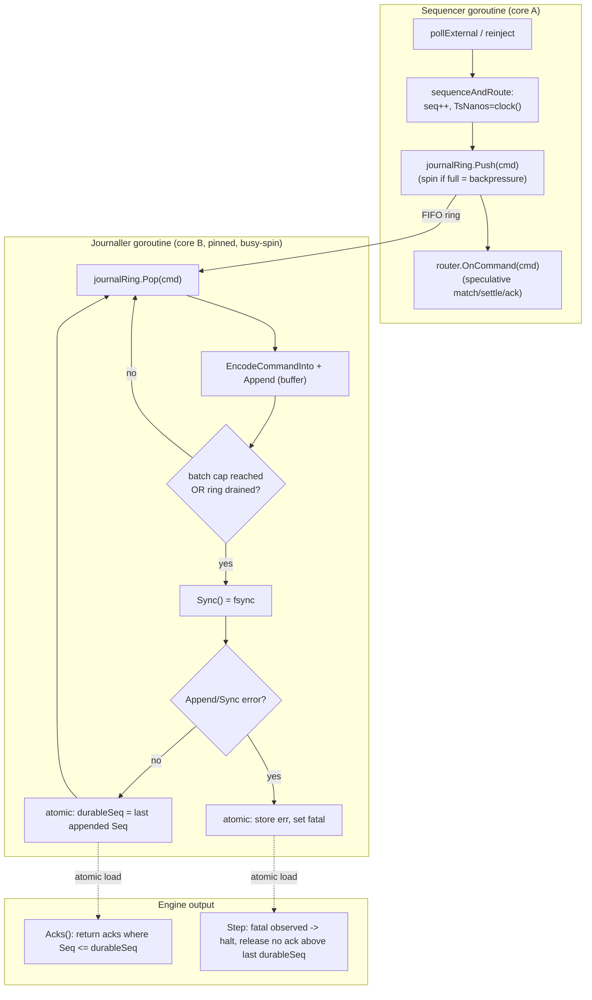
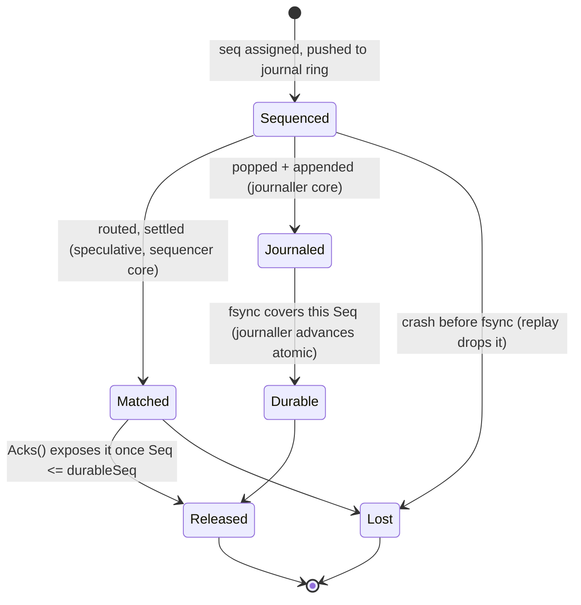

# feat: Off-thread Journaller

## Summary

Move WAL `Append` + group-commit `Sync` (fsync) off the engine/sequencer
goroutine onto a dedicated **Journaller** goroutine — the LMAX "Journaller"
consumer — so the matcher never blocks on disk. The sequencer still assigns
`Seq`/`TsNanos` (single ordering authority, unchanged) and routes matching
speculatively; it now hands the sequenced command to the Journaller over an SPSC
ring instead of journaling inline. The Journaller batches, fsyncs, and publishes
`durableSeq` through an atomic that the engine reads to gate ack release — the
existing durable-ack barrier (plan 002), relocated. Determinism is preserved:
the journal ring is FIFO so the on-disk byte stream is identical regardless of
Journaller timing, and `durableSeq` stays output-side-only.

This is a **performance refinement**, not a correctness fix. It is justified by
profiling, and it is the load-bearing change for the **1M durable TPS** target
(the real target; `CLAUDE.md`/design docs still say 100k).

---

## Problem Frame

The durable-ack barrier (plan 002) journals and fsyncs **on the sequencer's
`Step` loop** (`internal/sequencer/sequencer.go:148-213`):

```go
// sequenceAndRoute: inline Append on the engine goroutine
if err := s.journal.Append(wal.Record{...}); err != nil { return err }
s.router.OnCommand(*c)        // speculative match
// flush(): inline Sync on the engine goroutine
if err := s.journalSync(); err != nil { return err }   // fsync STALLS the loop
```

CPU profiling of the durable serial path at high `flushcap` (`cmd/throughput
-durable -flushcap 32768 -cpuprofile`, 2026-06-14, Apple Silicon / Darwin /
single SSD) shows the bottleneck is **not** WAL CPU work:

| Signal | Measurement |
|---|---|
| Raw matching ceiling (no-op journal) | **~1.25M cmd/s**, p50 step 585ns |
| Durable ceiling (flushcap≥32768) | **~880k cmd/s**, plateau below the matcher |
| `syscall.write` (WAL write) | **0.07s / 0.6% CPU** |
| `EncodeCommandInto` / CRC | **invisible** (below 0.06s threshold) |
| `fsync` | **off-CPU** — does not appear in CPU samples; surfaces as ms-scale `Step`-latency spikes (p99 ms-scale, max 28ms) |

Two conclusions, both load-bearing for this plan:

1. **fsync is off-CPU and stalls the single engine goroutine.** While the
   sequencer goroutine is blocked in `fsync`, it cannot match, settle, or
   sequence. At ~880k cmd/s with flushcap 32768 the engine freezes ~27×/s for
   the fsync duration — the gap between the 1.25M matcher ceiling and the 880k
   durable ceiling. This is the defect this plan removes.
2. **mmap is rejected.** The WAL write path is 0.6% CPU; mmap removes a `write()`
   syscall and a buffer copy worth that 0.6%. It does **not** speed up `fsync`
   (mmap still needs `msync`/`fdatasync` to be durable). Not worth the SIGBUS /
   writeback-semantics complexity for sub-1% — out of scope, see Scope
   Boundaries.

> Caveat on the numbers: the same profile shows `Book.alloc` (29%) and
> `Core.ack` (28%) as the top *on-CPU* costs, but both are **synthetic-workload
> artifacts** — `cmd/throughput`'s `GenBaseMid` rests orders forever (arena grows
> past `capHint`) and never calls `Acks()` (the ack slice grows unbounded). They
> are not steady-state durable costs and are explicitly **out of scope** here;
> see Follow-Up. The fsync-stall and mmap conclusions above are workload-
> independent.

The matcher already clears 1.25M cmd/s single-threaded; LMAX's whole thesis is a
single-threaded BLP. So the path to 1M **durable** TPS is not to parallelize
matching (the current parallel topology regresses to ~378k — see plan-004 and
Scope Boundaries) but to stop the matcher from blocking on fsync. That is
exactly the LMAX input-disruptor shape: matcher and Journaller consume the
sequenced stream concurrently; the durable-ack barrier waits on the Journaller
before releasing output (`docs/designs/lmax-reference.md` §4, §9).

---

## Key Technical Decisions

- **The sequencer keeps `Seq`/`Ts` assignment; only `Append`+`Sync` move.** Seq
  assignment and the single timestamp read (`sequencer.go:274-277`) are the
  ordering authority and must stay single-threaded on the sequencer. The
  Journaller is a pure downstream consumer of already-sequenced records. Chosen
  over moving sequencing itself, which would break the single-ordering-authority
  invariant.

- **Hand-off via a dedicated SPSC ring; Journaller is the sole consumer.** The
  sequencer (producer) pushes the sequenced `Command` onto a `RingCommand`; the
  Journaller (consumer) pops, encodes, appends, and fsyncs. FIFO ordering of the
  ring guarantees records reach the WAL in `Seq` order, so the **on-disk byte
  stream is byte-identical** regardless of when the Journaller runs. Reuses the
  existing `internal/spsc` ring; no new transport.

- **`durableSeq` becomes an atomic owned by the Journaller, read by the engine.**
  The Journaller advances `atomic.Uint64 durableSeq` after each successful
  `Sync`. `Engine.Acks()` / `ParallelEngine.Acks()` gate on
  `journaller.DurableSeq()`. Single writer (Journaller), many readers — no lock.
  This relocates the watermark that plan 002 put on the sequencer
  (`sequencer.go:58-72`); the gate semantics are unchanged.

- **Async `durableSeq` timing is output-side-only and therefore determinism-
  safe.** Plan 002 already established that `durableSeq`/flush timing never feed
  `Seq`, timestamps, or fill order, so replay is invariant to flush cadence. An
  *asynchronous* cadence is the same guarantee with looser timing: mid-stream the
  watermark advances nondeterministically, but final state after `Drain` is
  deterministic and the WAL bytes are identical. Tests assert sync-vs-async
  produce identical WAL bytes and identical final state (U6).

- **Keep a synchronous Journaller as the default; async is opt-in.** Introduce a
  `Journaller` seam with two implementations: `SyncJournaller` (inline
  Append+Sync — behavior-identical to today, used by every property/differential/
  recovery test and by `Replay`) and `AsyncJournaller` (goroutine + ring + atomic
  watermark, used by `cmd/engine` and the throughput harness). This preserves all
  existing synchronous, deterministic tests **unchanged** while enabling the
  async path for production/perf. Chosen over forcing every test through a
  goroutine, which would inject timing nondeterminism into the suite for no
  correctness benefit.

- **Bounded speculation via ring backpressure.** Matching may run ahead of
  durability (the speculative model from plan 002), bounded by the journal ring
  depth: when the ring fills (Journaller can't keep up — slow disk), the
  sequencer's push spins (backpressure), capping the matcher to Journaller
  throughput. Records are **never dropped** — the WAL is the source of truth.

- **Fail-stop crosses the goroutine boundary via an atomic.** An `Append`/`Sync`
  error on the Journaller latches an atomic fatal flag + stores the error; the
  engine checks it each `Step` (atomic load) and halts, releasing no ack above
  the last good `durableSeq`. Replaces plan 002's same-goroutine `fatal` field
  with a cross-goroutine handshake. Chosen over a panic so the host controls
  shutdown and the error is testable.

- **`Drain`/snapshot become a barrier against the Journaller.** `Drain()` and
  `SyncJournal()` must block until the Journaller has consumed the ring and
  fsynced through the current `Seq` (`durableSeq >= Seq`), so snapshots never
  capture state the WAL cannot back. A synchronous quiesce point against the
  async consumer.

- **The Journaller gets a pinned core and busy-spins.** Like the matcher, the
  Journaller runs hot on a dedicated core (`platform.PinCurrentThread`), the LMAX
  `BusySpin` wait strategy. `GOMAXPROCS` accounting adds one core for it.

---

## High-Level Technical Design

Live path with the Journaller decoupled. The matcher and Journaller run on
separate cores; the only synchronization is the FIFO ring (forward) and the
`durableSeq` atomic (backward, output-side).



Durability state machine for a single command's `Seq` (unchanged from plan 002
except the actor that advances `Durable`):



The two SLOs separate cleanly: **internal match latency** = sequencer step
(sub-µs, never blocks on disk); **durable-ack latency** = ring-wait + batch +
fsync on the Journaller (ms-scale, fsync-bound). The matcher's throughput is
decoupled from the durable-ack latency.

---

## Requirements

- R1. WAL records reach disk in strictly ascending `Seq` order, byte-identical to
  the current inline path, regardless of Journaller scheduling. (Determinism.)
- R2. The sequencer assigns `Seq`/`TsNanos` exactly as today; no Journaller code
  reads the clock or assigns sequence numbers.
- R3. The matcher (sequencer `Step`) never blocks on `fsync`; it blocks only on
  ring backpressure when the Journaller cannot keep up.
- R4. `Engine.Acks()` and `ParallelEngine.Acks()` expose no ack with
  `Seq > durableSeq`, where `durableSeq` is the Journaller's atomic watermark.
- R5. A flush captures the last-appended `Seq` **before** `Sync`, then advances
  `durableSeq` to that value after `Sync` returns — never over-claiming coverage
  the fsync did not include (carried from plan 002 R3).
- R6. An `Append`/`Sync` error on the Journaller fail-stops the engine: matching
  halts on the next `Step`, no ack above the last good `durableSeq` is released,
  and the error is surfaced to the host.
- R7. `Drain()` and `SyncJournal()` block until `durableSeq >= Seq` (or a fatal
  latches); after `Drain()`, `Acks()` returns the full set, so existing
  drain-then-read callers and tests are unaffected.
- R8. A snapshot's `Seq` never exceeds `durableSeq` (carried from plan 002 R8):
  the `Drain`+`SyncJournal` barrier guarantees it against the async consumer.
- R9. `SyncJournaller` (default) reproduces today's behavior exactly; the entire
  existing property/differential/recovery/rapid suite passes unchanged against
  it.
- R10. Same generated stream under `SyncJournaller` and `AsyncJournaller`
  produces byte-identical WAL output and an identical final state digest.
- R11. The hot path stays zero-alloc: the ring carries fixed-size `Command` POD;
  the Journaller's encode reuses a buffer; no per-command allocation on either
  goroutine.
- R12. **(Property / invariant layer.)** With the async Journaller wired, every
  existing `INV-*` (`tests/property`, `CheckAllInvariants`) holds after every
  command, plus four new journal invariants asserted continuously:
  - **INV-JRN-01** — WAL records are written strictly ascending and gap-free in
    `Seq` (no reorder across the ring).
  - **INV-JRN-02** — `durableSeq` is monotonically non-decreasing.
  - **INV-JRN-03** — no ack with `Seq > durableSeq` is ever observable through
    either `Acks()` accessor.
  - **INV-JRN-04** — after `Drain()` with no fatal latched, `durableSeq == Seq`.
- R13. **(Differential layer.)** The engine with the async Journaller produces
  fills, balances, and book state **identical to the reference-model oracle**
  (`tests/refmodel`) over randomized streams — async journaling is behavior-
  transparent (the oracle has no notion of durability, so equality proves the
  matcher/ledger results are unperturbed).
- R14. **(Fuzz layer.)** Coverage-guided `FuzzEngine` and the `pgregory.net/rapid`
  state machine exercise the async path — including full-ring backpressure,
  fail-stop on `Append`/`Sync` error, and crash-before-fsync — asserting
  differential equivalence + invariants; every fixed bug adds a permanent
  regression seed under `tests/property/testdata/fuzz/`.

---

## Implementation Units

### U1. The `Journaller` seam + `SyncJournaller` (behavior-preserving extraction)

- **Goal:** Introduce a `Journaller` abstraction and move the existing inline
  Append/flush/`durableSeq` logic behind a synchronous implementation, with no
  behavior change.
- **Requirements:** R5, R9.
- **Dependencies:** none (foundation).
- **Files:** `internal/sequencer/sequencer.go`, new
  `internal/sequencer/journaller.go` (or a small `internal/journal` package — see
  Approach), `internal/sequencer/sequencer_test.go`.
- **Approach:** define a `Journaller` interface — `Submit(types.Command) error`
  (hand a sequenced command off for durability), `DurableSeq() types.Seq`,
  `Drain() error` (block until caught up), `Fatal() error`, `Close() error`.
  `SyncJournaller` wraps the current `*wal.Writer` + the `unsynced`/`flushCap`/
  `durableSeq` fields and the `flush()` logic lifted verbatim from
  `sequencer.go:196-213`: `Submit` does `Append` + `unsynced++`; the sequencer
  calls `Drain`-style flush on ring-empty/cap as today. The sequencer's
  `sequenceAndRoute` calls `journaller.Submit(*c)` instead of `journal.Append`,
  and reads `journaller.DurableSeq()` for the gate. Keep the package boundary
  minimal; if circular-import pressure appears (the engine reads `DurableSeq`),
  put `Journaller` in its own `internal/journal` package depending only on
  `internal/types` + `internal/wal`.
- **Patterns to follow:** the optional-`Sync` assertion and `flush()` capture-
  before-Sync discipline already in `sequencer.go:196-213`; the no-op-journal
  handling (`journalSync` returns nil with no `Sync` method).
- **Test scenarios:**
  - Happy path: `SyncJournaller` over the in-memory journal — `DurableSeq`
    tracks `Seq` after drain exactly as the current sequencer tests assert.
  - Edge: cap-triggered vs drain-triggered flush both advance `durableSeq`
    (port existing `sequencer_test.go:253-287`).
  - Negative: `Append`/`Sync` error → `Fatal()` returns it (port U1 of plan 002).
  - Determinism: identical WAL bytes vs the pre-refactor path for a fixed stream.
- **Verification:** the full existing `internal/sequencer` suite passes with the
  sequencer delegating to `SyncJournaller`; `make test` green; no behavior diff.

### U2. `AsyncJournaller`: goroutine + journal ring + atomic watermark

- **Goal:** A Journaller that consumes a ring on its own goroutine, batches,
  fsyncs, and publishes `durableSeq` atomically.
- **Requirements:** R1, R2, R3, R5, R11.
- **Dependencies:** U1.
- **Files:** `internal/journal/async.go` (or `internal/sequencer/journaller.go`),
  `*_test.go`, `internal/spsc` (reuse `RingCommand`).
- **Approach:** `AsyncJournaller` owns a `*spsc.RingCommand` (the journal ring), a
  `*wal.Writer`, an `atomic.Uint64 durableSeq`, an `atomic.Bool fatal` + stored
  `error`, and a goroutine running a busy-spin loop: pop commands, `Append`
  each (reusing an encode buffer), and `Sync` when the batch cap is hit **or**
  the ring drains with unsynced records pending (the same two triggers as plan
  002, now on the Journaller). After a successful `Sync`, store the captured
  last-`Seq` into `durableSeq` (atomic). `Submit` pushes to the ring, spinning on
  a full ring (backpressure, R3). The goroutine pins to a core
  (`platform.PinCurrentThread`) and `runtime.Gosched`es only when truly idle.
- **Patterns to follow:** the worker busy-spin loop in
  `internal/market/parallel.go:83-120` (pop / Gosched-on-empty / pin); the
  group-commit cap + drain triggers from `sequencer.go:148-190`.
- **Test scenarios:**
  - Happy path: submit N commands, `Drain` → `durableSeq == N`, WAL holds N
    records in order.
  - Edge: ring smaller than the stream → `Submit` backpressures, no record
    dropped, final WAL complete.
  - Edge: idle Journaller issues no spurious `fsync`.
  - Edge: cap=1 → fsync per command (latency-floor mode).
  - Alloc: a benchmark asserts `Submit` + the Journaller loop are zero-alloc per
    command (`-benchmem`), per the CI zero-alloc gate.
- **Verification:** unit tests show in-order durable records and atomic watermark
  advance; zero-alloc benchmark green; `-race` clean on the producer/consumer
  pair.

### U3. Cross-goroutine fail-stop

- **Goal:** Propagate a Journaller `Append`/`Sync` error to the engine so it
  halts without releasing speculative acks.
- **Requirements:** R6.
- **Dependencies:** U2.
- **Files:** `internal/journal/async.go`, `internal/sequencer/sequencer.go`,
  `internal/market/engine.go`, `internal/market/parallel.go`, `*_test.go`.
- **Approach:** on a Journaller I/O error, store the error and set the atomic
  fatal flag; stop the Journaller loop (durableSeq frozen at the last good
  value). The sequencer's `Step` checks `journaller.Fatal()` (atomic load, cheap)
  at the top and, when set, latches its own terminal state, routes nothing
  further, and returns the error — mirroring plan 002's fail-stop but sourced
  across the boundary. No ack above the frozen `durableSeq` is ever released.
- **Patterns to follow:** plan 002's `fatal` latch + `Step` error return
  (`sequencer.go:148-151`); the engine wiring that consumes the error
  (`cmd/engine/main.go:82-98`).
- **Test scenarios:**
  - Error path: Journaller `Append` fails on the Nth command → next `Step`
    returns the error; `durableSeq` never passes N-1; no ack ≥ N released.
  - Error path: `Sync` fails mid-batch → fail-stop; pending acks in that batch
    withheld.
  - Edge: speculative matches that ran ahead of the failed record are discarded
    on restart (recovery replays the durable log only — assert via U6).
  - Race: `-race` clean on the fatal handshake (atomic flag + stored error with
    correct ordering: store error before setting flag; load flag before reading
    error).
- **Verification:** injected-failure test halts the engine with no leaked ack;
  `make test` + `make race` green.

### U4. `Drain`/`SyncJournal`/snapshot barrier against the async consumer

- **Goal:** Make quiesce points block until the Journaller has fsynced through
  the current `Seq`, so snapshots and drain-then-read callers stay correct.
- **Requirements:** R7, R8.
- **Dependencies:** U2, U3.
- **Files:** `internal/market/engine.go` (`Drain`, `SyncJournal`),
  `internal/market/snapshot.go`, `internal/market/snapshotter.go`,
  `internal/sequencer/sequencer.go`, `tests/property/snapshot_test.go`.
- **Approach:** `Drain()` steps until the sequencer ring is empty (as today),
  then calls `journaller.Drain()` which spins until `durableSeq >= Seq` or a
  fatal latches. `SyncJournal()` becomes `journaller.Drain()`. `Snapshotter.
  Snapshot` already does `Drain` → `SyncJournal` → publish; with the barrier the
  snapshot `Seq` is `<= durableSeq` by construction. A fatal during the barrier
  aborts the snapshot (carried from plan 002 U4). For `SyncJournaller` the
  barrier is a no-op flush (already caught up).
- **Patterns to follow:** `Snapshotter.Snapshot`'s `Drain`-then-sync sequence
  (`snapshotter.go:82-96`); plan 002 U4's abort-on-fatal.
- **Test scenarios:**
  - Happy path: `Drain` after a partial batch → `durableSeq == Seq`, `Acks()`
    full (no regression for existing drain-then-read tests).
  - Edge: snapshot after an unflushed async batch → snapshot `Seq == durableSeq`,
    never a speculative higher `Seq`.
  - Error path: fatal during the snapshot barrier → no snapshot file published.
  - Determinism: `restore + tail == full replay` (INV-DET-02) holds with the
    async Journaller.
- **Verification:** `make property` green; snapshot-ordering assertion holds
  against the async path.

### U5. Wiring + topology + core budget

- **Goal:** Select `AsyncJournaller` for production/throughput, pin it, and
  account for its core; keep tests on `SyncJournaller`.
- **Requirements:** R3, R9.
- **Files:** `internal/market/engine.go` (assembly), `internal/market/parallel.go`,
  `cmd/engine/main.go`, `cmd/throughput/main.go`,
  `cmd/internal/harness/engine.go`, `pkg/config/config.go`.
- **Approach:** add a `Config` field selecting the Journaller mode (sync default;
  async for `cmd/engine` and `-durable` throughput runs), with a configurable
  journal-ring size and the existing `FlushCap` now consumed by the Journaller.
  `NewEngine`/`NewParallelEngine` construct the chosen Journaller and pass it to
  the sequencer. Bump `GOMAXPROCS` accounting by one for the Journaller core
  (serial: sequencer + journaller + producer = 3 hot; parallel: + workers).
  Pin the Journaller above the worker range. `pkg/config` gains the env knobs
  (`OB_JOURNAL_MODE`, `OB_JOURNAL_RING`) read once at startup.
- **Patterns to follow:** `harness.BuildEngine` topology switch; the
  `GOMAXPROCS` accounting in `cmd/throughput/main.go:53-62`; `platform`
  pin/Unpin usage in the worker.
- **Test scenarios:**
  - Build-equivalence: serial and parallel engines accept either Journaller mode
    and produce identical results for a fixed stream (extend
    `cmd/internal/harness/engine_test.go`).
  - Config: `OB_JOURNAL_MODE` parse — valid sync/async, invalid rejected, default
    sync (positive/negative/edge per `pkg/config` conventions).
  - Integration: `cmd/engine` runs end-to-end with the async Journaller and
    recovers correctly after a clean stop.
- **Verification:** `make test`; `make throughput TOPOLOGY=serial` with the async
  Journaller shows the durable ceiling rising toward the matcher ceiling (see
  U6's benchmark); all `cmd/*` compile.

> **Mandatory three-layer coverage.** This change touches sequencer + WAL
> durability semantics, so per `CLAUDE.md` ("Testing is MANDATORY") it ships with
> all three layers — property/invariant (U6), differential (U7), and fuzz (U8).
> A unit that adds engine behavior without extending these is incomplete. Each
> layer below runs against the **async** Journaller; the sync path is covered by
> U1's behavior-preserving port of the existing suite.

### U6. Property / invariant layer

- **Goal:** Assert every `INV-*` plus the four new journal invariants after every
  command under the async Journaller, and the sync≡async + same-seed determinism
  properties.
- **Requirements:** R10, R12.
- **Dependencies:** U2, U3, U4.
- **Files:** `tests/property/invariants.go` (extend `CheckAllInvariants`), new
  `tests/property/invariants_journal_test.go`,
  `tests/property/determinism_test.go`, `tests/property/generators.go`.
- **Approach:** add `INV-JRN-01..04` to the per-command invariant set. INV-JRN-01
  reads the WAL back (or taps the Journaller's append sequence) and asserts
  strictly-ascending, gap-free `Seq`; INV-JRN-02 tracks `durableSeq` across steps
  and asserts non-decreasing; INV-JRN-03 scans every exposed ack and asserts none
  exceed the current `durableSeq`; INV-JRN-04 runs after `Drain` and asserts
  `durableSeq == Seq`. Because the async watermark advances nondeterministically
  mid-stream, INV-JRN-03 asserts the **gate relation** (no ack above the watermark
  at the moment of observation), not an exact watermark value — the determinism
  is captured separately. Add a determinism test driving one `GenSharp`/`GenBroad`
  stream through `SyncJournaller` and `AsyncJournaller`, asserting **byte-
  identical WAL output and identical final state digest** (R10), plus a
  same-seed-twice async run asserting identical digest (output-side timing must
  not leak into state).
- **Patterns to follow:** `CheckAllInvariants` (`tests/property/invariants.go:24`),
  the state-digest equality in `tests/property/determinism_test.go`, the existing
  INV naming in `docs/designs/invariant-fuzz-testing-guide.md`.
- **Test scenarios:**
  - Positive: long random stream, async Journaller → all `INV-*` + `INV-JRN-*`
    hold after every command.
  - Negative: a deliberately stale watermark (test seam) → INV-JRN-02/03 catch a
    regression (the invariant has teeth).
  - Edge: idle engine (no commands) → invariants hold trivially; no fsync.
  - Edge: `Drain` mid-batch → INV-JRN-04 holds (`durableSeq == Seq`).
  - Determinism: sync vs async, same seed → identical WAL bytes + state digest;
    async twice, same seed → identical digest.
- **Verification:** `make property` green; `INV-JRN-01..04` documented in the
  testing guide and asserted each step; determinism test passes both directions.

### U7. Differential layer (engine vs reference oracle)

- **Goal:** Prove the async Journaller is behavior-transparent — the engine still
  matches the independent reference-model oracle over randomized streams.
- **Requirements:** R13.
- **Dependencies:** U2.
- **Files:** `tests/property/differential_test.go`,
  `tests/property/filter_differential_test.go`, `tests/refmodel/model_match.go`
  (parameterize the engine builder).
- **Approach:** thread a Journaller-mode parameter through the differential
  runner so the same randomized stream runs against (a) the reference model, (b)
  the engine with `SyncJournaller`, and (c) the engine with `AsyncJournaller`,
  asserting all three agree on fills, balances, reserved amounts, and book state
  after each step. The oracle ignores durability, so any divergence is the async
  path perturbing matching/settlement — exactly what must never happen. Reuse the
  existing `RunDifferential` entry; add an async variant row. Cover both the
  base generators and the order-filter differential.
- **Patterns to follow:** `RunDifferential` (`tests/refmodel` differential entry),
  `tests/property/differential.go`, the model in `tests/refmodel/model.go` +
  `state.go`.
- **Test scenarios:**
  - Positive: mixed order-type stream (limit/market/IOC/FOK/post-only/iceberg/
    stop) across 3 markets, shared balances → engine(async) ≡ oracle each step.
  - Negative: insufficient-funds and FOK-unfillable rejections → both engine and
    oracle reject identically; no state divergence (async journaling must not
    change rejection paths).
  - Edge: stop activation re-injected mid-stream → async engine and oracle agree
    on the activated order's effect and ordering.
  - Parity: engine(sync) ≡ engine(async) ≡ oracle for the same seed.
- **Verification:** `make differential` green for both Journaller modes; the
  async row is wired into CI's differential slice.

### U8. Fuzz + rapid state-machine layer

- **Goal:** Coverage-guided and model-based exploration of the async durability
  state, with permanent regression seeds for every failure mode.
- **Requirements:** R1, R6, R14.
- **Dependencies:** U2, U3, U4.
- **Files:** `tests/property/fuzz_test.go`, `tests/property/statemachine_test.go`,
  `tests/property/recovery_test.go`, `tests/property/testdata/fuzz/FuzzEngine/`.
- **Approach:** extend `FuzzEngine` so the decoded command stream is replayed
  through the engine with the async Journaller, asserting differential
  equivalence + `CheckAllInvariants` on every step (the existing fuzz target
  already decodes a stream; add the async engine assertion). Extend the `rapid`
  state machine with durability-aware actions — `Submit`, `Step`, `Drain`,
  `InjectAppendError`, `InjectSyncError`, `FillJournalRing` (force backpressure),
  and `CrashRecover` — and check `INV-JRN-*`, fail-stop semantics (no ack above
  the frozen watermark), and recovery equivalence (`restore+tail == full replay`)
  after each action, with shrinking. Commit three regression seeds: (1)
  `Append`/`Sync` fail-stop, (2) full-ring backpressure then drain to completeness,
  (3) crash-before-fsync leaving the undurable tail absent after `Recover`.
- **Patterns to follow:** `decodeStream` (`tests/property/fuzz_test.go:14-64`),
  the rapid machine in `tests/property/statemachine_test.go`, `replayInto()`
  (`tests/property/recovery_test.go:40-57`), `RunDifferential`.
- **Test scenarios:**
  - Fuzz: random byte corpus → decode → async engine ≡ oracle + invariants hold;
    no panic, no leaked ack.
  - Rapid: interleaved Submit/Step/Drain/error-injection/backpressure/crash →
    `INV-JRN-*` + recovery equivalence hold; failures shrink to a minimal case.
  - Recovery: crash before fsync → undurable tail absent, durable prefix intact,
    no ack ever observed for the lost tail (R6).
  - Backpressure: full journal ring → `Submit` blocks, no record dropped, final
    WAL complete after drain (R1).
  - Regression: the three seeds above committed and replayed green.
- **Verification:** short `make fuzz` slice green; `rapid` state machine passes
  with shrinking; three regression seeds committed under
  `tests/property/testdata/fuzz/FuzzEngine/`; `make property` (which runs the
  rapid layer) green.

### U9. Decoupling throughput benchmark (evidence, not a gate)

- **Goal:** Demonstrate the matcher decouples from fsync without a flaky
  wall-clock CI gate.
- **Requirements:** R3.
- **Dependencies:** U2, U5.
- **Files:** `cmd/internal/harness/*_test.go`, `cmd/throughput` (reuse).
- **Approach:** a reproducible fixed-count (`-n`) durable run with the async
  Journaller, asserting the durable throughput exceeds a conservative floor well
  above the ~880k inline-durable ceiling — documenting the win as a regression
  tripwire, not a precise SLA. Keep it out of the latency-sensitive zero-alloc
  benches.
- **Test scenarios:**
  - Positive: async durable `-n` run clears the floor on the reference machine.
  - Edge: tiny `-n` still terminates and reports (no divide-by-zero, no hang).
- **Verification:** runs in CI's non-gating perf slice; documented in the PR with
  the before/after durable ceiling.

---

## Scope Boundaries

**In scope:** the `Journaller` seam, the `SyncJournaller` extraction, the
`AsyncJournaller` (goroutine + ring + atomic watermark + group-commit),
cross-goroutine fail-stop, the `Drain`/snapshot barrier, wiring + core budget,
and the mandated three-layer harness — property/invariant (U6, incl. the new
`INV-JRN-01..04`), differential (U7), and fuzz + rapid (U8) — plus the
non-gating decoupling benchmark (U9).

**Explicitly rejected (with evidence):**
- **mmap WAL.** Profiling shows the WAL write path is 0.6% CPU and `fsync`
  dominates durability; mmap does not accelerate `fsync`. The sub-1% win does not
  justify the `msync`/writeback/SIGBUS complexity. (Design doc deferred mmap to a
  "performance phase"; this plan closes the question: not for throughput.)

### Deferred to Follow-Up Work (re-measure first)

- **Arena pre-sizing / `Book.alloc`.** The profile's 29% `alloc` cost is a
  synthetic-workload artifact (orders rest forever, book grows past `capHint`).
  Before tuning, re-measure under a balanced match-heavy workload where the
  free-list dominates. Likely a `capHint`/`pkg/config` change, not an algorithm
  change.
- **Ack buffer growth / `Core.ack`.** The profile's 28% `ack` cost is inflated by
  the throughput harness never draining `Acks()` (unbounded slice). The real fix
  is an output-side ack ring (the LMAX "output disruptor") that bounds the buffer
  — a separate refinement the design doc already defers.
- **Flush-cap auto-tuning** against p50/p99 durable-ack latency on real NVMe.
- **Validating the parallel topology for 1M.** The current `remoteShard.call` is
  a blocking RPC and regresses to ~378k; a real pipelined parallel path (async
  dispatch + async fill-drain via the existing `fills` ring + `drainFills`) is a
  separate plan, only needed above the 1.25M single-thread ceiling.

### Outside v1

- Replication / Raft (the Journaller's sibling "Replicator" consumer), failover,
  backup/DR — out of scope per `CLAUDE.md`. This plan is the single-node
  Journaller leg of LMAX's journal+replicate barrier.

---

## System-Wide Impact

- **Determinism contract (highest risk):** correctness hinges on the journal ring
  being strictly FIFO and `durableSeq` staying output-side. A bug that let the
  Journaller reorder records or let the watermark feed back into matching is a
  silent correctness failure. Three independent guards cover it: U6's
  byte-identical sync-vs-async determinism test + `INV-JRN-01/02` (ordering &
  monotonicity), U7's differential equivalence vs the reference oracle
  (behavior-transparency), and U8's rapid/fuzz exploration of error + backpressure
  + crash paths; `-race` on the producer/consumer handshake is the runtime guard.
- **Hot path / zero-alloc:** the ring carries fixed-size `Command` POD; the
  Journaller reuses its encode buffer. The added per-command cost on the
  sequencer is one ring `Push` (tens of ns) replacing an inline `Append`. No
  allocation on either goroutine; the CI zero-alloc gate extends to the
  Journaller loop.
- **Concurrency / threading:** introduces a second hot goroutine in serial
  topology (sequencer + Journaller) and a third class in parallel (control +
  workers + Journaller). `GOMAXPROCS` and core-pinning budgets grow by one; on
  Darwin pinning is a no-op so the win is only measurable on Linux (note for the
  reviewer reading dev-box numbers).
- **API surface:** the sequencer's `Journal` field becomes a `Journaller`; `Step`
  keeps its `(bool, error)` signature from plan 002. `Drain`/`SyncJournal` now
  block on the async consumer — every caller already treats them as
  quiesce-then-read, so the contract is preserved, but the blocking semantics
  must be documented so a future non-blocking refactor doesn't reintroduce a
  speculative-snapshot hole.
- **Two-SLO model becomes real:** internal match latency (sub-µs) and durable-ack
  latency (fsync-bound) are now produced by different goroutines — the design
  doc's §18 two-SLO framing is no longer aspirational; harnesses should report
  them separately.

---

## Risks & Dependencies

- **Risk: reordering across the ring.** A producer/consumer bug could let records
  hit the WAL out of `Seq` order. Mitigation: SPSC FIFO is order-preserving by
  construction; R1/R10 assert byte-identical output; `-race` on the pair.
- **Risk: timing nondeterminism leaks into tests.** The async watermark advances
  nondeterministically mid-stream. Mitigation: tests use `SyncJournaller` by
  default and read only after `Drain` (which barriers to `durableSeq == Seq`); the
  one async test asserts post-drain state only.
- **Risk: backpressure deadlock.** If the sequencer spins on a full journal ring
  while the Journaller is blocked on a slow/failed fsync, the engine stalls.
  Mitigation: a Journaller fatal unblocks the sequencer via the fatal check
  before the next push; size the ring for the worst-case fsync latency × matcher
  rate.
- **Risk: snapshot captures speculative state.** Mitigation: U4's
  `Drain`+barrier guarantees `snapshotSeq <= durableSeq`; tested.
- **Dependencies:** builds directly on plan 002 (durable-ack barrier — already
  implemented: `durableSeq`, `flushCap`, `flush()` in `sequencer.go`). No
  external dependency. All work within `internal/sequencer`, a new
  `internal/journal`, `internal/market`, `cmd/*`, `pkg/config`, `tests/property`.

---

## Sources & Research

- Profiling investigation (2026-06-14): `cmd/throughput -topology serial -durable
  -flushcap {0..32768} [-cpuprofile]` on Apple Silicon / Darwin / single SSD.
  Findings: raw matcher ceiling ~1.25M cmd/s; durable ceiling ~880k (fsync-bound,
  plateau); `syscall.write` 0.6% CPU; `fsync` off-CPU (ms-scale `Step` stalls);
  `Book.alloc`/`Core.ack` top on-CPU costs are synthetic-workload artifacts.
- LMAX Journaller consumer + sequence barrier: `docs/designs/lmax-reference.md`
  §4, §5, §9 (Journaller → engine §6), §11 (SPSC vs full-Disruptor in Go).
- Durable-ack barrier (predecessor, implemented):
  `docs/plans/2026-06-14-002-feat-durable-ack-barrier-plan.md`;
  `internal/sequencer/sequencer.go:58-78,112-114,148-213,274-289`.
- Inline journaling site this plan relocates:
  `internal/sequencer/sequencer.go:274-289` (`sequenceAndRoute`), `196-213`
  (`flush`/`journalSync`).
- WAL `Append` vs `Sync` (buffered write + group-commit fsync):
  `internal/wal/wal.go:78-126`; record framing `internal/wal/record.go:15-52`.
- Ack collection + accessor gated on `DurableSeq`:
  `internal/market/engine.go:200-202,345-364`; `ParallelEngine.Acks()` in
  `internal/market/parallel.go`.
- SPSC ring (reused for the journal ring): `internal/spsc/ring.go:9-61`,
  `internal/spsc/concrete.go:7-24`.
- Worker busy-spin + pin pattern to mirror for the Journaller loop:
  `internal/market/parallel.go:83-120`; `internal/platform/pin_linux.go`,
  `pin_darwin.go`, `gc.go`.
- Throughput harness + durable/cpuprofile flags:
  `cmd/throughput/main.go`; `cmd/CLAUDE.md`.
- Design context: `docs/designs/spot-orderbook-engine-design.md` §5 (SPSC), §6
  (sequencer/WAL), §12 (threading/cores), §18 (two-SLO load test).
