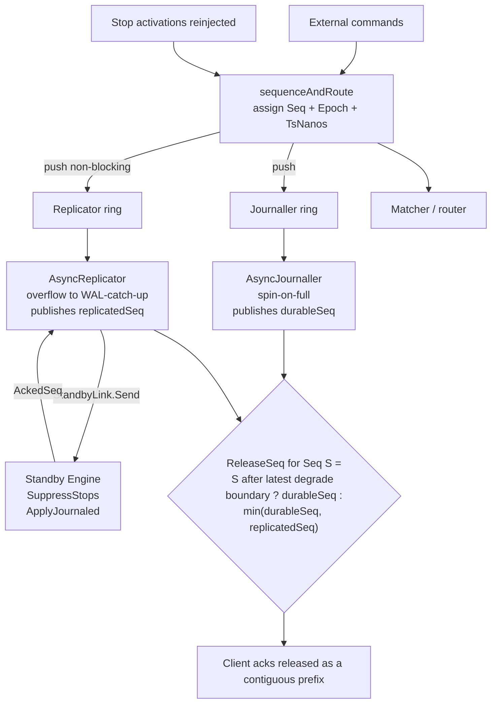
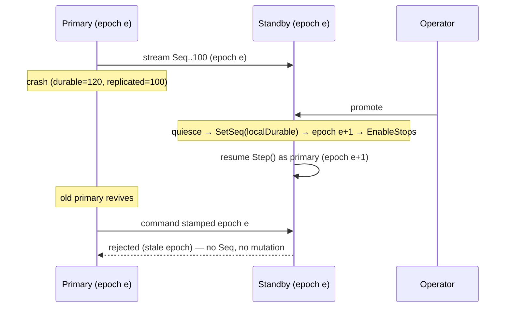

# feat: Replicator — Hot Standby with Epoch-Fenced Failover

## Summary

Add an LMAX-style replicator: a second consumer of the sequencer's sequenced
command stream that streams every `Seq` to a hot standby and publishes a
`replicatedSeq` watermark gating client acks in sync mode. The implementation
mirrors the existing `AsyncJournaller`/`durableSeq` trio structurally
(`internal/sequencer/async_journaller.go`), adds epoch-fenced manual promotion,
a config-selected `sync`/`async`/`off` mode, and a `min(durableSeq,
replicatedSeq)` ack gate. The whole data plane is built over an in-process
`StandbyLink` seam so the correctness machinery — fencing, ack-gating, catch-up,
determinism — is fully exercised by the property/differential/fuzz/chaos suite
without any networking. The network transport is a follow-up behind the same
seam.

---

## Problem Frame

The engine is a single-node deterministic state machine. The WAL protects
against process crashes, but every durable copy lives on one machine; a
catastrophic host/disk loss loses the book and ledger outright. `ARCHITECTURE.md`
reserves a "Raft replicator (out-of-scope v1)" slot, and the repo has zero
networking or multi-node code. The brainstorm
(`docs/brainstorms/2026-06-14-replicator-hot-standby-requirements.md`) moved the
v1 line to add hot-standby failover while deliberately avoiding consensus: manual
promotion plus epoch fencing gives split-brain safety without an election
implementation.

Research confirmed the `AsyncJournaller` is the right structural template (not
Raft) and surfaced three hazards the brainstorm under-specified, now first-class
in this plan: epoch must persist in the **snapshot header** or fencing dies on
cold restart; replicator backpressure must **decouple from journaling** so a slow
standby stalls acks only; and `ApplyJournaled` is **not idempotent**, so the
standby must reject duplicate Seqs on reconnect.

---

## Requirements Traceability

All requirements below trace to the origin brainstorm (R1–R14, INV-REP-01..06,
AE1–AE4). See `origin:` in frontmatter.

| Origin | Carried by units |
|---|---|
| R1 (stream every Seq incl. stop activations) | U5 |
| R2 (standby applies via journaled-apply path) | U6 |
| R3 (`replicatedSeq` watermark) | U5 |
| R4 (reuse WAL record framing + CRC) | U1, U4 |
| R5 (sync/async/off config) | U2, U3 |
| R6 (`confirmed ⊆ min(durableSeq, replicatedSeq)`) | U3, U8 |
| R7 (bounded async lag, alert-only) | U5 |
| R8, R9 (epoch fencing, live + replay) | U1, U7 |
| R10 (manual promotion resume) | U7 |
| R11 (standby-down → stall acks, keep journaling) | U3, U5 |
| R12 (degrade-to-solo journaled command) | U8 |
| R13 (backpressure — never drop *from the WAL*; see note) | U5, U6 |
| R14 (snapshot + WAL-tail catch-up) | U6 |
| INV-REP-01..06 | U9 |
| AE1–AE4, chaos matrix | U9, U10 |

> **R13 note — deliberate divergence from the origin's spin-on-full wording.**
> The origin phrases R13 as "never dropped, matching `AsyncJournaller`
> spin-on-full." This plan does **not** spin the replicator ring (that would stall
> matching — see the non-blocking decision below). Instead a full replicator ring
> drops the standby to WAL-tail catch-up: records are never lost *from the WAL*,
> not *from the replication ring*. This is loss-free only up to the primary's
> `durableSeq` — see the async-window caveat in Key Technical Decisions. U5's
> backpressure test asserts every ring-dropped Seq is recovered by U6's catch-up,
> making the weaker contract machine-verifiable.

---

## Key Technical Decisions

- **Replication mode is an ack-gate policy, not two transports.** The off-thread
  streaming consumer (`AsyncReplicator`) is used for both `sync` and `async`
  modes; the mode only decides whether the ack gate includes `replicatedSeq`.
  `off` swaps in a `NopReplicator` whose `ReplicatedSeq()` returns `MaxUint64`, so
  `min(durableSeq, replicatedSeq)` cleanly reduces to `durableSeq`. This avoids a
  second implementation and keeps the gate a single expression.

- **`Replicate` is non-blocking; ring overflow drops the standby to WAL-tail
  catch-up — it never stalls the sequencer.** This is the one deliberate
  divergence from `AsyncJournaller.Append`, which spins on a full ring. A slow or
  dead standby must stall *acks only* (via `replicatedSeq` freezing), never
  journaling or matching (R11). The journaller keeps its spin-on-full behavior —
  durability still backpressures.
  - **Async-window caveat (load-bearing under `OB_JOURNAL_MODE=async`).** A
    ring-dropped Seq is recoverable only once it is *durable*. Under async
    journaling, `durableSeq` lags `lastSubmitted`: a just-sequenced record may sit
    in the journaller's in-memory batch (not yet fsync'd) **and** be dropped from
    the replicator ring — in that window it is in neither the replication ring nor
    any fsync'd WAL segment. WAL-tail backfill can therefore serve only Seqs
    `≤ durableSeq`. The standby must **never** advance `replicatedSeq`, nor go live
    on promotion, for a Seq above the primary's `durableSeq`. This keeps `confirmed
    ⊆ min(durableSeq, replicatedSeq)` true under host loss (those Seqs were never
    confirmed) — but the honest claim is "no *confirmed* order is lost," not "no
    record is ever lost."
  - **`replicatedSeq` counts streamed-and-acked Seqs only.** It advances from
    `StandbyLink.AckedSeq()` for Seqs the standby durably applied *via the streamed
    path*. A WAL-tail-backfilled Seq advances `replicatedSeq` only through the same
    accounting (the standby confirms durable application of that exact Seq); it must
    never advance `replicatedSeq` past a dropped Seq that backfill has not yet
    confirmed, or the `⊆` relation breaks at the degrade boundary.

- **Epoch is an envelope field on the WAL record, persisted with the snapshot.**
  Not on `Command` (its `CommandSize = 102` is a fixed durability contract) and not
  overloaded onto the unused `Record.Flags`. Two facts found in review reshape this
  from "add a field" into "introduce versioning":
  - **The WAL record header is *not* versioned today** — `headerSize = 28` is a
    fixed `[Seq|TsNanos|Type|Flags|PayloadLen|CRC]` layout with no version byte or
    magic; only the *snapshot* is versioned (`snapshotVersion`/`snapshotMagic`).
    So there is no record-version gate to "mirror." Widening the header to carry
    `Epoch uint64` silently changes the framing of every existing record with no
    discriminator to tell old from new. U1 must therefore **introduce record-format
    versioning from scratch** (a per-record version/magic field, or a per-segment
    format-version header) and define old-vs-new detection — this is a real design
    sub-task, not an assumed primitive. The backward-compat policy (decode legacy
    zero-epoch records vs. require a one-time WAL migration) must be pinned before
    U1 starts; see Open Questions.
  - **Snapshot `Seq` lives in the container header, the `snapshotVersion` gate in
    the engine-header section** — two different structures. U1 must say which one
    carries `Epoch`: the version-gated engine header (`validateHeader`) or the
    container header next to `Seq` (which has a magic but no version field).
  `Restore` primes current-epoch the way it primes `Seq` via `SetSeq`. Without
  snapshot persistence, a node that cold-restarts from `snapshot + empty tail`
  loses its epoch and fencing fails — a correctness hole, not polish.

- **Degrade-to-solo and re-arm are new `CmdType` control records.** Add
  `CmdDegradeToSolo` and `CmdRearm` (`CmdType` values 5, 6) journaled and
  replicated like any command, no-op to book/ledger state. They flip the
  *output-side* ack-gate mode; the mode is reproduced on replay by re-applying the
  records, and must **not** enter `StateFingerprint` (the gate is never part of
  state). Re-arm is the explicit symmetric command that restores sync gating after
  a standby reconnects — acks already released during solo are never un-confirmed.

- **Built over an in-process `StandbyLink` seam; network transport deferred.**
  The seam (`Send`/`AckedSeq`/`Fetch`/`Fatal`) abstracts the wire. The in-process
  link drives a local standby `Engine`, which is what every property/differential/
  fuzz/chaos test uses (primary + standby in one process, deterministically).
  Chaos failures inject at the seam: partition = link stops delivering; standby
  crash = standby `Engine` reset + WAL-tail recovery. The network link is a
  follow-up behind the same seam — consistent with the repo's "no network gateway
  in v1" posture.
  - **The seam carries a backfill primitive, not just `Send`.** WAL-tail catch-up
    (U6) needs the standby to fetch missed Seqs; the seam exposes a `Fetch(afterSeq)`
    so the catch-up path is expressed *through* the seam and stays portable to the
    network link — rather than the in-process standby reaching into the primary's
    WAL directory directly (which the network link could never do).
  - **Honest scope of what in-process proves.** The in-process link exercises the
    fencing *decision* (epoch comparison, no-Seq-no-mutation reject), the ack-gate,
    catch-up, and determinism. It does **not** exercise the concurrency and framing
    hazards epoch fencing and R4's CRC framing actually defend against: a
    zombie-old-primary delivering *concurrently* with live promotion, dual-sender
    races, reordering, partial/torn frames, and duplicate delivery beyond the
    reconnect window. Those are real network failure modes and move to the
    network-transport follow-up's chaos suite (U10 adds an adversarial in-process
    link variant — reorder/duplicate/truncate — to exercise the receipt-side
    framing defenses before the wire exists). "Fully exercised in-process" means the
    state machine, not the wire.

- **The standby is a full durable node with its own WAL.** A promoted standby
  resumes from its own locally-fsync'd Seq (so a crash of the newly-promoted node
  is itself recoverable) and re-syncs via `market.Recover`, not a memory-only
  mirror.

- **Promotion drains the standby's own journaller, then resumes at that Seq.**
  The standby applies via `ApplyJournaled`, which mutates the book/ledger
  *immediately* — so its in-memory state runs ahead of its own async `durableSeq`.
  Priming `SetSeq` to a lower durable Seq would roll back the watermark but **not**
  the already-applied state (the engine has no state-truncation primitive). So
  promotion does not "discard the un-durable tail" — it makes the tail durable:
  **quiesce → `DrainJournal` on the standby's *own* journaller (force `durableSeq`
  up to `lastApplied`) → `SetSeq` to that drained Seq → epoch++ → `EnableStops` →
  resume `Step()`.** After the drain, applied == durable, so resume-Seq is
  unambiguous and no rollback is needed. (The earlier "received(120) > applied(110)
  > durable(100)" framing is the *pre-drain* picture; the drain collapses applied
  and durable to a single boundary.) This mirrors how `Recover` calls `SetSeq` then
  `EnableStops`, with the standby-journaller drain added in front.

---

## High-Level Technical Design

### Fan-out topology

The sequencer (single producer) fans each sequenced command to two independent
SPSC rings. The ack gate is the `min` of both watermarks. A slow standby freezes
only `replicatedSeq`.

### Ack-gate by mode (journal × replication)

`ReleaseSeq` is always a single monotonic watermark evaluated as a contiguous
prefix. `D` = `durableSeq`, `Rep` = `replicatedSeq`.

| Journal \ Replication | off | sync | async |
|---|---|---|---|
| sync (inline) | `D` | `min(D, Rep)` | `D` |
| async (off-thread) | `D` | `min(D, Rep)` | `D` |

After a `CmdDegradeToSolo` at Seq `k`, the gate is `D` for all Seqs `> k`; Seqs
`≤ k` still require the `min`. A `CmdRearm` at Seq `m` restores `min(D, Rep)` for
Seqs `> m`. The boundary Seq is the inflection that keeps the released set a
contiguous prefix.

### Promotion and fencing

---

## Implementation Units

Grouped into four phases. U-IDs are stable and never renumbered.

### Phase A — Foundations

### U1. Epoch envelope: WAL record header, snapshot header, replay fencing

- **Goal:** Make epoch a persisted envelope field and enforce fencing on the
  replay path, independent of any replicator (epoch defaults to 0; existing
  behavior unchanged).
- **Requirements:** R4, R8, R9 (replay path).
- **Dependencies:** none.
- **Files:**
  - `internal/wal/record.go` — introduce a record/segment format version (none
    exists today) and add `Epoch uint64`; extend encode/decode with legacy decode;
    keep CRC over payload.
  - `internal/wal/replay.go` — fence on epoch: a record whose epoch is below the
    max epoch seen so far is rejected with a distinct corruption error (not
    `ErrSeqGap`).
  - `internal/market/snapshot.go` — add `Epoch` to the snapshot header; bump
    `snapshotVersion`; validate on `Restore`.
  - `internal/market/recover.go` — prime current-epoch on `Restore`/`Recover`,
    parallel to `SetSeq(maxSeq)`; replay ends at `max(epoch seen)`.
  - `internal/wal/record_test.go`, `internal/wal/replay_test.go`,
    `internal/market/snapshot_test.go`, `internal/market/recover_test.go`.
- **Approach:** Epoch is metadata like `Seq`/`TsNanos`, set by the primary at
  sequencing time. The record header is **unversioned today** (only the snapshot
  is), so this unit introduces record-format versioning from scratch — there is no
  `snapshotVersion`-style gate to mirror at the record level. Pick a per-record
  version/magic field or a per-segment format-version header, and define legacy
  (`epoch=0`) detection so existing WALs still replay (see Open Questions for the
  backward-compat policy that must be pinned first). The replay-path fence (R9) is
  separate from the live-path fence (U7) and must reject a spliced stale-epoch
  record rather than silently apply it.
- **Patterns to follow:** `snapshotVersion` header validation in
  `internal/market/snapshot.go`; `ErrSeqGap` contiguity check in
  `internal/wal/replay.go`; `SetSeq` priming in `internal/market/recover.go`.
- **Execution note:** Version-bump first with a failing round-trip test
  (old-format record/snapshot still decodes or is explicitly rejected) before
  wiring fencing.
- **Test scenarios:**
  - Happy: encode→decode a record with `Epoch=7`; round-trips byte-exact.
  - Edge: record with `Epoch=0` (legacy default) decodes; snapshot header version
    mismatch is rejected by `Restore` (falls back to full replay).
  - Error: `Replay` over a WAL where a record's epoch drops below a prior record's
    epoch returns the stale-epoch error, distinct from `ErrSeqGap`. `Covers AE2`
    (replay arm).
  - Edge: cold `Recover` from `snapshot(epoch=e) + empty tail` primes
    current-epoch to `e`.
- **Verification:** Record/snapshot round-trips preserve epoch; replay rejects a
  stale-epoch record; cold restart preserves epoch; all existing WAL/recovery
  tests stay green.

### U2. Config: `OB_REPLICATION_MODE` / `OB_REPLICATION_RING`

- **Goal:** Startup config for replication, following the `OB_JOURNAL_*` pattern
  exactly.
- **Requirements:** R5.
- **Dependencies:** none.
- **Files:**
  - `pkg/config/config.go` — `ReplicationMode string` (`off` default) +
    `ReplicationRing uint64`; load via `getenv`/`envUint`; validate mode ∈
    {`off`,`sync`,`async`} and ring is power-of-two-or-zero.
  - `internal/market/engine.go` — parallel `market.Config` fields
    (`ReplicationMode`/`ReplicationRing`/`ReplicationCore`), translated from
    `config.Config` in `cmd/engine` wiring.
  - `cmd/engine/*` — pass the new fields through.
  - `.env.example` — document `OB_REPLICATION_MODE`/`OB_REPLICATION_RING`.
  - `pkg/config/config_test.go`.
- **Approach:** Copy the `OB_JOURNAL_MODE`/`OB_JOURNAL_RING` block; the only
  difference is the three-valued mode.
- **Patterns to follow:** `OB_JOURNAL_MODE` load+validate in
  `pkg/config/config.go`; `AsyncJournal`/`JournalRing` fields in `market.Config`.
- **Test scenarios:**
  - Positive: `OB_REPLICATION_MODE=sync` + valid ring → expected `Config`.
  - Negative: invalid mode (`foo`) → error; non-power-of-two ring → error.
  - Edge: unset → `off` default via `Default()`.
- **Verification:** Config tests cover positive/negative/edge; `make lint`
  clean.

### Phase B — Replication data plane

### U3. Replicator seam, `NopReplicator`, decoupled `min` ack gate

- **Goal:** Introduce the `Replicator` interface and route the ack gate through
  `min(durableSeq, replicatedSeq)` with replication `off` (so the gate reduces to
  `durableSeq` and no behavior changes yet).
- **Requirements:** R1, R5, R6, R11.
- **Dependencies:** U2.
- **Files:**
  - `internal/sequencer/replicator.go` — `Replicator` interface
    (`Replicate(types.Command) error`, `Flush`, `Drain`, `ReplicatedSeq()
    types.Seq`, `Fatal()`, `Close()`); `NopReplicator` whose `ReplicatedSeq()`
    returns `types.Seq(math.MaxUint64)`.
  - `internal/sequencer/sequencer.go` — add `Replicator` to `Config` (default
    `NopReplicator`); call `s.replicator.Replicate(*c)` in `sequenceAndRoute`
    after the journaller `Append` succeeds (latch fatal symmetrically); add
    `ReleaseSeq() types.Seq` = `min(journaller.DurableSeq(),
    replicator.ReplicatedSeq())`; add a `replicator.Fatal()` check to the idle
    path in `Step`.
  - `internal/market/engine.go` **and** `internal/market/parallel.go` — gate
    `Acks()` on `ReleaseSeq()` instead of bare `DurableSeq()`. There are **two**
    production ack sites (`Engine.Acks()` and `ParallelEngine.Acks()`), both calling
    the shared `releasedAcks(core.acks, seq.DurableSeq())`; both must route through
    `ReleaseSeq()` (or thread `ReleaseSeq` into the shared helper) or the two
    topologies diverge on ack release.
  - `internal/sequencer/replicator_test.go`, `internal/market/engine_test.go`.
- **Approach:** This is the seam + gate plumbing only. With `NopReplicator`,
  `ReleaseSeq()` ≡ `DurableSeq()`, so the change is behavior-neutral and provable
  by the existing suite staying green. The error-return ripple from re-routing the
  gate touches every caller of the ack accessor — sweep `cmd/*` harnesses and test
  drivers (the durable-ack-barrier plan hit the same ripple).
- **Patterns to follow:** `Journaller` interface and `Config.Journaller` default
  wrapping in `internal/sequencer/journaller.go` and `sequencer.go`; the
  watermark-captured-before-durability discipline.
- **Test scenarios:**
  - Positive: replication off → `ReleaseSeq()` equals `DurableSeq()` for all
    inputs; acks released identically to today.
  - Edge: `NopReplicator.ReplicatedSeq()` = `MaxUint64`; `min` never withholds.
  - Integration: a stub replicator whose `ReplicatedSeq` lags → acks withheld
    above the lagging watermark (gate honored). `Covers AE1`.
  - Negative: a stub replicator returning `Fatal()` on the idle path halts `Step`
    (no ack released past the frozen watermark).
- **Verification:** Full existing suite green with the gate rerouted; gate honors
  a lagging stub; caller sweep complete (`make test`).

### U4. `StandbyLink` seam + in-process link

- **Goal:** Abstract the transport and provide an in-process link that delivers
  records to a local standby `Engine`.
- **Requirements:** R2, R4.
- **Dependencies:** U1.
- **Files:**
  - `internal/sequencer/replicator.go` (or `standby_link.go`) — `StandbyLink`
    interface: `Send(types.Command) error`, `AckedSeq() types.Seq`,
    `Fetch(afterSeq types.Seq) ([]types.Command, error)` (WAL-tail backfill,
    bounded to the primary's `durableSeq`), `Fatal() error`, `Close() error`.
  - `internal/market/standby_link.go` — in-process implementation: an SPSC ring to
    a standby `Engine`-applier goroutine; `AckedSeq` advances as the standby
    durably applies.
  - `internal/market/standby_link_test.go`.
- **Approach:** The link carries the raw sequenced `Command` (epoch+Seq+TsNanos in
  the record envelope), never a pre-funded order — the standby must reserve/match
  from the raw command itself (determinism, G2). In-process delivery is FIFO and
  byte-identical to the WAL stream.
- **Patterns to follow:** `spsc.NewCommand` usage in
  `internal/sequencer/async_journaller.go`; the `ApplyJournaled` replay loop in
  `internal/market/recover.go`.
- **Test scenarios:**
  - Happy: send Seqs 1..N; standby applies all in order; `AckedSeq()=N`.
  - Edge: link `Close()` mid-stream → `Fatal()` surfaces; `AckedSeq` freezes.
  - Integration: bytes the standby received equal the primary's WAL bytes
    (byte-identity), mirroring `TestAsyncWALByteIdenticalToSync`.
- **Verification:** Records delivered in order and byte-identical; link failure
  surfaces through `Fatal()`.

### U5. `AsyncReplicator` (off-thread, non-blocking, watermark)

- **Goal:** The off-thread replication consumer mirroring `AsyncJournaller`, with
  non-blocking `Replicate` and a `replicatedSeq` watermark sourced from
  `StandbyLink.AckedSeq()`.
- **Requirements:** R1, R3, R7, R11, R13.
- **Dependencies:** U3, U4.
- **Files:**
  - `internal/sequencer/async_replicator.go` — own SPSC ring; consumer goroutine
    pops → `link.Send` → publishes `replicatedSeq` from `link.AckedSeq()`; latched
    `atomic.Pointer[fatal]`; `Drain` barrier; core pinning when `core >= 0`.
    `Replicate` is **non-blocking**: on a full ring it marks the standby lagging
    and returns (the sequencer never spins), leaving catch-up to U6.
  - `internal/market/engine.go` — `buildReplicator(cfg)` parallel to
    `buildJournaller`, shared by serial and parallel topologies; wire into
    `sequencer.Config.Replicator`; add `DrainReplication` to snapshot quiesce.
  - `internal/sequencer/async_replicator_test.go`.
- **Approach:** Structurally clone `async_journaller.go` (atomics split:
  `replicatedSeq` reader-side, `lastSubmitted` producer-side; store-error-before-
  pointer fatal ordering). The single divergence is overflow policy: drop-to-lag,
  not spin. Async bounded-lag (R7) is a Seq-count gap exposed for observability,
  alert-only (no stall); sync-mode stall is the gate's job, not the ring's.
- **Patterns to follow:** `internal/sequencer/async_journaller.go` in full
  (watermark atomics, `run()` loop, `flushTo` capturing `last` before publishing,
  fatal latch); `BenchmarkAsyncAppend` zero-alloc gate.
- **Execution note:** Add the zero-alloc `BenchmarkReplicate` before optimizing;
  the producer-side push must stay 0 allocs/op.
- **Test scenarios:**
  - Happy: stream N records; `replicatedSeq` advances to N after `Drain`.
  - Edge (decouple, the key one): full replicator ring under light load with async
    journal → `durableSeq` keeps advancing to `Seq`; only `replicatedSeq` lags; the
    sequencer never blocks. `Covers AE1` (stall is replication-side only).
  - Error: `link.Fatal()` latches the replicator fatal; sequencer halts on the
    idle `Fatal()` check (sync mode); records already in the WAL are intact.
  - Edge: zero-alloc — `BenchmarkReplicate` reports 0 allocs/op.
  - Backpressure: tiny ring, 1000 records → none reordered; lagging standby
    recovers all via U6 (no loss from the log).
- **Verification:** `replicatedSeq` advances correctly; a slow standby stalls acks
  only (durableSeq unaffected); zero-alloc bench passes; fail-stop halts in sync
  mode.

### Phase C — Standby lifecycle

### U6. Standby apply, catch-up, and idempotency

- **Goal:** The standby applies the replicated stream, rejects duplicate Seqs, and
  re-syncs from snapshot + WAL tail to fingerprint-equality.
- **Requirements:** R2, R13, R14.
- **Dependencies:** U4, U5.
- **Files:**
  - `internal/market/standby.go` — standby `Engine` with `SuppressStops=true`
    consuming the link via `ApplyJournaled`; **standby-owned `lastApplied`
    counter** (apply only `Seq == lastApplied+1`; ignore `Seq ≤ lastApplied`); gap
    detection triggers a `Fetch(afterSeq)` WAL-tail backfill before going live.
  - `internal/market/recover.go` — reuse `Recover` for the standby's
    snapshot+tail catch-up (snapshot→stream seam must satisfy `ErrSeqGap`
    contiguity; backfill the hole, never halt permanently).
  - `internal/market/standby_test.go`.
- **Approach:** `ApplyJournaled` is `e.core.OnCommand(cmd)` — it tracks no Seq,
  returns nothing, and the `Engine` exposes no `lastApplied`. So the standby
  maintains its **own** applied-Seq counter (seeded from `Recover`'s `maxSeq`,
  advanced per applied `cmd.Seq`) — this is *not* mirroring a `wal.Replay` seam
  (`afterSeq` there is caller-supplied, not engine-resident). `OnCommand` is not
  idempotent (re-applying `newOrder` double-reserves), hence the guard. Local
  durability is at command granularity: journal the record, then apply; a mid-apply
  crash re-applies the whole command from the standby's own WAL (`OnCommand` is not
  transactional — never resume mid-command). **Backfill is fenced to the primary's
  `durableSeq`:** `Fetch` can serve only Seqs `≤ durableSeq` (a higher Seq may be
  un-fsync'd — see the async-window caveat), and the standby blocks on any gap above
  `durableSeq` rather than going live.
- **Patterns to follow:** `ApplyJournaled` and `Recover`'s replay loop;
  `SuppressStops`/`EnableStops` flip; `StateFingerprint` as the equality oracle;
  the snapshot quiesced-boundary discipline.
- **Test scenarios:**
  - Happy: stream 1..N to a fresh standby → `StateFingerprint()` equals the
    primary at N.
  - Edge (idempotency): stream 995..1010 to a standby at `lastApplied=1000` →
    996..1000 ignored, 1001+ applied, fingerprint converges. `Covers AE` for R14.
  - Edge (gap backfill): standby reconnects with a 50-Seq hole → backfills from
    WAL tail, then goes live; does not halt on `ErrSeqGap`.
  - Error (mid-apply crash): kill the standby applier between `ledger.Reserve` and
    `sh.Submit`; recover from its WAL → re-applies the whole command;
    `CheckAllInvariants` holds (INV-BAL-03 reserved == Σ locked).
- **Verification:** Standby converges to fingerprint-equality (INV-REP-06); dup
  Seqs ignored; gap backfilled; mid-apply crash recovers cleanly.

### U7. Manual promotion + live-path epoch fencing

- **Goal:** Promote a standby (quiesced `SetSeq(localDurable)` + epoch++ +
  `EnableStops` + resume `Step`); reject stale-epoch (zombie) commands on the live
  path with no Seq consumed and no mutation.
- **Requirements:** R8, R9 (live path), R10.
- **Dependencies:** U1, U6.
- **Files:**
  - `internal/market/engine.go` — `Promote()`: quiesce, `SetSeq` to the standby's
    locally-durable Seq, increment epoch, `EnableStops`, resume stepping; live-path
    fence in `OnCommand`/`sequenceAndRoute` rejecting epoch `< current` with no
    state change and **no Seq consumed** (a fenced command must not pollute the
    log).
  - `internal/sequencer/sequencer.go` — current-epoch field; stamp epoch on each
    sequenced record; epoch++ as a precondition of the first post-promotion
    `sequenceAndRoute`.
  - `internal/market/promote_test.go`.
- **Approach:** Promotion runs the drained sequence from Key Technical Decisions
  (quiesce → drain the standby's own journaller → `SetSeq` → epoch++ →
  `EnableStops` → `Step()`), so applied == durable at the boundary. The promoted
  lineage forks at that Seq; any old-primary command above it (epoch `e`) is
  abandoned and fenced even though it is CRC-valid and contiguous. **Live-path
  fencing inserts before `s.seq++` in `sequenceAndRoute`** so a stale-epoch command
  consumes no Seq; the reject must not latch `fatal` the way a journal failure does.
  **Stop-table parity:** the standby applied streamed stop activations under
  `SuppressStops`, so `EnableStops` on promotion must re-arm only *still-resting*
  stops and must not re-fire an activation that already fired on the primary.
- **Patterns to follow:** `Recover`'s `SetSeq`+`EnableStops`; the no-partial-
  mutation reject discipline already used for invalid commands.
- **Test scenarios:**
  - Happy: promote an up-to-date standby → resumes sequencing contiguously at
    `localDurable+1`, epoch `e+1`; `CheckAllInvariants` holds (INV-REP-05).
  - Edge (resume-Seq, A1): promote with received(120) > applied(110) >
    durable(100) → `SetSeq` primed to 100; Seqs above 100 not advertised.
  - Error (zombie fencing): old primary revives at epoch `e`, submits a command to
    the epoch-`e+1` node → rejected; no Seq consumed, no ack, no mutation
    (INV-REP-04). `Covers AE2`.
  - Edge: old-primary epoch-`e` records 101..120 (CRC-valid, contiguous) are all
    fenced on the promoted node.
  - Edge (drain): promote an async-journalling standby with applied(110) >
    own-durable(100) → drain forces own-durable to 110; resume-Seq = 110, no state
    rollback; `CheckAllInvariants` holds.
  - Edge (stop parity): a stop that already activated (its activation Seq was
    streamed and applied under suppression) does **not** re-fire on `EnableStops`;
    only resting stops re-arm; the promoted stop table is fingerprint-equal to the
    primary's and no duplicate activation Seq is generated.
- **Verification:** Promotion resumes deterministically; zombie commands fenced
  with zero side effects; no stop double-activation; post-promotion invariants hold.

### U8. Degrade-to-solo + re-arm; gate-mode persistence

- **Goal:** Add `CmdDegradeToSolo`/`CmdRearm` control commands that flip the
  ack-gate mode, replay deterministically, and survive cold restart without
  entering `StateFingerprint`.
- **Requirements:** R6, R11, R12.
- **Dependencies:** U1, U3. (U1 because the cold-restart gate-mode reconstruction
  replays through the U1 epoch-aware `wal.Replay`; an `epoch=0` degrade record must
  replay cleanly without tripping the stale-epoch fence.)
- **Files:**
  - `internal/types/types.go` — `CmdDegradeToSolo = 5`, `CmdRearm = 6` (reserved
    `CmdType` values); fixed-size, pointer-free.
  - `internal/types/codec.go` — encode/decode the new types within `CommandSize`
    (no payload growth; no `CommandSize` bump).
  - `internal/market/engine.go` — route both in `OnCommand` as no-ops to
    book/ledger; track the degrade/re-arm boundary Seqs derived by replaying the
    records; for a command at Seq `S`, `ReleaseSeq` uses `durableSeq` when `S` is
    strictly after the latest degrade Seq `k` (i.e. `S > k`, and no later re-arm),
    `min(durableSeq, replicatedSeq)` otherwise — evaluated as a contiguous prefix.
  - `internal/market/engine_test.go`, `internal/market/recover_test.go`.
- **Approach:** The gate mode is output-side and must not be in `StateFingerprint`
  (else standby/primary fingerprints diverge). On cold restart it is reconstructed
  by replaying the degrade/re-arm records in the WAL — so it is durable without a
  state field. Re-arm is symmetric: acks released during solo are never
  un-confirmed; the released set always stays a contiguous prefix (the boundary
  Seq is the inflection). **Because the gate mode is excluded from
  `StateFingerprint`, fingerprint-equality is the *wrong* oracle for boundary
  agreement** — a dedicated assertion checks that the standby reconstructs the same
  degrade/re-arm boundary Seqs as the primary, so a promoted standby applies the
  identical gate to the identical Seq range the dead primary would have.
- **Patterns to follow:** `OnCommand` type switch and the existing
  `CmdType` routing; `releasedAcks` contiguous-prefix release.
- **Test scenarios:**
  - Happy: degrade at Seq=205 → Seq 206 confirmable on `durableSeq` alone; Seq 204
    still gated on `replicatedSeq`. `Covers AE3`.
  - Edge (replay): full WAL replay reproduces the degrade at 205 byte-identically;
    recovered state equals the live run; gate mode reconstructed. `Covers AE4`.
  - Edge (re-arm symmetry): degrade, run solo to 400, re-arm at 401, standby
    reconnects → no invariant claims 206..400 needed replication (INV-REP-03).
  - Edge (prefix monotonicity): `releasedAcks` never releases Seq N while
    withholding any Seq < N across the degrade boundary.
  - Edge (fingerprint): degrade/re-arm records do not change `StateFingerprint`;
    standby applying them stays fingerprint-equal.
  - Edge (boundary agreement, not via fingerprint): after replaying the same
    degrade/re-arm stream, the standby's reconstructed boundary Seqs equal the
    primary's; a promoted standby gates the identical Seq range.
- **Verification:** Gate flips correctly at boundaries; degrade/re-arm replay
  deterministically; release set stays a contiguous prefix; fingerprints
  unaffected.

### Phase D — Correctness harness

### U9. `INV-REP-*` invariants + `RunDifferentialReplicated`

- **Goal:** Assert the replication invariants after every command and add the
  replicated differential driver.
- **Requirements:** INV-REP-01..06, R6.
- **Dependencies:** U5, U6, U7, U8.
- **Files:**
  - `tests/property/invariants_replication.go` — `INV-REP-01` (standby
    fingerprint == primary at acked `replicatedSeq`), `INV-REP-02` (gap-free
    in-order prefix), `INV-REP-03` (`confirmed ⊆ min(durableSeq, replicatedSeq)`
    unless a degrade precedes), `INV-REP-04` (no two epochs at one Seq; stale-epoch
    never mutates), `INV-REP-05` (post-promotion all `INV-*` hold), `INV-REP-06`
    (catch-up convergence). Define a **new `ReplicatedInspectable`** interface that
    embeds `Inspectable` and adds the standby-exposure methods; the `INV-REP-*`
    checker takes `ReplicatedInspectable`. Do **not** widen the shared `Inspectable`
    (it is satisfied by both `Engine` and `ParallelEngine`, and the parallel
    topology has no standby in scope — widening would force dead stubs on it).
  - `tests/property/differential.go` — `RunDifferentialReplicated` cloning
    `RunDifferentialAsync`: drive primary + standby + reference oracle; after each
    command assert primary == oracle, standby == primary at its acked watermark,
    and all `INV-*`/`INV-REP-*`; a mid-stream promotion leaves the promoted node
    matching the oracle for the remainder.
  - `tests/property/replication_test.go`.
- **Approach:** Compare fingerprints only at a quiesced shared Seq (drive one
  command, drain both, compare) — never a mid-cascade standby against a settled
  primary. The standby is differential-tested against the *same* oracle as the
  primary (no replicator-specific oracle).
- **Patterns to follow:** `CheckAllInvariants` return-first-violation shape;
  `RunDifferentialAsync` and the `Driver` interface in
  `tests/property/differential.go`.
- **Test scenarios:**
  - Each `INV-REP-0N` fires on a crafted violation (e.g. force a standby
    fingerprint drift → INV-REP-01 catches it).
  - `RunDifferentialReplicated` over a randomized stream holds all invariants;
    standby fingerprint == primary at the acked watermark.
  - Mid-stream promotion: oracle match continues post-promotion.
- **Verification:** All six invariants detect their violation; replicated
  differential is green over randomized streams.

### U10. Rapid chaos ops + chaos suite

- **Goal:** Extend the `rapid` state machine with replication/failure operations
  and add the four-scenario chaos suite (default `OB_JOURNAL_MODE=async`).
- **Requirements:** R6–R14, AE1–AE4, full chaos matrix.
- **Dependencies:** U9.
- **Files:**
  - `tests/property/statemachine_test.go` — add `kind` values: standby-pause,
    standby-resume, promote, degrade-to-solo, re-arm, standby-crash, partition;
    assert watermark/fingerprint/fencing invariants survive shrinking.
  - `tests/property/replication_test.go` — `FuzzReplicatedEngine` →
    `RunDifferentialReplicated`; mirror `TestAsyncWALByteIdenticalToSync` for the
    standby stream vs primary WAL.
  - `tests/property/chaos_test.go` — table-driven, default `OB_JOURNAL_MODE=async`;
    each scenario asserts `confirmed ⊆ min(durableSeq, replicatedSeq)` survives and
    post-failure state passes `CheckAllInvariants`.
  - `tests/property/testdata/fuzz/FuzzReplicatedEngine/` — permanent seed corpus.
- **Approach:** Failure injection happens at the `StandbyLink` seam and the
  standby `Engine` (no networking). An **adversarial in-process link variant**
  (reorder, duplicate, truncate frames) exercises R4's receipt-side CRC/framing
  defenses and the duplicate-Seq guard before the wire exists. Every
  fencing/divergence bug found adds a permanent seed. Chaos scenarios:

  | Scenario | Inject | Assert |
  |---|---|---|
  | Primary crash mid-batch | kill primary with un-fsync'd + un-replicated tails | no *confirmed* order lost (`confirmed ⊆ min(D, Rep)`); standby promotes cleanly; invariants hold |
  | Async-window loss | overflow the replicator ring at Seq S while S is still un-fsync'd, then kill the host | S was never *confirmed* (not "never lost"); standby blocks on the gap above `durableSeq` rather than going live |
  | Zombie primary / fencing | promote (epoch++), revive old primary | stale-epoch rejected; no split-brain; ledger never diverges |
  | Standby crash + catch-up | kill+restart standby | converges to fingerprint-equality; no gaps/reordering |
  | Partition / slow standby | stop/throttle the link | sync stall (acks only); bounded async lag; clean backpressure; resume on heal |

- **Patterns to follow:** `drawCommand` generator and the `rapid` machine in
  `tests/property/statemachine_test.go`; `failingJournal`/`syncFailJournal`
  fail-stop tests in `internal/sequencer/async_journaller_test.go`;
  `FuzzAsyncEngine` and the permanent-seed convention.
- **Test scenarios:** the four chaos scenarios above (each a table row); rapid
  machine with replication ops shrinks any divergence/fencing failure to a minimal
  repro; `FuzzReplicatedEngine` runs the differential; standby-stream bytes ==
  primary WAL bytes.
- **Verification:** All four chaos scenarios pass with async journaling; rapid
  machine green and shrinks failures; fuzz target wired with a seed corpus;
  `make property` and `make fuzz` green.

---

## Scope Boundaries

### In scope
- Single hot standby (1+1), in-process `StandbyLink`, epoch-fenced manual
  promotion, sync/async/off mode, degrade-to-solo + re-arm, full
  property/differential/fuzz/chaos test layer.
- **`CmdRearm` is a plan-time addition beyond origin R12** (which names only
  degrade-to-solo). Included on the completeness principle: a degrade with no
  re-arm makes sync mode one-shot per process — operators would have no path back
  to replicated gating short of a restart.

### Deferred to Follow-Up Work
- **Network transport** behind the `StandbyLink` seam (the in-process link proves
  the machinery; the wire is a separate PR).
- **In-engine old-primary rejoin** (truncate-then-converge of a zombie's divergent
  local tail). Default for this iteration: an **operator wipe-and-resync runbook**
  — wipe the old primary's data dir before rejoin, then catch up as a fresh
  standby. Document the runbook; the in-engine reset path is follow-up.
  - **Honest split-brain scope.** The epoch fence catches *interleaved-epoch
    records within one log*. It does **not** stop a stale old primary that restarts
    standalone on its own divergent data dir — its log is monotonic at epoch `e`,
    no fence trips, and it comes up believing its forked tail is valid.
    Split-brain prevention for that case rests entirely on the deferred,
    code-unenforced wipe runbook. A persisted epoch-lease/cluster-identity token
    (a node refuses to become primary without an epoch grant) would move this
    safety off operator discipline — noted as the natural successor to manual
    promotion, out of scope here.
- Seeding `docs/solutions/` with the fan-out / epoch-encoding / `min`-gate
  learnings via `/ce-compound` after this lands.

### Outside this product's identity (from origin)
- Automatic leader election / consensus (Raft or external arbiter) — epoch fencing
  is the shared core that keeps this addable later without touching the data plane.
- More than one standby (N>1).
- Read-serving standbys — the standby is a passive applier.

---

## Risks & Mitigations

| Risk | Severity | Mitigation |
|---|---|---|
| Replicator backpressure stalls journaling/matching (self-stall via the `min` gate) | High | Non-blocking `Replicate` (U5); a full ring drops the standby to WAL-tail catch-up; explicit decouple test (durableSeq advances while replicatedSeq lags) |
| Epoch lost on cold restart → fencing fails | High | Epoch persisted in the snapshot header + replay fence (U1); cold-restart-preserves-epoch test |
| `ApplyJournaled` double-applies on reconnect overlap | High | Duplicate-Seq guard on the standby (U6); idempotency test with overlapping window |
| Gate change ripples to every ack-accessor caller | Medium | Caller sweep of `cmd/*` and test drivers (U3), as the durable-ack-barrier plan did |
| Degrade gate-mode leaks into `StateFingerprint` → fingerprint divergence | Medium | Gate mode is output-side, reconstructed by replay, never in state (U8); fingerprint-unaffected test |
| Standby re-reads wall clock → divergence | High | Standby applies captured `TsNanos` via `ApplyJournaled`; adversarial-clock determinism test (U9/U10) |
| Adding `Epoch` breaks replay of existing WALs (record header is unversioned today) | High | Introduce record-format versioning in U1 (not "mirror snapshotVersion"); pin the backward-compat policy before U1 (Open Questions); epoch on the envelope, not `Command` |
| Async-window: ring-dropped Seq not yet fsync'd is lost on host death | High | Backfill fenced to `durableSeq`; standby blocks above it; honest claim is "no *confirmed* order lost"; dedicated async-window chaos scenario (U10) |
| Split-brain via a stale primary restarting standalone | High | Epoch fence covers interleaved-epoch logs only; whole-fork prevention is the deferred operator wipe runbook (documented, code-unenforced) — successor is a persisted epoch-lease |

---

## Open Questions (Deferred to Implementation)

- **Resolve before U1 starts — record-format backward-compat policy.** The WAL
  record header is unversioned today, so adding `Epoch` is a framing change with no
  discriminator for old logs. Decide: (a) a two-byte version/magic prefix on the
  record (or a per-segment format-version header) so legacy 28-byte records still
  decode at `epoch=0`, vs. (b) a documented one-time WAL migration (replay old →
  new) with explicit operator action. This is a durability-contract decision, not
  an offset detail — it must be pinned before the first line of U1.
- Whether `Epoch` rides in the snapshot's version-gated engine-header section
  (`validateHeader`) or the container header next to `Seq` (magic, no version) —
  resolve consistently with the record-versioning choice above.
- **Backfill source/ownership** — does `StandbyLink.Fetch(afterSeq)` read the
  primary's WAL on the primary side (portable to the network link), and what is the
  operator-visible signal when a standby's backfill is stuck above `durableSeq`?
- The async bounded-lag observability surface (where/how the Seq-count lag is
  exposed) — align with the existing `durableSeq`/snapshotter observability when
  building U5.
- Whether `DrainReplication` folds into `DrainJournal` or stays a separate barrier
  — decide against the snapshot quiesce path in U5.
- Core-pinning assignment for the replication consumer relative to the journaller
  and matcher — tune in U5 against the bench harness.

---

## Sources & Research

- `docs/brainstorms/2026-06-14-replicator-hot-standby-requirements.md` — origin.
- `internal/sequencer/async_journaller.go` — structural template (watermark
  atomics, spin-on-full, latched fatal, `run()` loop, `flushTo`).
- `internal/sequencer/journaller.go`, `internal/sequencer/sequencer.go` — seam,
  `sequenceAndRoute` hook, ack gating, idle `Fatal()` check.
- `internal/wal/record.go`, `internal/wal/replay.go` — record framing, `ErrSeqGap`
  contiguity, torn-tail handling.
- `internal/market/engine.go`, `recover.go`, `snapshot.go` — `ApplyJournaled`,
  `SetSeq`, `EnableStops`, `Recover`, `StateFingerprint`, `snapshotVersion`.
- `internal/spsc/ring.go`, `concrete.go` — single-consumer constraint → second
  ring for fan-out.
- `internal/types/types.go`, `codec.go` — `CmdType` values, `CommandSize` as a
  durability contract.
- `pkg/config/config.go` — `OB_JOURNAL_MODE`/`OB_JOURNAL_RING` pattern.
- `tests/property/{invariants.go,differential.go,statemachine_test.go,async_journal_test.go,recover_test.go}`,
  `tests/refmodel/` — harness conventions for `INV-REP-*`,
  `RunDifferentialReplicated`, rapid ops, fuzz seeds, fail-stop tests.
- `docs/designs/lmax-reference.md` §4, §11 — replicator as the second input-
  disruptor consumer; SPSC-second-ring vs multicast-barrier fan-out.
- `docs/plans/2026-06-14-002-feat-durable-ack-barrier-plan.md` — watermark-capture
  discipline, the every-record-including-reinject rule, the gate-change caller
  ripple.
- `docs/plans/2026-06-13-003-feat-engine-snapshot-restore-plan.md` — snapshot+tail
  determinism guardrails the standby catch-up inherits.
- **Conflict to correct at source (not in this plan):**
  `docs/designs/spot-orderbook-engine-design.md` says reservation rounds *down*;
  `CLAUDE.md` says *up* (authoritative). The standby must not inherit the stale
  round-down phrasing.
